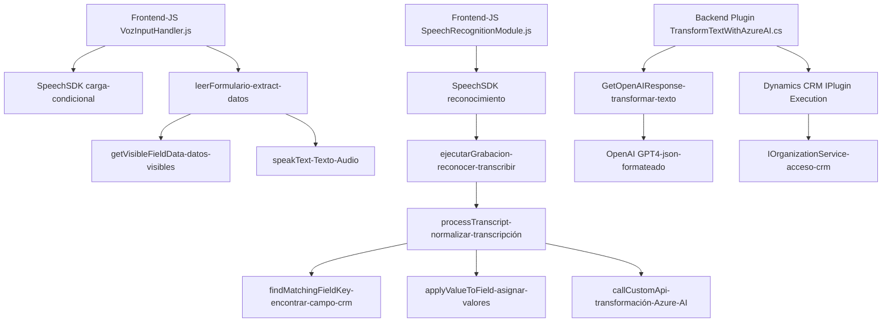

### Breve resumen técnico
El repositorio analizado contiene implementaciones para gestionar formularios en Dynamics CRM mediante entrada/salida de voz (frontend/JS) y procesamiento avanzado de texto usando inteligencia artificial (plugin/backend con Azure services). Combina tecnologías de frontend e integración de APIs externas con Azure Speech SDK y Azure OpenAI.

### Descripción de arquitectura
La arquitectura es híbrida y modular:
1. **Frontend (JS)**: Implementa capacidades de entrada y salida de voz con funciones que integran el Azure Speech SDK. Usa módulos para la extracción y procesamiento de datos dinámicos dentro de los formularios CRM.
2. **Backend (Plugin)**: Implementa un plugin para Dynamics CRM usando una arquitectura basada en "extensiones plugin" de CRM. Procesa texto con Azure OpenAI GPT-4 para generar JSON estructurado que puede ser utilizado dentro del CRM.

### Tecnologías usadas
- **Frontend**:
  - **Azure Speech SDK**: Para reconocimiento y síntesis de voz.
  - **Dynamics CRM Web API**: Gestión de datos del CRM.
  - ECMAScript (JavaScript).
- **Backend**:
  - **Azure OpenAI API** (modelo GPT-4).
  - **Microsoft Dynamics CRM SDK**: Extensiones personalizadas y servicios de integración.
  - **C#** (.NET Framework).
  - **System.Text.Json** y **Newtonsoft.Json**.

### Dependencias o componentes externos
- **Azure Speech SDK**: Reconocimiento de voz y síntesis.
- **Azure OpenAI API**: Procesamiento avanzado de texto usando GPT.
- **Dynamics CRM Web API**: Extensiones y gestión de datos.
- **HTTP/REST API**: Comunicación con servicios externos.
- **Microsoft.Xrm.Sdk**: Desarrollo basado en la arquitectura de plugins del CRM.

### Diagrama Mermaid compatible con GitHub

### Conclusión final
El repositorio implementa soluciones robustas para integrar reconocimiento de voz (entrada/salida) en Dynamics CRM y procesamiento de texto mediante IA avanzada (GPT). Utiliza una arquitectura desacoplada basada en módulos con integración directa a Microsoft Azure como proveedor de servicios. La combinación entre frontend (navegador) y backend (plugin CRM) sigue patrones de modularidad e integración de APIs externas, mejorando accesibilidad y automatización en entornos CRM empresariales.