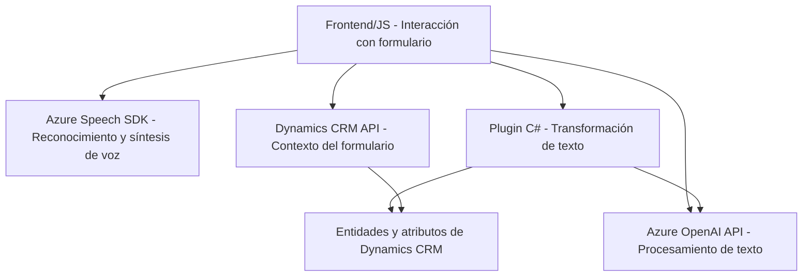

### Breve resumen técnico
El repositorio presenta una integración entre Dynamics CRM y Azure APIs, específicamente Azure Speech SDK y Azure OpenAI. Incluye tres core components:
1. **Frontend/JS**: Implementación de funcionalidades para formularios en Dynamics CRM que utilizan Azure Speech SDK para síntesis y reconocimiento de voz.
2. **Plugins**: Un backend plugin para Dynamics CRM que interactúa con Azure OpenAI to perform text transformation tasks.

### Descripción de arquitectura
La solución implementa una **n capas** y una arquitectura **orientada a eventos**, caracterizada por las siguientes capas:
1. **Capa de presentación (Frontend)**: Incluye scripts para operar sobre formularios de Dynamics CRM; proporciona capacidades de entrada (por reconocimiento de voz) y salida (mediante síntesis de voz) orientadas a la interacción directa con usuarios.
2. **Capa de lógica (Plugins)**: Plugins de Dynamics CRM que procesan datos y los transmiten a servicios de IA como Azure OpenAI para obtener una respuesta transformada.
3. **Capa de datos (Contexto CRM)**: La interacción con los atributos y entidades del sistema de Dynamics CRM.

### Tecnologías usadas
1. **Frontend:**
   - Azure Speech SDK para el reconocimiento y síntesis de voz.
   - JavaScript, probablemente utilizado en el entorno de Dynamics CRM para programación de front-end y lógica de negocio.
   - Dynamics CRM API (`Xrm.WebApi`).

2. **Plugins/Backend:**
   - C# (.NET Framework) para la implementación de plugins de Dynamics CRM.
   - Azure OpenAI API para transformar texto con GPT modelos (por ejemplo, Codex, GPT-3/GPT-4).
   - Newtonsoft.Json para manejo avanzado de JSON.

### Dependencias o componentes externos
1. **Microsoft Azure Services**:  
   - **Azure Speech SDK**: Para síntesis y reconocimiento de voz.
   - **Azure OpenAI**: Para transformación de texto.
   - Interacción con ambos servicios requiere conexión a internet y autenticación mediante claves API de Azure.

2. **Microsoft Dynamics CRM**:  
   - Utilizado como backend para gestionar entidades y campos de formulario.
   - Utiliza plugins para ejecutar lógica personalizada.

3. **Frameworks internos y externos**:  
   - En el frontend: Uso de APIs dinámicas en JavaScript para integración de formularios.
   - En el backend: Uso del SDK de Dynamics CRM con las interfaces `IPlugin`, `IServiceProvider`, etc.

### Diagrama **Mermaid**

### Conclusión final
La solución presentada es una combinación de herramientas frontend y backend integradas de manera eficiente con Dynamics CRM. Las capacidades ofrecidas, como reconocimiento de voz, síntesis de texto, y transformación avanzada con Azure OpenAI Model (GPT), suponen una arquitectura ideal para interfaces ricas y automatización personalizada en plataformas empresariales. La implementación sigue principios de modularidad y desacoplamiento con una orientación hacia servicios externos, satisfaciendo requisitos modernos de software empresarial.