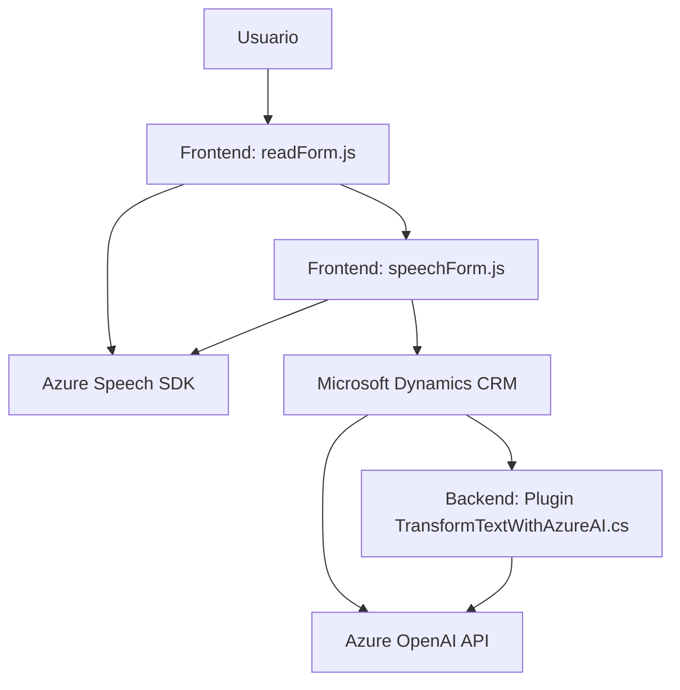

# **Análisis y descripción del sistema**

### **Breve resumen técnico**
El repositorio contiene tres archivos que, en conjunto, implementan una solución compuesta por un **frontend** basado en JavaScript que interactúa con un servicio de síntesis por voz de Azure Speech SDK (`readForm.js` y `speechForm.js`). Además, incluye un archivo backend (`TransformTextWithAzureAI.cs`), diseñado como un plugin de **Microsoft Dynamics CRM**, que emplea la API de Azure OpenAI para transformar texto según normas predefinidas.

---

### **Descripción de arquitectura**
La solución sigue una arquitectura de **n capas** con separación entre el frontend (cliente web que interactúa con el usuario) y el backend (plugin en la plataforma Dynamics CRM). La integración con los servicios externos de Azure y Dynamics CRM sigue el patrón de **API Gateway**. A nivel de diseño:
1. **Frontend:**
   - Modular: Cada función cumple una responsabilidad única, modularizando la lógica para la captura de datos del formulario, la síntesis de voz y las interacciones con el backend.
   - Basado en eventos y asincronía, lo que facilita un flujo de trabajo eficiente y similar al modelo de estados.

2. **Backend:**
   - Implementación de un **plugin design pattern** específico de Dynamics CRM para procesar datos y realizar integraciones externas, como la API de Azure OpenAI.
   - Encapsulación: La lógica se distribuye mediante clases y métodos con responsabilidades específicas (transformar texto, enviar solicitudes API, manejar respuestas).

---

### **Tecnologías, frameworks y patrones utilizados**
#### **Tecnologías y frameworks:**
1. **Frontend:**
   - Lenguaje: JavaScript.
   - Speech-to-text y soluciones de síntesis de voz: **Azure Speech SDK**.
   - Consume APIs de Microsoft Dynamics 365.

2. **Backend:**
   - Lenguaje: C#.
   - Framework y plataforma: Microsoft Dynamics CRM (IPlugin).
   - AI: **Azure OpenAI API**.
   - Librerías clave:
     - `Newtonsoft.Json.Linq`: Para el manejo de JSON.
     - `System.Net.Http`: Solicitudes HTTP a la API de Azure.
     - `System.Text.Json`: Serialización y deserialización de JSON.

---

#### **Patrones detectados**
1. **Frontend:**
   - **Modularidad con SRP**: Cada función tiene un propósito definido (gestión de formularios, síntesis de voz, carga del SDK).
   - **Dynamic Resource Loading**: La función `ensureSpeechSDKLoaded` emplea carga dinámica de recursos externos (Azure Speech SDK).
   - **Callback/Event-driven Programming**: Uso de callbacks para gestionar la asincronía del SDK.

2. **Backend:**
   - **Plugin Design Pattern**: La clase `TransformTextWithAzureAI` implementa este patrón, integrándose en Dynamics CRM como un observador de eventos.
   - **Integración con API externa**: Comunicación directa con Azure OpenAI mediante solicitudes HTTP, aislada a través de un método dedicado (`GetOpenAIResponse`).
   - **Factory Pattern**: Uso de `IOrganizationServiceFactory` para separar la creación y uso de servicios CRM.

---

### **Dependencias o componentes externos**
1. **Azure Speech SDK**:
   - Funciona como la herramienta principal para gestionar la síntesis y reconocimiento de voz, y se carga dinámicamente desde `https://aka.ms/csspeech/jsbrowserpackageraw`.
2. **Azure OpenAI API**:
   - Proporciona capacidades de procesamiento de texto con IA a través de la API GPT.
3. **Microsoft Dynamics 365**:
   - Base sobre la que opera el plugin y desde donde se invoca la funcionalidad de transformación de texto.
4. **Librerías del entorno .NET**:
   - Ejemplo: `Newtonsoft.Json`, `System.Net.Http`.

---

### **Diagrama Mermaid 100 % compatible con GitHub Markdown**

---

### **Conclusión final**
Este sistema implementa una solución integral para la interacción con formularios dinámicos basada en entrada de voz y procesamiento de datos mediante tecnologías de inteligencia artificial. La arquitectura de **n capas** separa frontend y backend, mientras que los componentes utilizan APIs modernas para síntesis de voz (Azure Speech SDK) y transformación de texto (Azure OpenAI).

Podría evolucionar hacia una arquitectura más distribuida basada en **microservicios** si el backend y su plugin expanden funcionalidades hacia servicios desacoplados fuera de Dynamics CRM. Actualmente, el uso de APIs, asincronía y modularidad garantiza una alta escalabilidad dentro del dominio de aplicaciones empresariales.