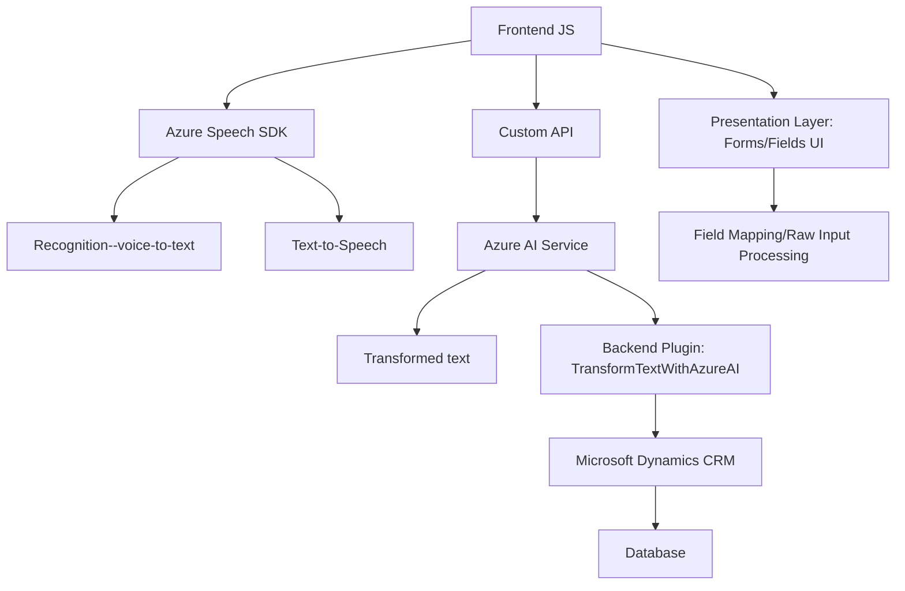

### Breve resumen técnico
La solución presentada es un híbrido que combina frontend web, integración API y programación de extensiones en Microsoft Dynamics CRM. Utiliza múltiples subcomponentes para reconocimiento y síntesis de voz, procesamiento de datos y plugins en el backend.

### Descripción de arquitectura
- La arquitectura es **n-capas**:
  - **Capa de presentación**: Implementación JS para manejar formularios dinámicos, voz, y APIs de síntesis y reconocimiento.
  - **Capa lógica**: Gestión de voz en el cliente, invocaciones a Azure AI/Custom APIs y transformación de datos.
  - **Capa de integración**: Plugin en Dynamics CRM que utiliza el servicio Azure OpenAI para ejecutar transformaciones avanzadas de texto.

### Tecnologías usadas
- **Frontend**:
  - **JavaScript**: Para interactuar con formularios y ejecutar Azure Speech SDK.
  - **Azure Speech SDK**: Para reconocimiento y síntesis de voz.
- **Backend**:
  - **C# / Microsoft Dynamics Plugins**: Extensión en Dynamics personalizada con `IPlugin`.
  - **Azure OpenAI Service**: Procesamiento externo de texto.
  - **Newtonsoft.Json**: Manipulación avanzada de JSON.
- **General**:
  - **Integración API REST**: Llamadas HTTP a servicios externos.
  - **Microsoft Dynamics CRM**: Como sistema central de gestión y plataforma extensible.

### Diagrama Mermaid

### Conclusión final
Esta solución destaca por la integración de capacidades avanzadas como reconocimiento de voz y procesamiento IA mediante Azure Services. La arquitectura de n-capas favorece una separación limpia de responsabilidades: una capa frontend maneja la interacción del usuario y el reconocimiento de voz, mientras el backend procesa datos y los extiende hacia un CRM. Entre las fortalezas están el uso de SDK dinámicos para gestionar dependencias externas y una arquitectura basada en patrones claros para facilitar el mantenimiento y escalabilidad, aunque vulnerabilidades como el manejo de credenciales en el plugin deben revisarse para garantizar seguridad.