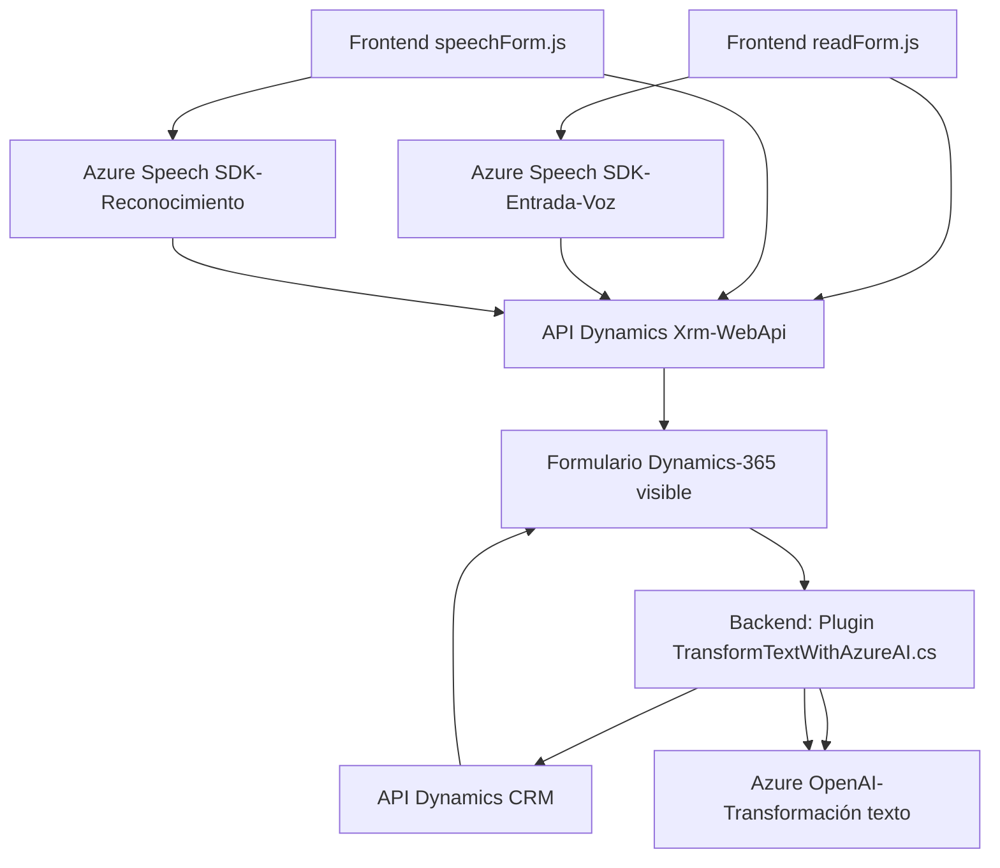

### Resumen técnico:
El repositorio contiene archivos organizados bajo el frontend y backend (Plugins), con implementaciones centradas en el uso de **Azure Speech SDK** y **Azure OpenAI**. Estas son utilizadas para la síntesis de voz, reconocimiento de voz y transformación de texto dentro del contexto de un **formulario gestionado por Dynamics 365**.

---

### Descripción de arquitectura:
1. **Arquitectura general**:  
   - La solución es una combinación de arquitectura **n-capas** y **orientada a eventos**.  
   - El frontend se centra en el procesamiento y manipulación de formularios de Dynamics 365 a través de recogida de datos (entrada de voz), extracción y actualización dinámica; mientras la capa del plugin permite extensibilidad y lógica de negocio mediante Azure OpenAI para la generación de resultados transformados.
   - Uso de patrones asincrónicos y modularidad para desacoplar las dependencias.  
   
2. **Interacciones clave**:
   - **Frontend**:  
     Procesa entrada visual y de voz mediante funciones modulares, utilizando el Azure Speech SDK y el API de Dynamics. Su lógica está específicamente diseñada para trabajar en sincronía con formularios de Dynamics 365. Incluye funcionalidades como reconocimiento de voz, manipulación de campos, y llamadas a APIs personalizadas.  
   - **Plugin Backend**:
     Un plugin estándar de Dynamics CRM transformando texto mediante la API del servicio Azure OpenAI. Se emplea para extender funcionalidades en Dynamics CRM, incluyendo la ejecución de lógica personalizada basada en las interacciones del cliente.

---

### Tecnologías y frameworks usados:
1. **Azure Speech SDK**:  
   - En el frontend, para reconocer la entrada de voz, síntesis y transcripciones dinámicas.
2. **Azure OpenAI API**:  
   - En el backend (plugin), para transformar texto recibido en base a reglas definidas.
3. **Dynamics 365 API Xrm.WebApi**:  
   - Manejo de datos y manipulación de formularios del CRM.
4. **JavaScript**:  
   - En el frontend (`readForm.js` y `speechForm.js`) siguiendo un modelo modular y orientado al DOM.
5. **C# (.NET Framework)**:  
   - En el backend (`TransformTextWithAzureAI.cs`) como plugin para Dynamics CRM.
6. **Frameworks auxiliares**:  
   - `Newtonsoft.Json` y `System.Net.Http` para manejo de datos JSON y solicitudes HTTP en C#.

---

### Dependencias o componentes externos:
1. **API y SDK externos**:
   - Azure Speech SDK (reconocimiento y síntesis de voz).
   - Azure OpenAI (transformación avanzada de texto).
   - Dynamics 365 Xrm.WebApi para integración con el CRM.
   - HTTP (solicitud externa desde el plugin hacia el servicio OpenAI).
2. **Frameworks auxiliares**:
   - `Newtonsoft.Json.Linq` y `System.Text.Json` para serializar datos JSON (en C#).
   - `DOM APIs` como interfaz base para cargar dinámicamente SDK en el frontend.
3. **Formulario en Dynamics 365**:
   - Evento `executionContext` del CRM para extraer datos, manipular campos y actualizar registros.

---

### Diagrama **Mermaid** válido para GitHub:

---

### Conclusión final:
Esta solución combina la interacción entre frontend y backend para formularios dinámicos en **Dynamics 365** mediante servicios avanzados como **Azure Speech SDK** y **Azure OpenAI**.  
La arquitectura es **n-capas** debido a la separación de lógica en frontend y backend, aunque incorpora patrones de integración asincrónicos y orientados a eventos. La modularidad en el diseño facilita extensibilidad y adaptabilidad, aprovechando APIs potentes como el SDK de Dynamics y servicios Azure. Aunque elegante y eficiente, es importante mejorar la seguridad en la exposición de claves y endpoints mediante configuraciones externas como variables de entorno.