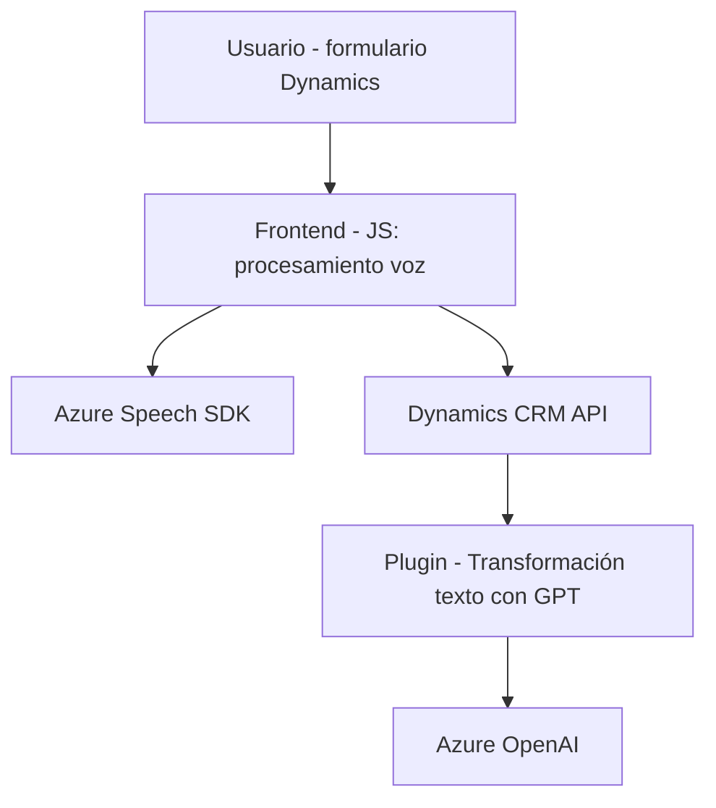

### Breve resumen técnico
El repositorio incluye tres piezas fundamentales de una solución que utiliza reconocimiento de voz (speech-to-text), síntesis de voz (text-to-speech), interacción con formularios dinámicos en Dynamics 365 y un plugin que aprovecha Azure OpenAI para transformar texto. La solución está enfocada en la accesibilidad, automatización y mejora de la interacción con datos mediante integración con servicios de Azure.

---

### Descripción de arquitectura
La solución muestra una arquitectura cliente-servidor orientada a servicios. En el cliente, el frontend utiliza JavaScript para interactuar directamente con formularios en Dynamics 365 y Azure Speech SDK, mientras que el servidor utiliza un plugin en Dynamics CRM que trabaja con Azure OpenAI para procesamiento de texto. Los archivos están organizados en diferentes capas funcionales:
1. **Frontend**: Contiene lógica para interacción con el usuario mediante voz.
   - Manejo de formularios dinámicos.
   - Uso de reconocimiento y síntesis de voz.
2. **Backend**: Implementa lógica de negocio extensible en Dynamics CRM mediante plugins.
   - Procesamiento avanzado de texto con modelos GPT.

La arquitectura general es una **estructura en n capas**, incluyendo las funciones del cliente (frontend), integración con Dynamics (API interna), y conexión con Azure (servicios externos).

---

### Tecnologías usadas
1. **Frontend**:
   - **JavaScript**:
     - Carga dinámica del SDK Azure Speech.
     - Procesamiento y generación de audio (text-to-speech).
   - **Azure Speech SDK**:
     - Reconocimiento y síntesis de voz.
   - Dynamics 365 frontend API (`executionContext`, `formContext`) para manipular datos de formularios.
2. **Backend**:
   - **C#**: Implementación del plugin para Dynamics CRM.
   - **Dynamics CRM SDK** (`IPlugin`, `IOrganizationServiceFactory`, etc.).
   - **Azure OpenAI**: Llamadas al servicio GPT para transformar texto.
   - **Newtonsoft.Json**: Manipulación de JSON en el plugin.
   - **System.Net.Http**: Peticiones HTTP al endpoint de Azure.

---

### Diagrama Mermaid válido para GitHub

---

### Conclusión final
La solución está orientada al uso intensivo de servicios en la nube (Azure Speech y Azure OpenAI) y personalización de Dynamics 365. Su diseño modular y dividido por capas permite una integración eficiente entre frontend y backend. Destaca el uso de patrones como el control basado en cliente y la extensión mediante plugins para CRM, maximizando la reutilización y escalabilidad del sistema.