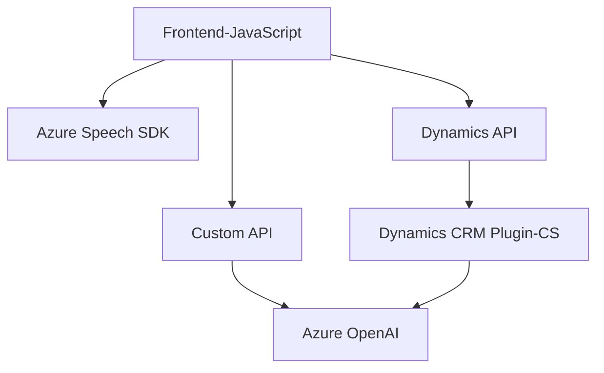

### Breve resumen técnico
El repositorio se enfoca en funcionalidades avanzadas de procesamiento de voz y texto, en integración directa con Dynamics 365 utilizando Azure Speech SDK y Azure OpenAI. Los distintos módulos desarrollan capacidades como reconocimiento de voz, síntesis de voz y transformación de datos con inteligencia artificial.

---

### Descripción de arquitectura
La solución se divide en componentes principales:

- **Frontend**: Los archivos JavaScript gestionan la interacción del usuario mediante voz sobre los formularios de Dynamics 365. Se implementa la lectura y transcripción de datos visibles, y se aplican valores de manera dinámica utilizando patrones basados en servicios externos como Azure Speech SDK y APIs personalizadas.
  
- **Backend (Plugin)**: Un plugin escrito en C# para Dynamics CRM procesa los datos de texto capturados o ingresados en el frontend. Utiliza Azure OpenAI para transformar dichos datos en objetos JSON estructurados, que luego son regresados al frontend o se aplican directamente a formularios.

- **Dependencia de servicios cloud**: Gran parte de la funcionalidad se basa en servicios como Azure Speech SDK y Azure OpenAI. Esto sigue una arquitectura **service-oriented**, ya que aprovecha funcionalidades externas y gestionadas. 

---

### Tecnologías usadas
Las siguientes tecnologías y patrones se emplean explícitamente:

1. **Frontend**:
   - **JavaScript**: Para lógica de negocio en la capa de presentación. 
   - **Azure Speech SDK** (vía CDN): Para reconocimiento y síntesis de voz.
   - **Dynamics 365 Client API**: Para manipular datos e interactuar con los formularios del cliente.

2. **Backend (Plugin)**:
   - **C#**: Para implementar lógica empresarial en el lado del servidor.
   - **Azure OpenAI**: Para procesamiento avanzado de datos mediante GPT-4.
   - **Microsoft.Xrm.Sdk**: Para integrar la API de Dynamics CRM.

3. **Patrones arquitectónicos**:
   - **N capas**: El sistema está dividido en frontend/client-side, servicios externos (Speech SDK, OpenAI), y backend/server-side (plugin para Dynamics CRM).
   - **Service-oriented Architecture (SOA)**: Alta dependencia de servicios externos (Azure Speech SDK y Azure OpenAI).
   - **Facade Pattern**: Abstrae operaciones técnicas complejas.
   - **Modularización basada en funciones**: En los scripts se opta por funciones para tareas independientes, buscando claridad y reusabilidad.

---

### Diagrama Mermaid válido para GitHub

---

### Conclusión final
La solución implementada en el repositorio es una **aplicación integrada que extiende la funcionalidad de Dynamics 365 CRM utilizando servicios avanzados de IA y procesamiento de voz.** Utiliza una arquitectura de **tres capas orientada a servicios** con un frontend dedicado en JavaScript que interactúa con los usuarios, un plugin en C# que maneja la lógica de negocio avanzada, y servicios externos basados en Azure (Speech SDK y OpenAI). Esta arquitectura permite una funcionalidad robusta, modular, y escalable para aprovechar capacidades de inteligencia artificial y voz en formularios empresariales.