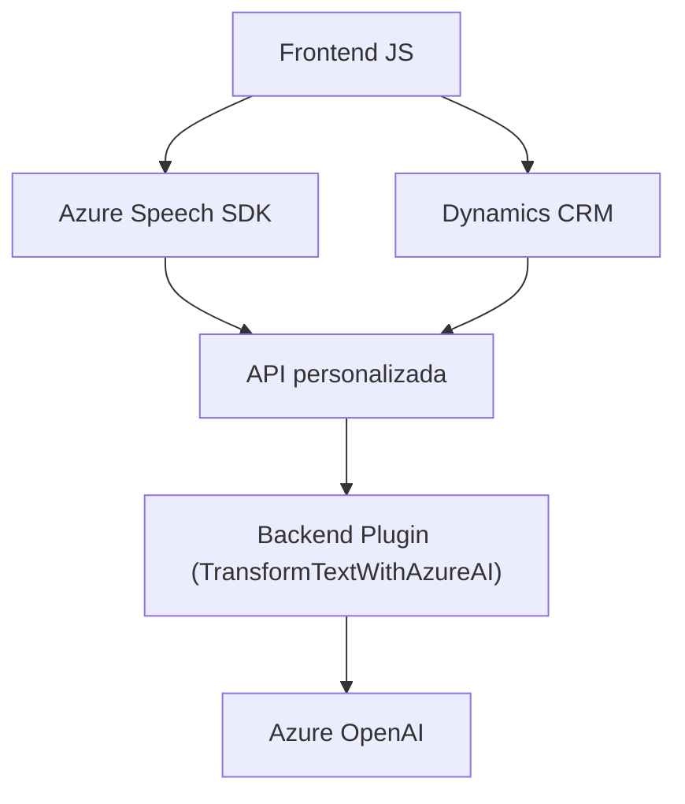

### Breve resumen técnico
La solución presentada parece estar enfocada en la integración de servicios basados en voz y procesamiento de texto utilizando tecnologías de Azure, aplicadas a formularios interactivos como parte de una aplicación basada en Microsoft Dynamics CRM. Tres principales interfaces han sido abordadas:
1. Archivos frontend en JavaScript para gestión de voz (entrada y salida).
2. Un plugin backend en C# para transformación de texto estructurado con Azure OpenAI.
3. Dependencias externas se centran en Azure Speech SDK y Dynamics CRM APIs.

---

### Descripción de arquitectura
Esta solución adopta una **arquitectura n-capas** con separación clara entre frontend, middleware y backend:
1. **Frontend**: Archivos `readForm.js` y `speechForm.js` implementan interacción de voz y manipulación de formularios. Están diseñados como un módulo funcional que consume servicios externos.
2. **Middleware**: Integración directa con Azure Speech SDK para entrada de voz y sintesis de texto a voz.
3. **Backend:** Plugin C# (`TransformTextWithAzureAI.cs`) utilizado en Dynamics CRM para transformación de datos textual mediante Azure OpenAI, en formato desacoplado basado en la API del CRM.

Esta separación permite escalabilidad, modularidad, y reutilización de componentes.

---

### Tecnologías usadas
1. **Frontend**:
   - JavaScript.
   - Azure Speech SDK: Reconocimiento de voz y síntesis de voz.
   - Xrm.WebApi: Manipulación de Dynamics CRM desde frontend.
2. **Backend**:
   - C# con Microsoft Dynamics CRM SDK (`Microsoft.Xrm.Sdk`).
   - Azure OpenAI para transformación de texto.
   - HTTP-based APIs.
   - Librerías para JSON: `Newtonsoft.Json` y `System.Text.Json`.

### Patrones usados
- **Patrón de integración con API externas**: Aplica servicios como Azure Speech y Azure OpenAI.
- **Modularidad funcional**: Cada función/método se centra exclusivamente en una tarea.
- **Desacoplamiento de servicios**: El plugin implementa integración segura con Dynamics CRM y respecto a Azure OpenAI.

---

### Diagrama Mermaid válido para GitHub

---

### Conclusión final
La solución tiene una arquitectura altamente desacoplada, n-capas y centrada en interacciones dinámicas con servicios externos. Las piezas funcionales del sistema están bien integradas para soportar reconocimiento de voz, manipulación de formularios y transformación de texto mediante herramientas inteligentes como Azure y Dynamics CRM.

El diseño general permite adaptabilidad y robustez, haciendo que sea ideal para implementaciones empresariales, como sistemas de automatización de procesos en CRM. El uso de tecnologías modernas como Azure Speech SDK y Azure OpenAI aseguran que la solución es escalable y compatible con aplicaciones IA-driven del futuro.