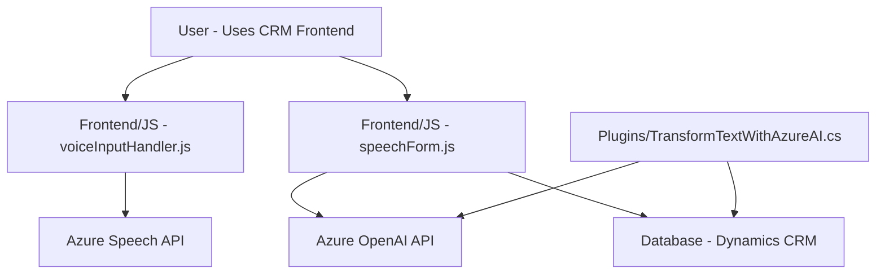

### Breve resumen técnico
El repositorio combina varios componentes para implementar funcionalidades basadas en voz e inteligencia artificial en el contexto de Microsoft Dynamics CRM. Incluye un frontend en JavaScript que interactúa con Azure Speech SDK para reconocimiento y síntesis de voz, y un plugin en C# que utiliza Azure OpenAI para transformar texto en información estructurada. La solución se integra con Dynamics CRM para actualizar formularios y realizar transcripciones inteligentes.

---

### Descripción de arquitectura
El sistema implementa una arquitectura **n capas** dividida conceptualmente en:
1. **Interfaz de usuario (Frontend)**: JavaScript permite la interacción con el usuario mediante los formularios de Dynamics CRM y programas de voz con el navegador.
2. **Lógica de negocio (Plugins)**: C# implementa reglas específicas de negocio mediante un plugin que llama a Azure OpenAI para transformación estructurada de datos.
3. **Servicios externos (SDK y APIs)**: Integración con:
   - Azure Speech SDK (para voz).
   - Azure OpenAI (para procesamiento de texto).

Patrones identificados:
- Event-Driven Architecture en el frontend, que reacciona dinámicamente a eventos (reconocimiento de voz y síntesis).
- Modularización mediante funciones que separan responsabilidades específicas (Frontend).
- Command Pattern en el plugin (una acción por ejecución, entrada/salida específicas).

---

### Tecnologías usadas
1. **Frontend**:
   - **JavaScript DOM API**: Para manipulación de formularios y generación de datos legibles.
   - **Azure Speech SDK**: Para síntesis y reconocimiento de voz.
   
2. **Backend Plugins** (Lógica en C#):
   - **Azure OpenAI API**: Transformación de texto con el modelo GPT.
   - Framework específico de Microsoft Dynamics CRM:
     - **Microsoft.Xrm.Sdk** para interacción directa con los datos y lógica CRM.

3. **Servicios y dependencias externas**:
   - **Azure Speech y OpenAI SDKs**: Provisión de inteligencia artificial aplicada (voz y texto).
   - **HTTP REST APIs**: Llamadas externas al servicio de Azure.

---

### Diagrama Mermaid (100% compatible con GitHub Markdown)

---

### Conclusión final
La solución presentada en este repositorio implementa un sistema basado en voz y procesamiento de texto que se integra con Microsoft Dynamics CRM. Utiliza una arquitectura de **n capas**, donde el frontend maneja interacción y generación de datos, la lógica en plugins extiende Dynamics CRM con capacidades de inteligencia artificial apoyándose en los SDK y APIs de Azure (Speech y OpenAI). Aunque la integración está bien estructurada, tiene áreas de mejora como la externalización de credenciales y una configuración más robusta para dependencias externas (ej.: mediante paquetes y herramientas como Webpack).