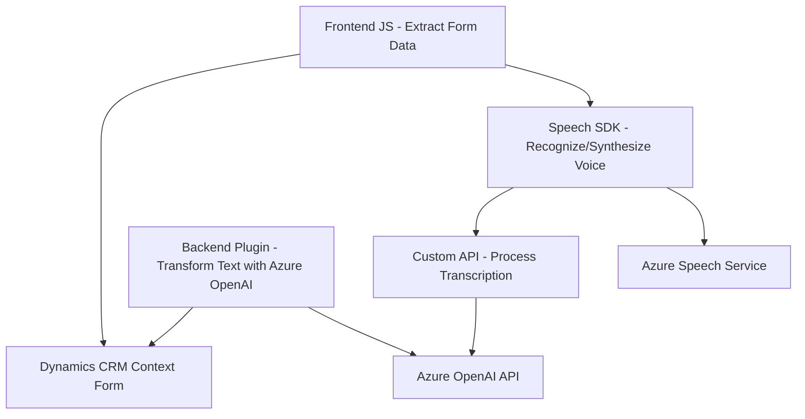

### Breve resumen técnico

La estructura del repositorio y los distintos archivos analizados indican una solución híbrida que combina componentes frontend con plugins backend para Dynamics CRM. Utiliza servicios externos como Azure Speech SDK y Azure OpenAI para procesamientos inteligentes de datos. Los archivos están orientados a mejorar la interacción entre usuarios y formularios de Dynamics 365 mediante funcionalidades avanzadas de reconocimiento de voz, síntesis de voz y transformación de texto.

---

### Descripción de arquitectura

La arquitectura combina:
1. **Frontend (JavaScript)**:
   - Manejo de datos del formulario.
   - Interacción con APIs externas para reconocimiento de voz, síntesis y transformación de texto.
   - Los componentes frontend utilizan estructuras modulares para cargar dinámicamente dependencias como Azure Speech SDK.
   
2. **Backend (Plugin)**:
   - Implementa procesamiento avanzado de texto mediante Azure OpenAI.
   - Ejecuta lógica empresarial dentro del ecosistema de Microsoft Dynamics CRM.
   - Diseño basado en extensibilidad de eventos en CRM mediante la implementación de `IPlugin`.

---

### Tecnologías usadas

1. **Frontend**:
   - **JavaScript ES6**:
     - Usado para la lógica procesal y modular basada en funciones.
   - **Azure Speech SDK**:
     - Para reconocimiento y síntesis de voz.
   - **HTML/DOM API**:
     - Extrae contexto de formulario y manipula los datos visibles.
   - **Dynamic Context API (Xrm)**:
     - Interacción directa con los formularios de Dynamics CRM.

2. **Backend**:
   - **C#/.NET Framework**:
     - Usado para la implementación de plugins.
   - **Microsoft Dynamics SDK**:
     - APIs integradas para manipular datos, contextos y servicios.
   - **Azure OpenAI API**:
     - Para la interacción y el procesamiento avanzado de texto.
   - **JSON Libraries**:
     - `Newtonsoft.Json`, `System.Text.Json`.
   - **Regex**:
     - Usado para transformar y validar estructuras de datos.

---

### Diagrama **Mermaid**

---

### Conclusión final

La solución presentada combina arquitectura **n-capas** en el frontend con un modelo de extensibilidad orientado a **event-driven plugins** en el backend para Dynamics CRM. El diseño híbrido mezcla procesamiento de datos a nivel de cliente y servidor, lo que le permite aprovechar las capacidades tanto del navegador como de los servicios en la nube. Además, se observa un uso de patrones de carga dinámica y modularidad, lo que otorga flexibilidad y escalabilidad. Las dependencias externas clave son Azure Speech SDK y Azure OpenAI API, posicionadas como componentes críticos para el reconocimiento de voz, síntesis y transformación de texto.