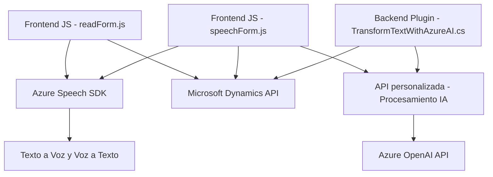

### Breve Resumen Técnico:

El repositorio incluye tres archivos que representan distintas funcionalidades dentro de un sistema integrado entre un frontend, servicios externos (Azure Speech SDK y Azure OpenAI API), y Microsoft Dynamics CRM. La solución incluye procesamiento de voz, interacción con formularios y transformación de texto usando inteligencia artificial.

---

### Descripción de Arquitectura:

La arquitectura de la solución se estructura como **n-capas**, donde cada componente cumple una responsabilidad específica:
1. **Capa de Presentación (Frontend)**:
   - `readForm.js` y `speechForm.js` manejan la interacción con los formularios y la funcionalidad de voz.
   - Explotan servicios externos como Azure Speech SDK y APIs de Microsoft Dynamics.
   
2. **Capa de Negocio**:
   - El plugin `TransformTextWithAzureAI.cs` realiza tareas de procesamiento inteligente de texto con Azure OpenAI y responde al contexto de CRM.
   
3. **Capa de Integración**:
   - Conexión con servicios externos como Azure Speech SDK, Azure OpenAI API y Dynamics CRM a través de Xrm.WebApi.
   
Se utilizan patrones como **modularidad funcional**, **cargador dinámico** para dependencias (Speech SDK), e integración mediante **servicios REST**.

---

### Tecnologías utilizadas:

1. **Frontend (JavaScript)**:
   - DOM para manipulación de formularios y carga dinámica.
   - Azure Speech SDK para Text-to-Speech (TTS) y Speech-to-Text (STT).
   - Integración con Microsoft Dynamics API (`Xrm.WebApi`).

2. **Backend (C#)**:
   - `.NET Framework` y namespaces .NET para transformación de datos.
   - Azure OpenAI API para procesamiento de texto avanzado.

---

### Dependencias externas:
1. **Azure Speech SDK**:
   - Usado para funciones de reconocimiento y síntesis de voz.
   
2. **Azure OpenAI API**:
   - API para procesamiento inteligente de texto con modelos de lenguaje como GPT.

3. **Microsoft Dynamics API (`Xrm.WebApi`)**:
   - Interfaz para manipular datos en Dynamics CRM.

---

### Diagrama Mermaid:

---

### Conclusión Final:

Esta solución está diseñada para gestionar formularios utilizando avanzadas capacidades de procesamiento y reconocimiento de voz, integrándose con servicios cloud como Azure Speech SDK y OpenAI. La arquitectura, de tipo **n-capas**, separa correctamente las responsabilidades entre presentación (Frontend), lógica de negocio (Backend) y servicios integrados (Azure y Dynamics CRM). Las dependencias están claramente gestionadas, con especial atención a la modularidad y extensibilidad. Es una buena arquitectura para aplicaciones en entornos empresariales que necesitan interacción natural con usuarios (voz y texto) y procesamiento inteligente de datos.