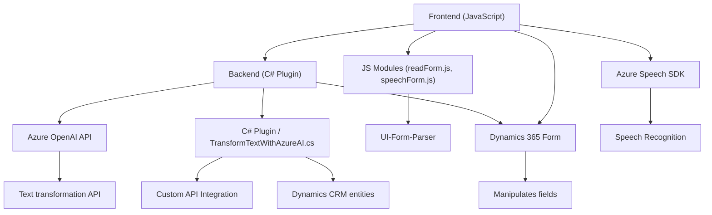

### Breve resumen técnico

El repositorio parece implementar una solución híbrida que integra funcionalidades de frontend y backend para habilitar capacidades avanzadas, como reconocimiento de voz y transformación de texto mediante APIs de Microsoft Azure. En particular, el sistema utiliza el **Azure Speech SDK** en el frontend y un **plugin para Dynamics CRM** en el backend que se conecta con Azure OpenAI.

### Descripción de arquitectura

La arquitectura de esta solución tiene las siguientes características:
1. **Cliente-Servidor:** Proporciona el frontend mediante scripts JS que interactúan con formularios en un navegador dinámico y hacen llamadas al backend.
2. **Patrones de integración:** Utiliza SDK de Azure Speech para reconocimiento de voz y generación de texto a voz en el frontend, mientras que en el backend utiliza un plugin para Dynamics CRM que se comunica con Azure OpenAI API.
3. **Componentes distribuidos:** Aunque los códigos (.js en el frontend y .cs en el backend) están separados, forman parte de una arquitectura orientada a servicios que incluye servicios externos y API personalizados.
4. **Monolito expandido:** En esencia, la solución es un monolito porque observa dependencias con Dynamics 365 y servicios cloud de Azure. Sin embargo, su diseño facilita una futura evolución hacia microservicios.

### Tecnologías usadas

- **Frontend:** 
  - Lenguaje: JavaScript.
  - Framework: Dynamics 365 scripting environment.
  - SDK: Azure Speech REST SDK.
  - APIs y tecnología: Native DOM Manipulation (event-handling), Dynamic Script Loading, Lazy Loading.

- **Backend:**
  - Lenguaje: C#.
  - Framework: Microsoft Dynamics CRM Plugin Framework.
  - SDK: Dynamics CRM SDK (`IPluginExecutionContext`).
  - API: Azure OpenAI (GPT-4 integration via HTTP).
  - Libraries: Json serialization (`System.Text.Json`, `Newtonsoft.Json.Linq`), HTTP client for API calls.

### Dependencias o componentes externos

1. **Microsoft Azure SDKs:**
   - Azure Speech SDK: Para generación de texto a voz y transcripción de reconocimiento de voz en el frontend.
   - Azure OpenAI Service: Utilizado en backend para procesamiento avanzado de texto.

2. **Microsoft Dynamics SDK:** Para desarrollo de plugins y operaciones en formularios y entidades CRM.

3. **Dynamics 365 API:** Used for form manipulation and API integration within Dynamics.

4. **External libraries:**
   - **Newtonsoft.Json.LINQ:** Parsing and manipulating JSON.
   - **System.Net.HttpClient:** API interaction for Azure OpenAI.

---

### Diagrama **Mermaid** (Válido para GitHub Markdown)

### Conclusión final

La solución presentada es un **hybrid monolith**, con un frontend script-based communicating with a backend plugin architecture, both designed to interact with external services like Azure Speech SDK and Azure OpenAI API, hosted in the Microsoft Dynamics 365 environment. Its design is modular and encapsulates each functionality into separate functions and services, making it scalable and relatively portable to newer models such as microservices or serverless functions in Azure.