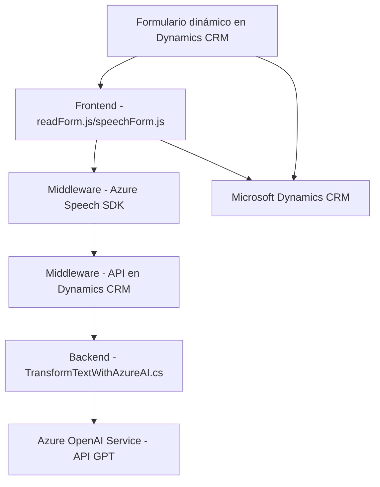

### Resumen Técnico
El repositorio describe una solución que implementa funcionalidades relacionadas con interacción de voz, procesamiento dinámico de formularios y generación de texto mediante servicios externos (Azure Speech SDK y Azure OpenAI). Está diseñado para integrarse con sistemas como Microsoft Dynamics CRM, con un enfoque de accesibilidad y simplificación de operaciones basadas en entradas de usuario.

---

### Descripción de Arquitectura
Este repositorio muestra una arquitectura híbrida compuesta por un **sistema de capas** que opera sobre tres niveles principales:
1. **Frontend/UX** – Gestión de entrada/salida de datos y voz en aplicaciones web (archivos JavaScript: `readForm.js` y `speechForm.js`).
2. **Middleware** – Procesamiento y transformación de datos con soporte para integración con APIs externas y IA (ejemplo: conexión con Azure services).
3. **Backend** – Plugins para extender funcionalidades de Dynamics CRM, utilizando servicios programables dentro del ecosistema de Microsoft.

A la vez, se observan principios de integración de **microservicios** en el uso de servicios como Azure Speech SDK y Azure OpenAI Service, que delegan el procesamiento de voz y texto a plataformas externas.

---

### Tecnologías Usadas
1. **Frontend:**
   - **JavaScript:** Desarrollo de lógica basada en funciones para interacción con el formulario y API externas.
   - **DOM:** Manipulación de elementos HTML dinámicos.
   - **Azure Speech SDK:** Procesamiento de voz (síntesis, entrada y conversión).
   
2. **Middleware/Backend:**
   - **Azure OpenAI Service:** Transformación de texto usando IA (GPT model).
   - **Microsoft Dynamics Plugins:** Extensión del CRM mediante C# (`TransformTextWithAzureAI.cs`).
   - **C#/.NET Framework:** Implementación de lógica empresarial en los plugins del CRM.
   - **HttpClient:** Llamadas HTTP al servicio Azure OpenAI.
   - **Newtonsoft.Json y System.Text.Json:** Manejo de estructuras JSON.

3. **Patrones Observados:**
   - Modularización: Separación de responsabilidades en funciones o métodos claramente definidos.
   - Sincronización asíncrona: Uso de eventos y callbacks (en JavaScript) y API REST para interoperabilidad.
   - Arquitectura de Plug-in: Extensiones en Dynamics CRM para lógica específica de negocio.
   - Microservicios: Integración explícita con servicios de Azure (Speech SDK y OpenAI).
   - Builder: Creación de objetos, como payloads JSON, de manera programática.

---

### Diagrama Mermaid

---

### Conclusión Final
Este repositorio forma parte de una solución con arquitecturas integradas de múltiples capas, diseñada para interactuar con entidades en Dynamics CRM mientras utiliza servicios externos (Azure Speech SDK y Azure OpenAI). Los scripts de JavaScript (frontend) proporcionan interacción directa para usuarios finales a través del navegador, como entrada de voz y visualización de datos. Los plugins de backend (C#) amplían las capacidades del CRM mediante reglas específicas y conectan con servicios de IA para transformación de datos.

La arquitectura es híbrida, donde mallas de microservicios, como el Azure Speech SDK y Azure OpenAI, juegan un papel crucial para cumplir con las necesidades del negocio. Este enfoque es adecuado para proyectos que buscan mejorar la accesibilidad y capacidades dinámicas mediante servicios en la nube, manteniendo una estructura modular y flexible.