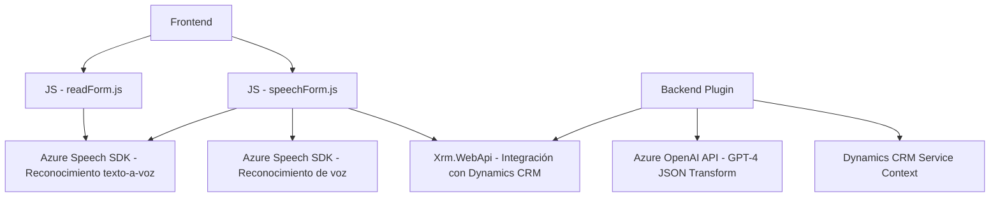

### Breve Resumen Técnico:
El repositorio consiste en una solución que combina la integración de capacidades de reconocimiento de voz, síntesis de texto a voz, y procesamiento de texto utilizando Azure Speech y Azure OpenAI, todo dentro del ecosistema de Microsoft Dynamics CRM. En esencia, el sistema implementa funcionalidades:
- Extensión de formularios para ejecutar lectura y reconocimiento de voz.
- Transformación de texto en JSON utilizando inteligencia artificial, mediante un **plugin para Dynamics CRM**.

---

### Descripción de arquitectura:
La arquitectura observada es una mezcla entre **Arquitectura en N Capas** y ciertas características de **Arquitectura Orientada a Microservicios** debido al uso de componentes externos (Azure Speech SDK y Azure OpenAI). 
1. **Frontend**: Archivos JavaScript que manejan la interacción con el usuario y el SDK de Azure Speech integrándose con Dynamics CRM para realizar tareas como lectura y reconocimiento de voz.
2. **Backend**: Implementación en `C#` de un plugin que interactúa con Dynamics CRM como un servicio interno para transformar el texto usando una API de Azure OpenAI.

Los componentes se desacoplan modularmente:
- **Frontend**: Contiene scripts que se encargan de la interfaz del usuario y la gestión de formularios.
- **Reconocimiento y síntesis de voz**: Integración directa con **Azure Speech SDK**.
- **Procesamiento avanzado de texto con IA**: A través de un plugin escrito en `C#`, que interactúa con **Azure OpenAI API** mediante el modelo GPT-4, para transformar datos del CRM.

#### Diseño de comunicación:
La arquitectura depende de una API Gateway que intermedia entre los servicios externos (Azure API y Speech SDK) y la lógica interna del sistema.

---

### Tecnologías Usadas:
1. **Backend**:
   - `.NET Framework/C#`: Utilizado para la lógica del plugin dentro de Dynamics CRM.
   - `Microsoft.Xrm.Sdk`: Permite la interacción con el modelo de datos y eventos de Dynamics CRM.
   - `System.Net.Http` y `System.Text.Json`: Manejo de peticiones HTTP y procesamiento de datos JSON.

2. **Frontend**:
   - **JavaScript**:
     - Para controlar el DOM y manejar funciones relacionadas con formularios y eventos.
     - Modularización en funciones específicas para encapsular la lógica.
   - **Azure Speech SDK**:
     - URL dinámico: `https://aka.ms/csspeech/jsbrowserpackageraw`.
     - Funcionalidades: reconocimiento de voz y síntesis de texto a voz.
   - `Xrm.WebApi`: Funcionar dentro de entornos Microsoft Dynamics CRM.

3. **Servicios externos**:
   - **Azure OpenAI API (GPT-4)**:
     - Procesamiento avanzado y creación de JSON estructurado según reglas específicas.
   - **Azure Speech SDK**:
     - Reconocimiento y síntesis de voz para interacción con formularios.

4. **Patrones de Diseño**:
   - **Separación por capas**: Frontend y Backend con llamados a servicios externos.
   - **Loader Pattern**: Carga dinámica del Speech SDK cuando es requerido.
   - **Plug-in Pattern**: Implementación del `TransformTextWithAzureAI` como plugin basado en eventos de Dynamics CRM.
   - **API Gateway Pattern**: Comunicaciones asíncronas entre el sistema y los servicios de Azure OpenAI/Speech.

---

### Diagrama Mermaid:

---

### Conclusión Final:
Este repositorio representa una solución moderna orientada a servicios y compuesta por módulos bien definidos con responsabilidad específica. Utiliza tecnologías de Microsoft Dynamics CRM para formularios interactivos, y conecta estos formularios con servicios avanzados externos como **Azure Speech SDK** y **Azure OpenAI API**. Su diseño arquitectónico combina principios de **simplificación modular** y **orientación a eventos** con la potencia de la nube de Azure y capacidades de inteligencia artificial. Es ideal para sistemas empresariales que buscan mejorar la experiencia del usuario con reconocimiento de voz y procesamiento por IA.