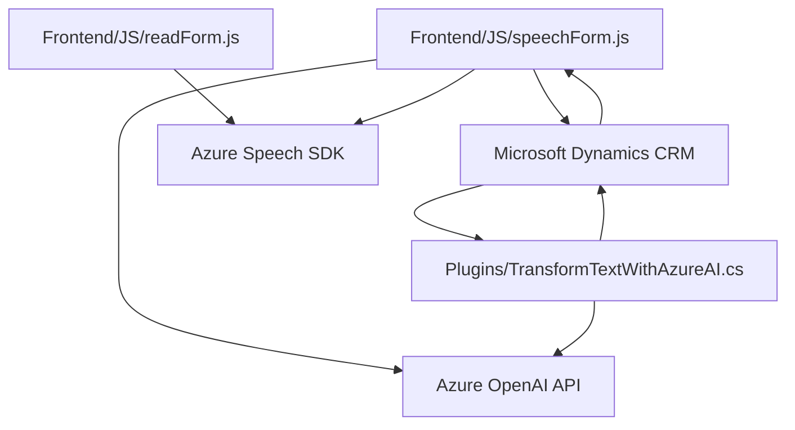

### Breve resumen técnico
Este análisis se basa en tres archivos principales de un proyecto ubicado en un repositorio GitHub. Los archivos pertenecen a un sistema que parece ser una integración de una solución para CRM (Dynamics 365) con capacidades de voz y procesamiento de lenguaje natural usando servicios en la nube, particularmente Azure Speech SDK y Azure OpenAI API.

---

### Descripción de arquitectura
La solución general implementa una arquitectura **de microservicios** orientada a eventos y a servicios externos (SOA), con una división clara entre tres componentes principales:
1. **Frontend**: Funcionalidades para interacción con usuarios en un navegador, integradas con SDKs de Azure Speech para realizar funciones de síntesis y reconocimiento de voz. Se integra además con APIs del backend para enviar y recibir datos.
2. **Backend (Plugin)**: Un plugin desarrollado utilizando el framework de Dynamics CRM y que interactúa con Azure OpenAI API para transformar texto según normas específicas que se programan.
3. **Servicio externo (Azure)**: Gestión de funcionalidades AI (reconocimiento de voz y OpenAI model) usando los servicios de Azure Cloud.

En términos de patrones:
- Se utilizan conceptos de **modularidad** permitiendo que cada funcionalidad sea una parte independiente del sistema.
- **Service-oriented architecture (SOA)** se observa en la interacción con múltiples API externas (Azure Speech SDK, Azure OpenAI, Dynamics CRM API).
- Hay elementos de **Command**, donde las transcripciones (en el frontend) actualizan internamente los campos del CRM.
- **Itinerario por eventos**: tanto la carga dinámica del SDK como el procesamiento de transcripciones dependen de eventos desencadenados.

---

### Tecnologías usadas
1. **Frontend web**:
   - **JavaScript**: Base del desarrollo en el lado cliente.
   - **Azure Speech SDK**: Para reconocimiento de voz y funcionalidad de síntesis de texto a audio.
   - **HTTP APIs**: Para llamar a servicios externos (API personalizada y Microsoft Dynamics CRM Web API).

2. **Backend**:
   - **Microsoft Dynamics CRM Plugin Framework**: Sistema de extensibilidad dentro de Dynamics para procesar y aplicar cambios a datos en modo servidor.
   - **Azure OpenAI API**: Usada para procesar texto con modelos avanzados como GPT-4.
   - **.NET / C#**: Lenguaje de desarrollo del plugin.
   - **System.Text.Json y Newtonsoft.Json.Linq**: Para manipulación de JSON en .NET.
   - **System.Net.Http**: Para comunicación HTTP con APIs.

---

### Diagrama Mermaid

---

### Conclusión Final
La solución analizada forma parte de una integración avanzada entre funcionalidades de voz y procesamiento natural, utilizando Microsoft Dynamics CRM como base y conectándose a servicios robustos de Azure Cloud. Su arquitectura claramente es de **microservicios con integración SOA**, lo cual permite escalabilidad y separación de módulos de responsabilidad. Sin embargo, se detecta un posible problema en la forma en la que se manejan las configuraciones sensibles (como el `apiKey`), que podría ser mitigado mediante el uso de configuraciones externas o sistemas de gestión de secretos.