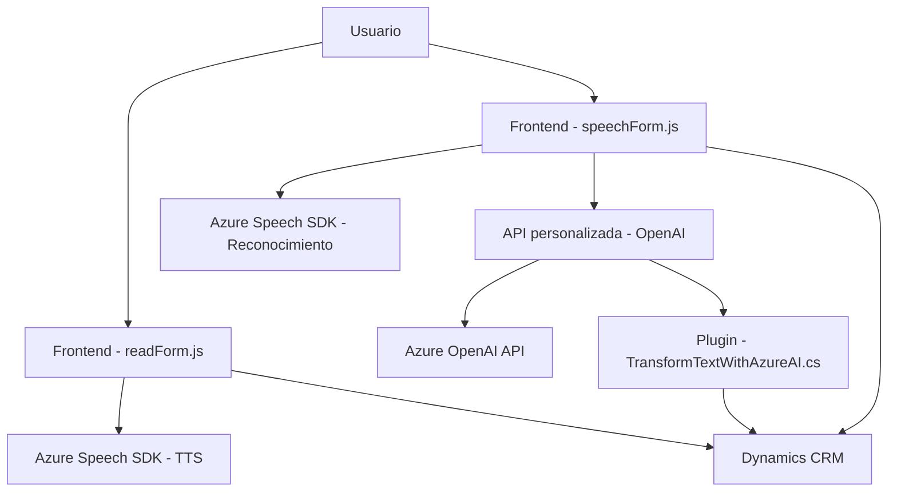

### Breve resumen técnico
El repositorio contiene archivos que indican una solución orientada a la integración de tecnologías de reconocimiento de voz, formulación de datos, y procesamiento de texto mediante servicios de Microsoft Azure, enfocados en aplicaciones de Dynamics CRM. Incluye un frontend para interacción con formularios, reconocimiento de voz, y síntesis TTS, junto con un plugin en .NET para extender funcionalidad mediante una API de OpenAI.

---

### Descripción de arquitectura
La solución tiende a ser modular y orientada a integrar múltiples capas y servicios externos, configurando una arquitectura híbrida con las siguientes características:

- **Frontend**: Código basado en JavaScript que implementa funciones para gestión de formularios y síntesis/reconocimiento de voz. Se comunica directamente con servicios de Azure (Speech SDK, Dynamics CRM).
- **Plugin Backend**: Extiende el framework de Microsoft Dynamics CRM mediante un plugin desarrollado en .NET. Incluye conexiones HTTP a servicios externos (Azure OpenAI API).

La arquitectura completa puede clasificarse como **"N-capas"**, donde:
1. **Presentación (Frontend)**: Implementación en JavaScript para interactuar con usuarios y formularios.
2. **Lógica de negocio (Plugin y Form Context)**: Transformación de datos de entrada en dinámicas empresariales usando APIs externas.
3. **Persistencia**: Gestão de datos mediante servicios de Dynamics CRM (e.g., `IOrganizationService`).

Adicionalmente, se observan patrones como:
- Modularización: División del código en funciones con responsabilidades bien definidas.
- Facade Pattern: Punto de entrada unificado en los aspectos de voz y funciones de reconocimiento/síntesis (`startVoiceInput`).
- API-driven con servicios de Microsoft Azure (Speech SDK y OpenAI).
  
---

### Tecnologías usadas
1. **Lenguajes de programación**:
   - **JavaScript**: Para la lógica del frontend.
   - **C# (.NET Framework)**: Para los plugins en Dynamics CRM.

2. **Frameworks**:
   - **Dynamics CRM SDK**: Para la integración de plugins en el sistema.
   - **Azure OpenAI API**: Para procesamiento avanzado de texto.
   - **Microsoft Azure Speech SDK**: Para reconocimiento de voz/síntesis de texto a voz.
   - **Xrm.WebApi**: Gestión de datos y llamadas internas dentro de Dynamics CRM.

3. **Principales paquetes/dependencias**:
   - `System.Net.Http`, `System.Text.Json` para gestión HTTP y procesos de JSON.
   - Posiblemente **Newtonsoft.Json** en ciertas partes del código .NET.
   - Carga dinámica del SDK de Speech para mejorar rendimiento y evitar dependencias adicionales.

---

### Diagrama **Mermaid**
A continuación, se presenta un diagrama simplificado de las interacciones entre los componentes principales de la solución:

---

### Conclusión final
La solución presenta una integración avanzada entre tecnologías de interfaz de usuario, reconocimiento de voz, síntesis TTS y procesamiento avanzado de texto. Está destinada a mejorar la interacción entre usuarios y formularios dentro de Dynamics CRM. 

La arquitectura sigue un diseño **modular y orientado a servicios**, aunque no adopta estándares más modernos como arquitectura hexagonal o microservicios. Es una solución eficaz para escenarios empresariales, pero podría beneficiarse de optimizaciones como la configuración centralizada de dependencias externas (e.g., claves Azure) y mejoras en la gestión de errores en plugins y APIs.