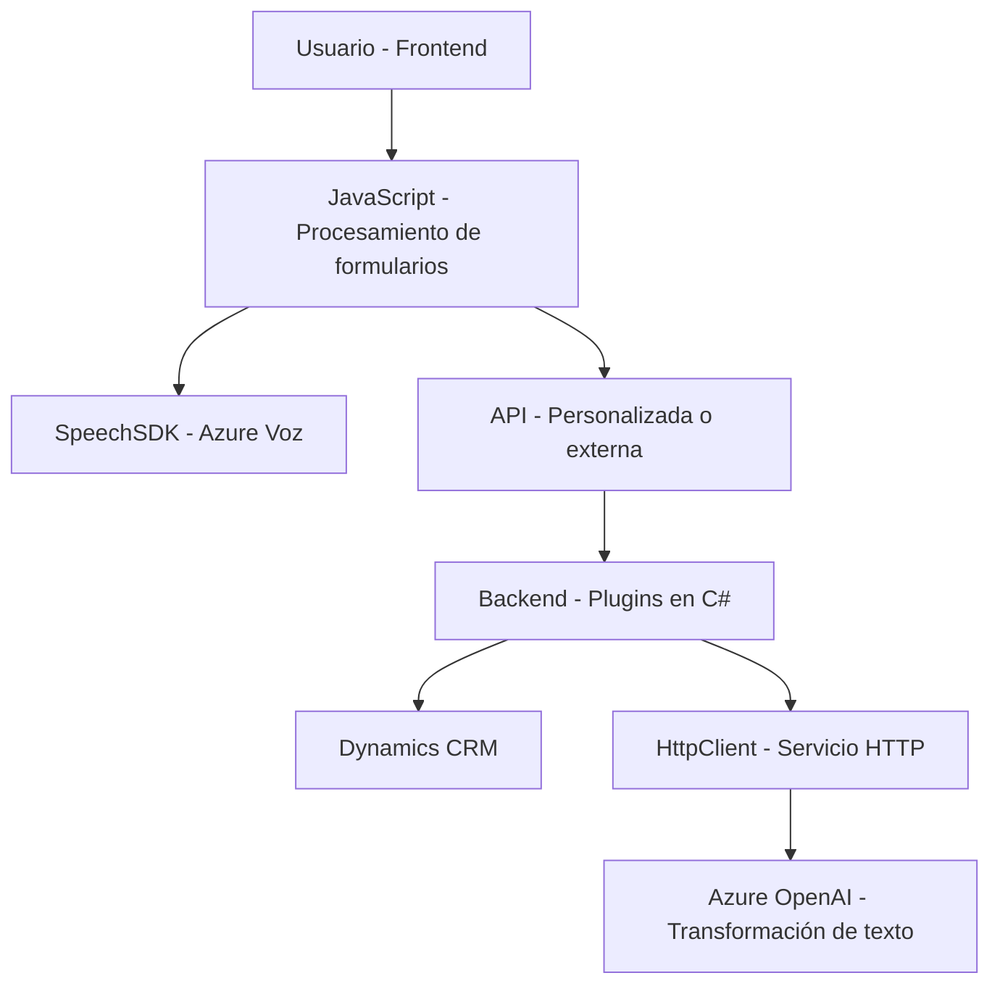

### Análisis técnico de la solución

#### **Breve resumen técnico**
El repositorio presenta una solución que implementa un conjunto de módulos para:
1. Procesamiento de formularios mediante entrada de texto y voz (frontend en JavaScript integrado con Azure Speech SDK).
2. Uso de plugins para Dynamics CRM que interactuan con Azure OpenAI para la transformación avanzada de datos en texto.
El repositorio combina lógica del lado del cliente (frontend) con extensiones del servidor mediante plugins en C#, integrados con servicios externos como Azure Speech y OpenAI.

---

#### **Descripción de arquitectura**
La solución utiliza una arquitectura **híbrida** combinando n-capas con integración a servicios externos en la nube:
1. **Frontend (JavaScript)**: Procesamiento de formulario y voz a texto usando Azure Speech SDK y llamadas a APIs externas.
2. **Extensiones en Dynamics CRM (C#)**: Implementa plugins mediante una arquitectura de **plugin-based extensibility**. Estas extensiones interactúan con Dynamics CRM para manipulación de datos y API externas como Azure OpenAI.
3. **Integración con APIs externas**:
   - Azure Speech SDK (para síntesis de voz y transcripción).
   - Azure OpenAI (para transformación avanzada de texto).

---

#### **Tecnologías usadas**
1. **Frontend**:
   - **JavaScript/ES6+**: Desarrollo modular y manipulación del DOM.
   - **Azure Speech SDK**: Procesamiento de entrada de voz y síntesis de texto a voz.
   - **APIs personalizadas**: Llamadas a APIs de análisis de texto.

2. **Backend**:
   - **C# (.NET Framework)**: Plugins para Microsoft Dynamics CRM.
   - **Microsoft Dynamics SDK**: Implementación de lógica basada en CRM.
   - **Azure OpenAI**: Generación y procesamiento de datos estructurados desde texto.
   - **HttpClient**: Solicitudes en el backend a servicios externos.
   - **JSON Libraries (Newtonsoft.Json, System.Text.Json)**: Procesamiento de JSON para manejar transformaciones complejas.

3. **Patrones de diseño y arquitectura**:
   - **Event-driven architecture**: Tanto para los eventos relacionados con el Speech SDK como los plugins de Dynamics CRM.
   - **SDK Integration**: Dependencia directa del Speech SDK y Dynamics SDK.
   - **Plugin-based extensibility pattern**: Plugins para agregar categorías de funcionalidades en el CRM.
   - **Externalized APIs**: Llamadas a OpenAI y Azure Speech para tareas específicas.

---

#### **Diagrama Mermaid**

El siguiente diagrama describe la solución y sus dependencias principales entre componentes:

---

#### **Conclusión final**
La solución implementa una arquitectura híbrida que combina un manejo y procesamiento de datos en formularios del frontend y una capa de extensibilidad en el backend mediante plugins de Dynamics CRM. También hace uso intensivo de SDKs y servicios externos basados en la nube (Azure Speech y OpenAI) para ejecutar procesos de voz y transformación avanzada de texto.

Los puntos fuertes son la modularidad y la integración con servicios en la nube, mientras que podrían mejorarse las prácticas de seguridad al evitar la incrustación de secretos como claves de API directamente en el código.