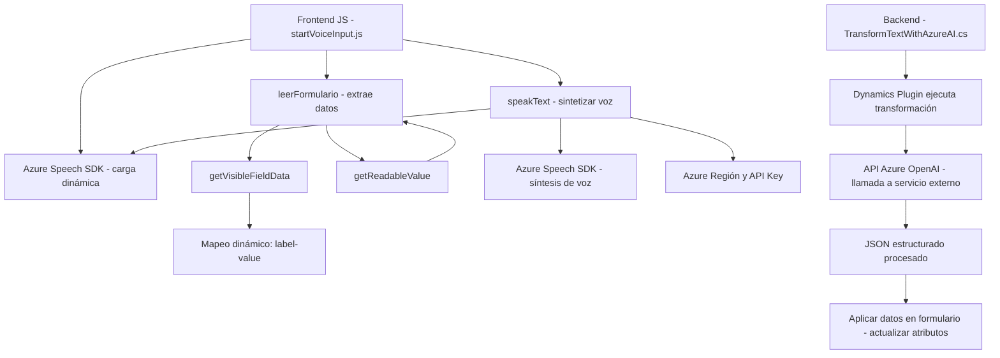

### Breve Resumen Técnico
El repositorio descrito está orientado al desarrollo funcional de una solución que integra la entrada y salida de voz con capacidades de procesamiento dinámico de datos y servicios de inteligencia artificial. Utiliza tecnologías avanzadas como **Azure Speech SDK** y **Azure OpenAI** para sintetizar, transcribir y transformar datos a nivel de cliente y servidor, integrándose con Dynamics 365.

---

### Descripción de Arquitectura
1. **Tipo de Solución:**
   El proyecto es una combinación de soluciones:
   - **Frontend-centric**: Implementado con JavaScript para interacción con usuarios y servicios.
   - **Backend Plugin**: Implementado en C# y utilizado como un plugin para Dynamics CRM.
   Además, emplea servicios externos (APIs) como Azure OpenAI y Speech SDK.

2. **Arquitectura:**
   El sistema utiliza una **arquitectura híbrida** con varias características:
   - **Interacción Cliente-Servidor:** Los scripts JavaScript actúan como la parte cliente (en frontend/formularios de Dynamics), mientras que el componente C# sirve para la lógica compleja en el backend, interactuando con APIs externas.
   - **Patrón de Plugins:** Aprovecha Dynamics CRM como base del sistema con extensiones basadas en plugins.
   - **Microservicios API:** Usa la API de Azure Speech para sintetizar y transcribir voz, y Azure OpenAI para transformar textos.

---

### Tecnologías Usadas
1. **Frontend:**
   - **JavaScript:** Para la creación de scripts que permiten la interacción en tiempo real con formularios y servicios.
   - **Azure Speech SDK**: Interfaz cliente para síntesis y transcripción de voz.
   - **Dynamics CRM Web API**: Integración con las API estándar y funcionalidad del CRM.

2. **Backend (Plugins en C#):**
   - **Microsoft Dynamics SDK:** Para implementar un plugin que interactúa con el modelo de Dynamics CRM.
   - **Azure OpenAI API:** Usada para transformación avanzada de texto en formato JSON estructurado y aplicable directamente en el CRM.
   - Bibliotecas .NET: Manejo de solicitudes HTTP (`System.Net.Http`), procesamiento de texto JSON (`System.Text.Json`, `Newtonsoft.Json.Linq`).

3. **Patrones de Diseño:**
   - **Adapter Pattern:** Por las capas entre el SDK, datos transcritos/texto hablado y las operaciones del formulario.
   - **Facade Pattern:** Simplificación de funcionalidades complejas (por ejemplo, `ensureSpeechSDKLoaded`).
   - **Microservicios:** Uso de APIs para realizar tareas específicas (como síntesis de voz y transformación de texto).

4. **Servicios Externos:** 
   - Azure Speech SDK para voz.
   - Azure OpenAI para transformación JSON y comprensión del lenguaje humano.

---

### Diagrama Mermaid

---

### Conclusión Final
El repositorio ejecuta una solución **clienteservidor** habilitada para voz y procesamiento avanzado de datos. Utiliza **microservicios y SDKs externos**, como los de **Azure Speech** y **OpenAI**, además de integrarse eficazmente a **Dynamics CRM** con un enfoque de plugins. La arquitectura es flexible y modular, con alto acoplamiento entre cliente y servidor a través de APIs especializadas. Esto la hace ideal para herramientas que optimizan la interacción dinámica con CRM y simplifican procesos manuales, como la entrada de datos por voz.