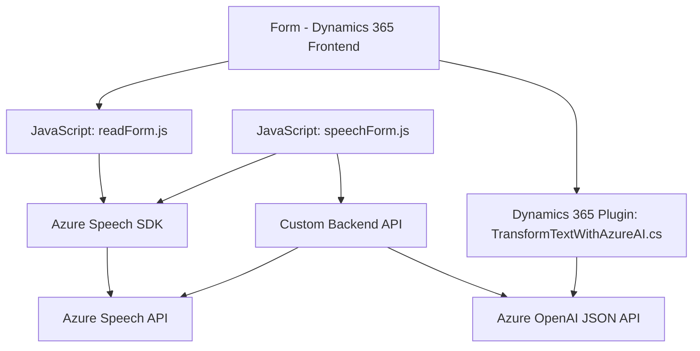

### Breve resumen técnico
Este repositorio implementa funcionalidades que integran servicios externos como Azure Speech SDK y Azure OpenAI con Dynamics 365. Su propósito es mejorar la experiencia de usuario mediante lectura de formularios, reconocimiento de voz y transformación de texto de entrada con IA. Incluye técnicas tanto para el cliente (frontend JavaScript) como para el backend (C# Plugin).

---

### Descripción de arquitectura
1. **Tipo de solución:** La solución es una **API complementaria** con un enfoque mixto:
   - **Frontend/JS:** Proporciona funcionalidades de integración y manipulación de datos visuales y reconocimiento de voz usando APIs de Azure Speech.
   - **Backend/C#:** Utiliza plugins configurados para Dynamics 365 que se ejecutan como microservicios conectados a Azure OpenAI API.

2. **Arquitectura global:** La solución implementa una **arquitectura híbrida**:
   - **Cliente:** Patrón basado en eventos y modularidad mediante servicios como Azure Speech SDK.
   - **Servidor:** Utiliza componentes de plugin APIs encapsulados, lo que se asemeja a ciertos principios de microservicios y arquitectura basada en eventos internos de Dynamics 365.

3. **Dependencias/Componentes externos:**
   - **Azure Speech SDK:** Para funcionalidades de reconocimiento de voz y síntesis de texto a voz (integrado en el cliente).
   - **Azure Cognitive Services (OpenAI):** Para transformar texto en formatos JSON estructurados (utilizado en el plugin backend).
   - **Xrm.WebApi:** Acceso y manipulación de datos en el sistema Dynamics 365.
   - **HTTP Services:** En el backend, llamadas a APIs mediante `HttpClient`.

4. **Patrones utilizados:**
   - **Carga dinámica:** Carga el SDK de Azure en el frontend solo si no está disponible.
   - **API Gateway:** La integración con external APIs sigue este patrón para la comunicación entre el cliente y el servidor.
   - **Encapsulación modular:** Generación de métodos especializados (por ejemplo, síntesis de texto a voz y procesamiento mediante IA).
   - **Evento-driven architecture:** El backend en Dynamics 365 responde de manera reactiva al contexto CRM.

---

### Tecnologías usadas
- **Frontend:** JavaScript.
- **Backend:** C# (.NET Framework).
- **Servicios externos:**
  - Azure Speech SDK (voz y audio).
  - Azure Cognitive Services (OpenAI para transformación de texto).
- **CRM Dynamics 365:** Plataforma principal del sistema.
- **Librerías**:
  - `System.Net.Http` para llamadas HTTP en el backend.
  - `System.Text.Json` para manejar datos JSON.
  - Xrm SDK para operaciones en el ecosistema de CRM.

---

### Diagrama **Mermaid** compatible con GitHub Markdown

---

### Conclusión final
Esta solución es una integración avanzada que combina servicios cognitivos de Azure con Dynamics 365 mediante un enfoque arquitectónico modular. En el frontend, facilita la interacción mediante reconocimiento de voz y síntesis con Azure Speech SDK y, en el backend, transforma datos con OpenAI API y los aplica dentro del contexto del CRM. Esta estructura permite extender fácilmente sus funcionalidades a otros casos de uso en aplicaciones empresariales. Sin embargo, la seguridad de las claves de API debe ser revisada, y se recomienda un sistema para su gestión (como Azure Key Vault).