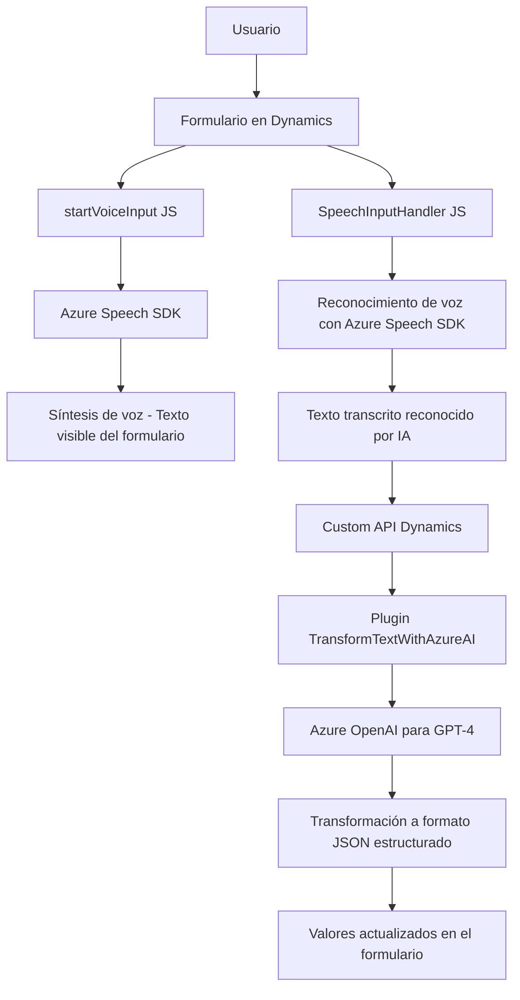

# **Resumen Técnico**

El repositorio contiene tres archivos con funcionalidades integradas con Dynamics CRM y Azure para procesos de reconocimiento y síntesis de voz junto con una API asociada a OpenAI para procesamiento avanzado de texto. 

Estos componentes permiten automatizar tareas relacionadas con formularios dinámicos como lectura en voz alta y entrada de datos mediante reconocimiento de voz, transformándolos en valores para los campos del formulario.

---

# **Descripción de Arquitectura**

1. **Solución:** API funcional + Frontend basado en Dynamics CRM Forms.
2. **Arquitectura:** 
   - Principalmente **cliente-servidor**.
   - Implementa patrones como **Plugin Architecture** (Dynamics CRM) y **carga condicional de dependencias**.
   - Se inclina hacia una arquitectura modular debido a la separación de funciones claras en los archivos.

---

# **Tecnologías Usadas**

1. **Frontend**:
   - **JavaScript**: Principal lenguaje para manipulación dinámica de formularios y consumo del SDK de Azure.
   - **Azure Speech SDK**: Para síntesis y reconocimiento de voz.
   - **Dynamics CRM Form Context**: Manejo de datos en formularios dinámicos (`executionContext`).

2. **Backend**:
   - **Microsoft Xrm SDK**: Para desarrollo de plugins en Dynamics CRM.
   - **Azure OpenAI API**: Procesamiento avanzado de texto con modelos GPT-4.

3. **Librerías adicionales**:
   - `System.Net.Http` y `Newtonsoft.Json` en el backend.
   - APIs personalizadas en Dynamics 365 (`trial_TransformTextWithAzureAI`).

---

# **Patrones Implementados**

- **Modularidad:** Las funciones y clases tienen responsabilidades claras, separadas por tarea.
- **Integración por capas:** Conexión entre cliente (Frontend), API (Azure Speech/OpenAI) y servidor (CRM Plugins).
- **Plugin Architecture:** Uso de la interfaz `IPlugin` en Dynamics CRM.
- **Service Factory Pattern:** Dynamics CRM utiliza fábricas de servicios como `IOrganizationServiceFactory`.
- **Carga condicional:** Carga dinámica de dependencias como el Azure Speech SDK.

---

# **Diagrama Mermaid**

---

# **Conclusión Final**

La solución arquitectónica presentada se alinea con el ecosistema Microsoft Dynamics CRM. El frontend implementa funcionalidades dinámicas mediante integración con Azure Speech SDK para síntesis y reconocimiento de voz, mientras que el plugin backend complementa el flujo funcional al interactuar con Azure OpenAI para análisis y transformación textual avanzada.

- **Fortaleza:** Modularidad y aprovechamiento de servicios en la nube para IA.
- **Debilidad:** Variables de configuración sensibles están directamente expuestas en el código fuente. Esto puede ser mejorado utilizando una estrategia de almacenamiento en configuraciones externas o variables seguras.