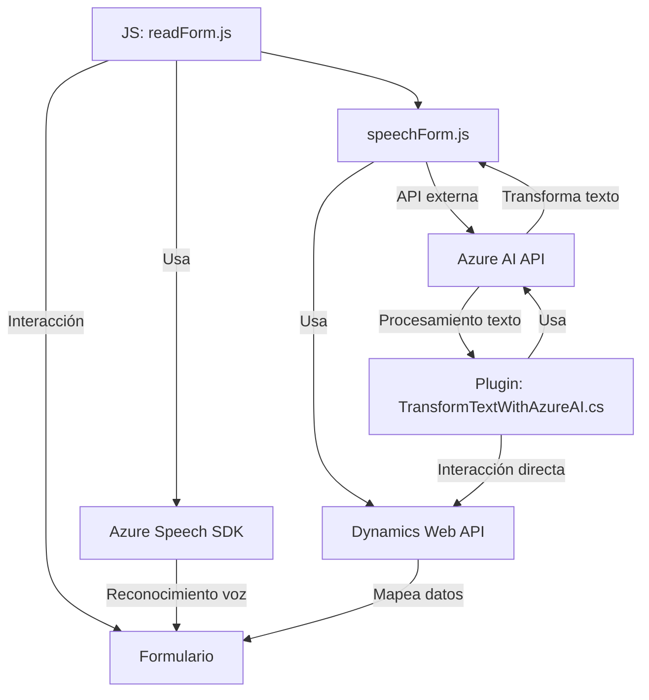

### Breve resumen técnico
El repositorio incluye tres archivos principales, cada uno desempeñando un rol complementario en una solución híbrida que combina cliente (frontend en JavaScript) y servidor (plugin de Dynamics CRM en C#). Está diseñado para integraciones con sistemas externos mediante APIs de Azure altamente especializadas en reconocimiento de lenguaje hablado y procesamiento avanzado de texto.

---

### Descripción de arquitectura
La arquitectura es una solución híbrida, mezcla cliente-servidor, diseñada para interactuar con un sistema CRM (Microsoft Dynamics 365) y con servicios de Azure, incluyendo Azure Speech SDK para entrada/salida de voz y Azure OpenAI para análisis y transformación de texto. 

El diseño sigue modelos de arquitectura orientados tanto al comportamiento de los datos como a la separación de responsabilidades. En particular:
1. **Clientes ligeros**: Los archivos en `FRONTEND/JS` están diseñados para ejecutar tareas específicas (procesar datos del formulario, reconocimiento y síntesis de voz) mientras delegan trabajo pesado a APIs externas.
2. **Plugins en CRM**: El archivo `TransformTextWithAzureAI.cs` añade capacidades extensibles al CRM mediante reconocimiento y transformación de textos.
3. **Modularidad y facades**: Las tareas se dividen en funciones que encapsulan la interacción con APIs externas y el modelo específico de procesamiento.

---

### Tecnologías utilizadas
- **Frontend (JS):** 
  - **Azure Speech SDK:** Para reconocimiento y síntesis de voz.
  - **Dynamic Script Loading:** Carga el SDK de Speech solo cuando es necesario.
  - **Dynamics 365 Web API:** Para realizar operaciones de lectura/escritura directamente con el CRM mediante solicitudes HTTP.
  - **Client-Side Modular Code:** Funciones pequeñas y reusables.
  
- **Backend (C#):**
  - **Microsoft Dynamics SDK:** Para construir el plugin que extiende las capacidades del CRM.
  - **Azure OpenAI:** Usado para procesamiento y análisis avanzado de lenguaje.
  - **Newtonsoft.Json**, **System.Text.Json**, **HttpClient:** Para serialización de datos JSON y comunicación HTTP con APIs externas.

---

### Dependencias y componentes externos
1. **Azure Speech SDK:** Para sintetizar voz y realizar reconocimiento automático desde formularios en el navegador.
2. **Dynamics 365 Web API:** Gestiona interacciones con entidades de formularios del CRM.
3. **Azure OpenAI:** Extiende procesamiento textual avanzado mediante lógica definida.
4. **Newtonsoft.Json:** Utilizado en el plugin para manejar estructuras JSON.
5. **API Dynamics Personalizada:** Archivo `speechForm.js` sugiere integración con APIs adicionales dentro de CRM, especialmente para reconocimiento contextual.

---

### Diagrama Mermaid

---

### Conclusión final
La solución presentada es un sistema híbrido orientado al contexto del CRM (Dynamics 365) y la asistencia avanzada mediante APIs de Azure (Speech SDK y OpenAI). La arquitectura demuestra integraciones eficientes tanto en el cliente como en el servidor. El frontend está diseñado como un cliente ligero que se comunica con backend extensible y externo. Además, el backend, implementado como plugin en Dynamics, aprovecha patrones de desacoplamiento y favorece la modularidad al procesar texto con Azure AI.

Este enfoque es ideal para escenarios donde la interacción por voz y AI enriquecen sistemas de CRM dinámicos, aunque la seguridad y robustez de las conexiones de API deben ser evaluadas continuamente.