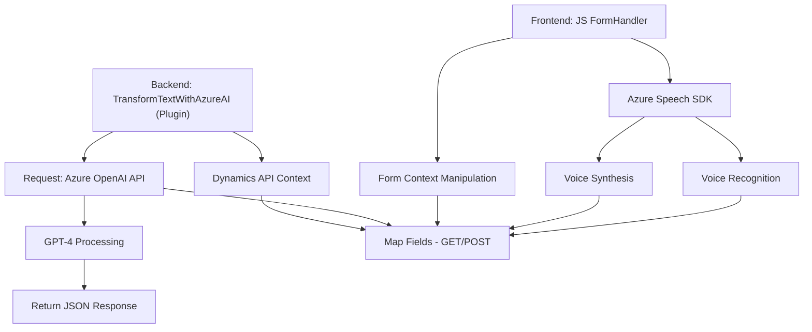

### Resumen Técnico
El repositorio integra funcionalidades relacionadas con el manejo de formularios en una aplicación orientada al CRM Dynamics, introduciendo dos aspectos principales basados en servicios externos:
1. Uso de reconocimiento de voz y síntesis usando el SDK de Azure Speech, desplazando datos del formulario entre entrada y salida.
2. Transformación de texto mediante Azure OpenAI para preprocesar datos y retornar estructuras definidas por reglas.

---

### Descripción de Arquitectura
La solución opera con una arquitectura **híbrida**, donde se integran capa de frontend y backend:
1. **Frontend:** Modular y orientado a servicios externos (Azure Speech SDK).
2. **Backend:** Plugin basado en el modelo de Dynamics CRM extensible, que delega procesamiento a servicios externos mediante un diseño de microservicio (Azure OpenAI).
3. **Patrones via Decoupling:** Existe una separación de responsabilidades clara entre frontend, backend y los servicios externos, aplicando correctos principios de modularidad y desacoplamiento.

---

### Tecnologías Usadas
1. **Frontend:**
   - *JavaScript*: Para gestión dinámica del formulario y la implementación del SDK de voz.
   - Azure Speech SDK: En la capa de frontend para manejar reconocimiento y síntesis de voz.
   - Dynamics CRM APIs (`Xrm.WebApi` y Form Context): Enlace y mapeo de datos del formulario.
   
2. **Backend:**
   - *C#*: Desarrollo de plugins dentro de Dynamics CRM.
   - *Azure OpenAI*: Transformación basada en IA (GPT-4).
   - *HTTP Client & JSON*: Manejo de solicitudes REST y serialización.

3. **Patrones Adicionales:**
   - Delegación/Callback: Carga dinámica del SDK en el navegador.
   - Orientación a contexto: Adaptación a ejecución basada en el contexto del formulario.

---

### Dependencias o Componentes Externos
1. **Frontend:**
   - Azure Speech SDK.
   - Form Context de Dynamics CRM (`Xrm.WebApi`, etc.).
   
2. **Backend:**
   - Azure OpenAI (GPT-4 API).
   - Framework estándar de Dynamics CRM para plugins (`Microsoft.Xrm.Sdk`).

3. **Componente Externo Compartido:**
   - Integración de APIs REST para intercambiar datos con servicios externos.

---

### Diagrama **Mermaid**

---

### Conclusión Final
El sistema combina funcionalidad de frontend y backend para manejar datos de formularios de manera innovadora, integrando reconocimiento de voz y procesamiento de texto con soluciones en la nube (Azure Speech y Azure OpenAI). Usa un diseño eficiente basado en patrones bien definidos de modularidad, delegación y desacoplamiento, y funciona como un puente entre la experiencia del usuario y los servicios avanzados de inteligencia artificial.