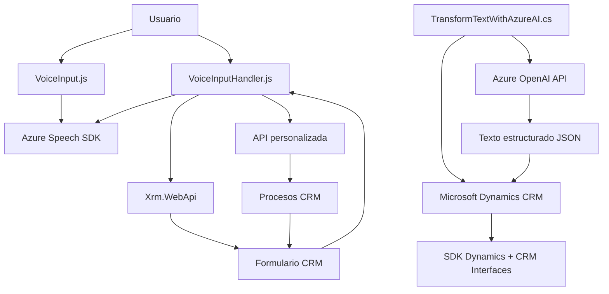

### Breve resumen técnico
El repositorio implementa funcionalidades relacionadas con reconocimiento y síntesis de voz mediante el **Azure Speech SDK** y procesamiento de texto con servicios de **Azure OpenAI** dentro de un ecosistema CRM (Dynamics CRM). Los módulos de JavaScript manejan interactividad basada en formularios dinámicos y el plugin de C# actúa como middleware para transformar texto basado en normas definidas.

---

### Descripción de la arquitectura
La solución combina una arquitectura de **n capas** con una integración orientada a servicios. En el frontend, se ejecuta la interacción entre usuarios y formularios mediante JavaScript. En el backend, el plugin de C# encapsula la lógica para la transformación avanzada de texto, actuando como un conector entre Dynamics CRM y los servicios de Azure OpenAI. Los patrones observados incluyen integración dinámica (SDK de Azure) y diseño modular orientado a eventos.

La arquitectura general se organiza en:
1. **Frontend (JavaScript)**:
   - Implementación de interacción específica entre formularios y servicios externos.
   - Gestión de SDKs dinámicos y procesamientos en tiempo real.
   
2. **Backend (Dynamics plugins con C#)**:
   - Lógica empresarial que une el CRM con servicios de IA de Azure OpenAI, mediante APIs REST.

---

### Tecnologías utilizadas
1. **Frontend**:
   - **JavaScript**: Para la interacción entre usuarios y formularios dinámicos.
   - **Azure Speech SDK**: Usado para reconocimiento y síntesis de voz.
   - **CRM Framework API (`Xrm.WebApi.online`)**: Para consultas y asignaciones en formularios dinámicos.

2. **Backend**:
   - **C# (Plugin para Dynamics CRM)**: Requiere bancos de servicios de Microsoft Dynamics CRM.
   - **Azure OpenAI REST API**: Para transformaciones avanzadas de texto.
   - Librerías .NET relacionadas: `Microsoft.Xrm.Sdk`, `System.Net.Http`, `Newtonsoft.Json.Linq`, `System.Text.Json`.

---

### Diagrama Mermaid

---

### Conclusión final
Esta solución representa un ecosistema híbrido bien diseñado que integra frontend, backend y servicios externos utilizando tecnologías modernas. En el **frontend**, el énfasis está en la interacción entre usuarios, voz y formularios mediante SDKs de Azure y programación en JavaScript, mientras que el **backend** maneja transformaciones avanzadas de texto mediante **Azure OpenAI API**. Aunque el diseño sigue una arquitectura modular basada en capas, también contiene aspectos de un diseño orientado a servicios facilitados por APIs externas.

La solución muestra una implementación robusta, especialmente útil en escenarios de automatización y mejora de accesibilidad para entornos CRM dinámicos.