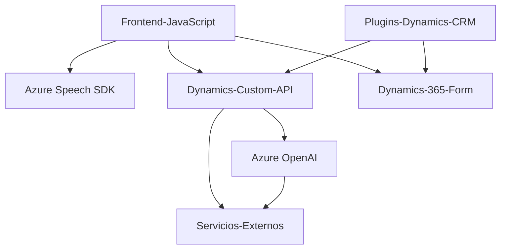

### Breve resumen técnico

Los archivos analizados forman parte de una solución integrada destinada a utilizar procesamiento de voz y transformación de datos textuales en Microsoft Dynamics CRM. El sistema proporciona funcionalidad avanzada de reconocimiento de voz y procesamiento de texto mediante servicios de Azure, incluyendo Azure Speech SDK y Azure OpenAI.

---

### Descripción de arquitectura

La solución utiliza una **arquitectura modular basada en servicios y plugins**. Los componentes están estructurados como módulos independientes que interactúan con APIs y servicios de terceros, y aprovechan el ecosistema de Dynamics CRM para integrarse y realizar operaciones sobre formularios de usuario en tiempo real.

- **Arquitectura global:** Híbrida, con elementos de n-capas y microservicios utilizando servicios externos como el Azure Speech SDK y Azure OpenAI.
- **Frontend:** Compuesta por scripts JavaScript diseñados para manejar la lógica de reconocimiento de voz y para procesar el contenido y sustituir valores en formularios de Dynamics.
- **Plugins:** Basados en el framework de plugins de Dynamics CRM, extendiendo funcionalidades a través de eventos del CRM.

---

### Tecnologías usadas

1. **Azure Speech SDK**:
   - Síntesis y reconocimiento de voz, integración en tiempo real.
   - Cargado dinámicamente desde su CDN en el frontend.

2. **Azure OpenAI**:
   - Procesamiento de texto con modelos como GPT-4.
   - Servicio externo accesible mediante HTTP.

3. **Dynamic 365 CRM SDK**:
   - Gestión de eventos y interfaces para manipulación de datos en formularios.

4. **JavaScript**:
   - Modularización basada en funciones específicas para procesamiento de voz y manejo de datos de formularios.

5. **C# (.NET)**:
   - Implementación de plugins mediante la interfaz `IPlugin`.

6. **HttpClient**:
   - Comunicación directa con APIs externas en el plugin de C#.

7. **JSON**:
   - Serialización y deserialización de datos estructurados.

---

### Diagrama Mermaid válido para GitHub

---

### Conclusión final

La solución es una integración avanzada orientada a enriquecer la experiencia de usuario en Microsoft Dynamics CRM mediante herramientas modernas de entrada de voz y procesamiento de texto. Utiliza una arquitectura híbrida perfecta para escenarios empresariales que requieren la colaboración entre sistemas internos como Dynamics 365 y servicios avanzados de IA en la nube.

Las fortalezas del diseño radican en:
- Modularidad: los componentes son autónomos y fáciles de escalar.
- Uso efectivo de servicios externos como Azure Speech SDK y Azure OpenAI.
- Cumplimiento de patrones de n-capas y desacoplamiento.

Sugiero una evaluación periódica del estado de las APIs externas y una implementación adecuada de mecanismos de caché o fallback para casos de inestabilidad en servicios externos. Además, la incorporación de pruebas-unitarias y de integración garantizará la robustez del proyecto en evoluciones futuras.