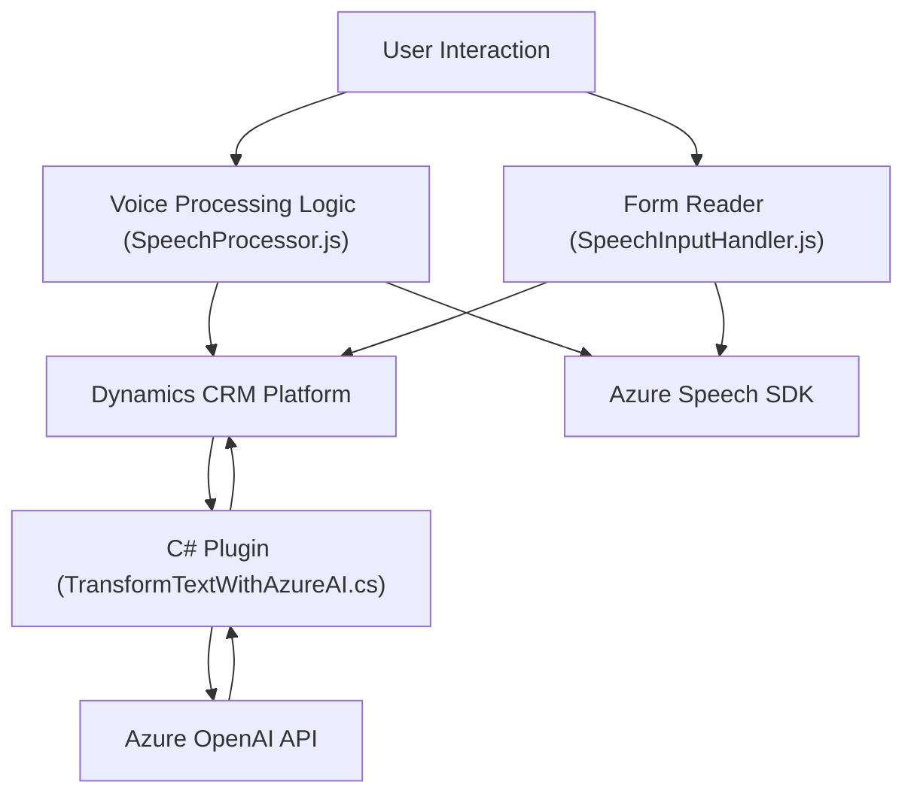

### Breve resumen técnico
El repositorio combina funcionalidades orientadas a procesamiento de voz y texto en el contexto de formularios y datos estructurados, específicamente para una plataforma CRM (Dynamics 365). Utiliza tecnologías como Azure Speech SDK y Azure OpenAI para reconocimiento de voz, síntesis de texto a voz y procesamiento de texto mediante IA.

---

### Descripción de la arquitectura
La arquitectura de este sistema puede clasificarse como una **arquitectura basada en eventos con comunicación asincrónica**. Los archivos JavaScript trabajan con el cliente Dynamics 365 bajo un modelo de integración mediante SDKs de terceros (Azure Speech y OpenAI), mientras que los plugins en C# integran procesamiento avanzado en el backend mediante eventos del sistema CRM.

El diseño sigue principios modulares y acopla el cliente con sistemas externos utilizando patrones como el **Adapter Pattern**. Los eventos/formularios actúan como los desencadenantes para las interacciones con las APIs y el procesamiento interno.

---

### Tecnologías usadas
1. **Frontend (JavaScript)**:
   - **Azure Speech SDK**: Para el reconocimiento y síntesis de voz (entrada y salida de voz).
   - **Dynamics 365 JavaScript API**: `executionContext`, `Xrm.WebApi.online`, `formContext`.

2. **Backend (C#)**:
   - **Plugins de Dynamics 365 CRM**: Extensiones usando la interfaz `IPlugin`.
   - **Azure OpenAI REST API**: Para el uso de IA en la transformación de texto.
   - **Bibliotecas**:
     - `System.Net.Http` y `Newtonsoft.Json` para consumo de APIs REST.
     - `System.Linq` y `Microsoft.Xrm.Sdk` para la manipulación de datos en Dynamics.

3. **Patrones**:
   - **Event-driven programming**: Interacciones basadas en eventos desencadenados por usuarios o actualizaciones de formularios.
   - **Adapter Pattern**: Conexión con APIs externas.
   - **Single Responsibility Principle**: Módulos/funciones con responsabilidades específicas.

---

### Diagrama Mermaid
El siguiente diagrama representa una visión simplificada de las interacciones entre los componentes principales:

---

### Conclusión final
Esta solución representa una **integración avanzada de servicios de voz y procesamiento de texto** para la automatización de operaciones en Dynamics 365 CRM. Mediante el uso de **Azure Speech SDK** y **Azure OpenAI**, el sistema habilita capacidades modernas de entrada de voz y generación de texto audible. La arquitectura definida es modular, orientada por eventos y se comunica con APIs externas de manera desacoplada.

Si bien la incorporación de servicios dinámicos aporta escalabilidad, la seguridad de las claves de acceso podría mejorarse mediante un manejo centralizado y encriptado. El sistema tiene un diseño robusto para expandir funcionalidades, como agregar soporte a otros idiomas y modos de procesamiento avanzado mediante Inteligencia Artificial.