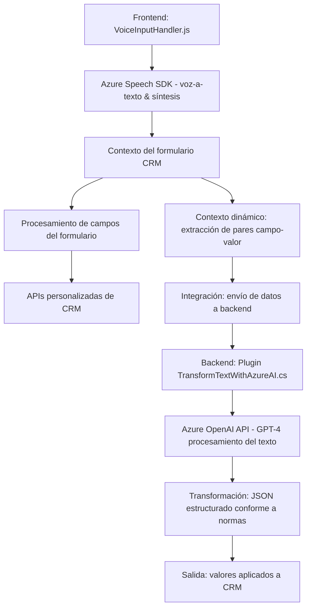

### Resumen Técnico
El repositorio parece ser una solución orientada a la integración entre **Microsoft Dynamics CRM**, servicios **Azure Speech SDK**, y **Azure OpenAI API**. Su foco principal está en procesar datos de formularios y aplicarlos usando entrada por voz o inteligencia artificial basada en cloud computing.

---

### Descripción de Arquitectura
La solución sigue principalmente una arquitectura **n-capas** con módulos separados:
- **Frontend (JavaScript)**: Realiza integración con Azure Speech SDK para captura de voz, síntesis, y procesamiento local de formularios.
- **Backend (Plugin de Dynamics CRM)**: Define lógica personalizada utilizando Dynamics CRM y el servicio Azure OpenAI para transformar texto en estructuras JSON aplicables al sistema.
- **Externo (Servicios Azure)**: Extenso uso de Azure Speech SDK y Azure OpenAI para tareas que requieren procesamiento de IA o capacidades de voz.

Dentro del patrón **n-capas**, se implementan tecnologías de comunicación con API para enviar y recibir datos, junto con principios de modularización para dividir funcionalidades específicas (voz, AI, transformación de datos).

---

### Tecnologías Usadas
1. **Frontend:**
   - **Azure Speech SDK**: Manejo de entrada por voz y síntesis de voz.
   - **JavaScript**: Uso de funciones como `Promise` y manejo de contexto (`executionContext`) dentro de entornos CRM para formularios dinámicos.
   - **Manipulación de contextos de CRM**: APIs para operatividad sobre entidades y campos dinámicos de Dynamics CRM.

2. **Backend:**
   - **C# (Framework .NET)**: Implementación de plugins compatibles con **Dynamics CRM**.
   - **Azure OpenAI API (GPT-4)**: Procesamiento avanzado de texto a través de un modelo de inteligencia artificial en la nube.

3. **Servicios Externos:**
   - **Azure Speech SDK** y **Azure OpenAI API**: Integración cloud con herramientas orientadas a procesamiento de lenguaje.

4. **Patrones:**
   - **Modularización**: Separación clara de funcionalidades (voz, lógica de AI, procesamiento de formularios).
   - **Plugin Architecture** y **SOA**: Uso explícito de servicios externos de Azure dentro de plugins que interactúan con eventos de CRM.

---

### Dependencias y Componentes Externos
- **Azure Speech SDK**: Gestión de captura por voz y síntesis de texto hablado.
- **Azure OpenAI API**: Uso del modelo GPT-4 para transformación de texto.
- **Microsoft Dynamics CRM**: APIs internas como `executionContext`, `formContext`, etc., para manejar datos e integrar plugins personalizados.
- **JSON Libraries**: Utilización de `Newtonsoft.Json` y `System.Text.Json` para manipulación y transformación de estructuras JSON.

---

### Diagrama Mermaid

---

### Conclusión Final
El repositorio define una solución n-capas que integra mediante plugins y JavaScript, servicios avanzados de reconocimiento de voz y procesamiento de AI desde Azure. Esto permite capturar datos dinámicos de formularios, aplicar transformaciones basadas en un modelo GPT-4, y usar síntesis de voz para una experiencia interactiva.

Aunque bien estructurado, el sistema depende en mayor medida de servicios externos, exponiendo posibles vulnerabilidades relacionadas con conexión a internet, acceso a credenciales de Azure, y manejo de fallos en servicios cloud. No obstante, se logra una arquitectura flexible adecuada para entornos CRM, capaz de expandirse para satisfacer necesidades de interacción humana-machine.