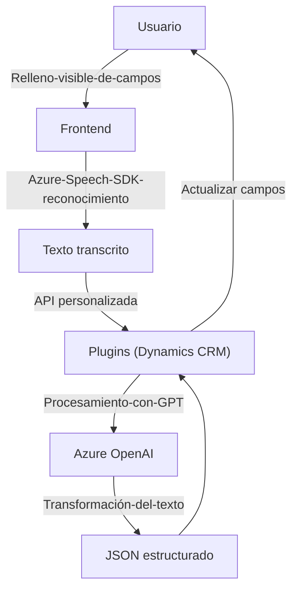

# Análisis Técnico

## **Breve resumen técnico**
El repositorio describe partes de una solución que combina funcionalidades frontend con backend en un sistema basado en Dynamics CRM, integrado con servicios de Azure Speech y Azure OpenAI. Los archivos muestran componentes para:
1. Capturar, procesar y sintetizar texto a voz basado en los datos de formularios dinámicos.
2. Interactuar con un formulario CRM de Dynamics 365 donde se aplican valores obtenidos por reconocimiento de voz y procesamiento de IA.
3. Implementar un plugin en C# dentro de Dynamics CRM para realizar transformaciones al texto utilizando el modelo GPT de Azure OpenAI.

---

### **Tipo de solución**
La solución está basada en **Frontend**, **plugins de backend para Dynamics CRM**, y **servicios cloud de Microsoft Azure**. En conjunto, tiene:
1. **Frontend**: Funcionalidades de interacción con el usuario y voz mediante Azure Speech SDK.
2. **Backend/Plugins**: Lógica integrada con Dynamics CRM usando plugins (.NET) para trabajar con datos transformados por Azure OpenAI.

Es una solución **híbrida** que mezcla estas capas con una fuerte integración con servicios externos.

---

## **Descripción de arquitectura**
La solución parece combinar aspectos de **arquitectura orientada a servicios (SOA)** y **arquitectura en n capas** para comunicar las diferentes piezas: 
- **Capa de presentación (Frontend/JS)**: Realizando interacción directa con el usuario, reconocimiento de voz y síntesis.
- **Capa de aplicaciones (Backend - Plugin en C#)**: Sirve como middleware para ejecutar lógica en el servidor, transformaciones de datos con OpenAI, y actualizar entidades CRM.
- **Servicios externos y APIs**: La arquitectura integra el SDK de Azure Speech y la API de OpenAI para llevar a cabo funciones avanzadas como la conversión de texto a voz y transformación lingüística por IA.

---

## **Tecnologías usadas**
1. **Frontend**:
   - **JavaScript**: Utilizado para las funcionalidades de síntesis y reconocimiento de voz, lectura de formularios, y manipulación del DOM.
   - **Azure Speech SDK**: Para texto a voz y reconocimiento de voz en el navegador.
   - **Dynamics 365 Web API (`Xrm.WebApi`)**: Interacción directa con los datos del formulario en CRM.
2. **Backend (Plugins)**:
   - **C# (.NET Framework)**: Desarrollo de plugins utilizando normas de Dynamics CRM.
   - **Azure OpenAI (modelo GPT)**: Procesa y transforma texto mediante peticiones HTTP desde el plugin.
3. **Servicios externos**:
   - **Azure Speech**: Servicios integrados para reconocimiento y síntesis de voz.
   - **Azure OpenAI GPT**: Generación de transformaciones semánticas avanzadas.

---

## **Diagrama Mermaid**
Componentes y flujo entre el frontend, backend y terceros servicios en Azure:

### **Diagrama descripción**
- Los usuarios interactúan con un formulario dinámico dentro de Dynamics CRM mediante la interfaz frontend.
- El frontend utiliza el SDK de Azure Speech para capturar entrada de voz y la API personalizada para enviar transcripciones textuales al backend.
- Los plugins en el backend de Dynamics CRM interactúan con Azure GPT, procesan las transcripciones y transforman los datos en formato estructurado para actualizar campos del formulario.
- El resultado afecta directamente el formulario visible en el CRM, creando un flujo cíclico entre usuario, componente de frontend y backend.

---

## **Conclusión final**
Este repositorio parece ser una parte de una solución integral cuyo objetivo es enriquecer la experiencia del usuario en un entorno Dynamics CRM con tecnologías avanzadas de voz e inteligencia artificial:
1. **Modalidad de integración**: La solución presenta una integración profunda de servicios nativos de Azure, ofreciendo beneficios como síntesis de voz y capacidades de IA (GPT) para mejorar la dinámica de los formularios en CRM.
2. **Arquitectura eficaz**: Usa patrones de modularidad, orquestación por servicios y desacoplamiento para garantizar reutilización y escalabilidad.
3. **Diagrama compatible**: El diagrama generado es simple y explica claramente los principales pasos y componentes sin usar características que violen compatibilidad en GitHub Markdown (Mermaid).

La solución está muy enfocada en aplicaciones empresariales, especialmente en entornos CRM como Dynamics 365, con soporte para operaciones avanzadas a nivel de servicios cognitivos en Azure.