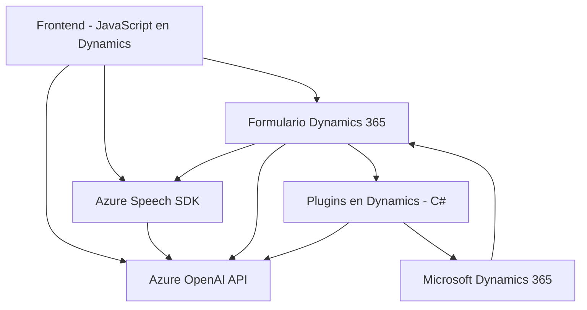

### Breve Resumen Técnico:
Este repositorio parece estar desarrollado para la integración entre formularios de Microsoft Dynamics 365 y los servicios de Azure. Sus principales componentes se centran en aprovechar el **Azure Speech SDK** y **Azure OpenAI API** para realizar tareas de accesibilidad y procesamiento de voz y texto mediante inteligencia artificial. Se incluyen soluciones para síntesis de voz, reconocimiento de voz y procesamiento de texto mediante un plugin en Dynamics CRM.

---

### Descripción de Arquitectura:
La arquitectura sigue principalmente un diseño **modular**, donde cada archivo cumple un rol específico:
- La capa frontend se integra con los formularios de Dynamics 365 utilizando JavaScript.
- Se emplean APIs externas como Azure Speech SDK y Azure OpenAI para operaciones avanzadas de voz y procesamiento de texto.
- En el backend, la arquitectura está centrada en un patrón de **plugin-driven development** específico para Dynamics CRM. Esto permite añadir funcionalidad personalizada en eventos del sistema de Dynamics.

Aunque utiliza límites de integración modular, el diseño general puede considerarse una arquitectura **multicapa**, con interacción entre:
- **Capa de presentación**: Scripts de frontend (JavaScript).
- **Capa de lógica de negocio/servicios**: Plugins de Dynamics CRM y operaciones procesadas por Azure.
- **Capa de datos**: Formularios de Dynamics 365 y APIs externas.

---

### Tecnologías Usadas:
1. **Frontend (para Dynamics 365)**:
   - **JavaScript**
   - **Azure Speech SDK**:
     - Usado para el reconocimiento y síntesis de voz.
     - Importado mediante un script remoto de Azure.
     - Funciones relacionadas: `startVoiceInput`, `speakText`, etc.
   - Funcionalidad dinámica vinculada al objeto `executionContext` de Microsoft Dynamics.

2. **Backend (Plugins)**:
   - **C#/.NET Framework**:
     - Implementación de `IPlugin` para desarrollo de plugins de Dynamics CRM.
     - Manejo de solicitudes API mediante `HttpClient` (para Azure OpenAI).
   - **Azure OpenAI API**:
     - Modelos como GPT utilizados para procesamiento avanzado de texto.

3. **Plataformas y Frameworks**:
   - **Microsoft Dynamics 365 CRM**
   - **Azure AI Services** (Speech + OpenAI)
   - **Microsoft.Xrm.Sdk** (para manejo de plugins en Dynamics).

---

### Diagrama Mermaid:

---

### Conclusión Final:
Este proyecto representa una solución **integrada** que combina la capacidad de los servicios Azure AI (Speech y OpenAI) con la plataforma de Microsoft Dynamics 365. La arquitectura modular permite que los componentes trabajen en conjunto para ofrecer funcionalidad enfocada en accesibilidad (síntesis y reconocimiento de voz) y procesamiento de texto estructurado, lo que resulta ideal para formularios empresariales.  
Además, el patrón de interacción entre frontend (JavaScript) y las capas de negocio/datos (Dynamics y Azure) brinda una integración robusta para sistemas CRM modernos. Sin embargo, es fundamental considerar el manejo de dependencias externas (como SDK de Azure y APIs) con un enfoque DDD o desacoplo más rígido para mejorar la flexibilidad y escalabilidad a futuro.