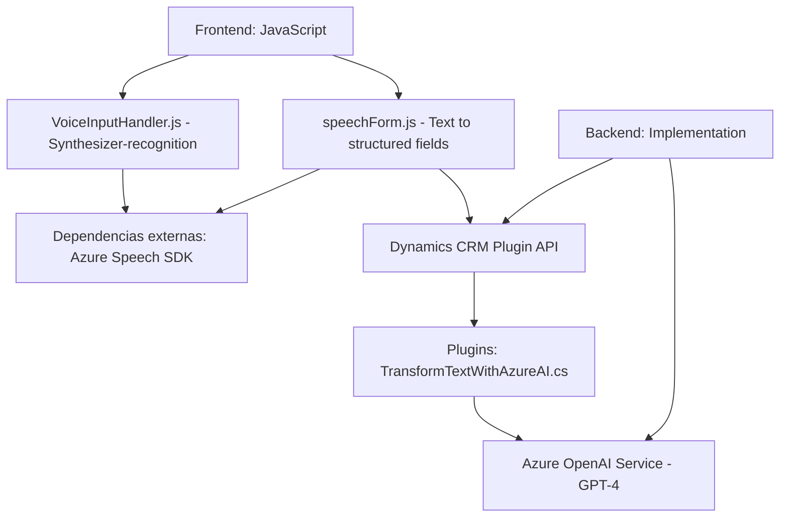

### Breve resumen técnico:
El repositorio contiene tres archivos principales que implementan funcionalidades específicas, interconectadas para gestionar formularios en un entorno empresarial basado en Microsoft Dynamics 365 y Azure. Se enfoca en la entrada por voz y el procesamiento dinámico de datos estructurados mediante tecnologías avanzadas como Azure Speech SDK y Azure OpenAI Service.

---

### Descripción de la arquitectura:
La solución parece ser un **sistema híbrido** compuesto por:
1. **Frontend basado en JavaScript:** Manejo dinámico del SDK de Azure Speech para reconocimiento y síntesis de voz, además de la interacción directa con formularios en un navegador.
2. **Backend de Dynamics 365 (plugins en C#):** Incluye un plugin que se integra con Azure OpenAI para procesar y transformar textos en JSON estructurado.
3. **Integración dinámica vía API externa:** Ambas capas (frontend y backend) interactúan con tecnologías de Microsoft Azure, lo que sugiere una arquitectura **orientada a servicios**.

Aunque utiliza una arquitectura híbrida, el sistema es principalmente monolítico con capacidad de integración a servicios externos, reflejando elementos de una arquitectura de **n capas** (frontend, backend + negocio, integración).

---

### Tecnologías y frameworks usadas:
1. **Frontend:**
   - **JavaScript:** Principal lenguaje para manejar lógica en el navegador.
   - **Azure Speech SDK:** Realiza reconocimiento y síntesis de voz.
   - **Dynamics 365 Web API (`Xrm.WebApi`)**: Utilizado para conectar y manipular los formularios de Dynamics.

2. **Backend:**
   - **C#.NET (Microsoft Dynamics Plugin):** Implementa lógica de negocio personalizada que transforma datos en el backend de Dynamics.
   - **Newtonsoft.Json:** Serialización/deserialización de objetos JSON.
   - **System.Net.Http:** Realiza solicitudes HTTP al servicio de OpenAI.
   - **Azure OpenAI Service:** Procesamiento de textos con IA.

---

### Diagrama Mermaid válido para GitHub:

---

### Conclusión final:
La solución consolidada sugiere una arquitectura orientada a servicios y adaptada para trabajar con Dynamics 365 y Azure. Se observa un enfoque modular y desacoplado en el diseño, con interacción entre el frontend basado en JavaScript y el backend de Dynamics mediante API, apoyándose en SDK y servicios externos. Esto la hace escalable y mantenible, aunque todavía dependiente de una plataforma monolítica centralizada (Dynamics CRM). 

Para una mayor inversión en escalabilidad y flexibilidad, podría implementarse una arquitectura de microservicios que distribuya responsabilidades más granularmente y reduzca la dependencia en Dynamics y sus plugins. Sin embargo, para el caso de uso actual, la solución es efectiva y bien estructurada.