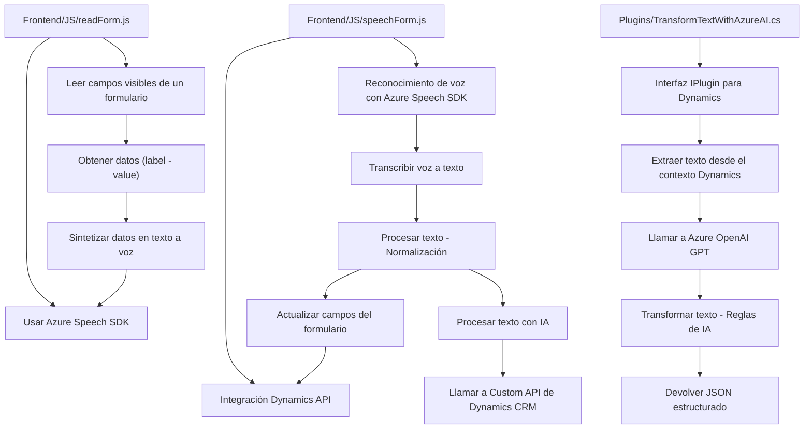

### Breve Resumen Técnico:
El repositorio contiene tres componentes principales: `readForm.js`, `speechForm.js`, y `TransformTextWithAzureAI.cs`. Juntos forman una solución orientada al reconocimiento, síntesis de voz y procesamiento de texto mediante la integración con **Azure Speech SDK**, **Azure OpenAI** y **Microsoft Dynamics CRM plugin architecture**. Cada archivo tiene su propio enfoque: la interacción con formularios (lectura y actualización de campos por voz), la integración con APIs y SDKs externos (Speech y Dynamics CRM), y el uso de inteligencia artificial con Azure OpenAI para transformar texto.

---

### Descripción de la Arquitectura:
La solución sigue una arquitectura **n-capas** enfocada en la separación de responsabilidades entre:
1. **Presentación**: Filesystem del "Frontend/JS" con componentes y scripts que interactúan directamente con formularios en la interfaz de usuario (lectura y voz).
2. **Lógica de negocio**: Scripts JS que procesan voz y datos, y el plugin `.cs` que realiza tareas avanzadas de transformación de texto.
3. **Integración externa**: Dependencias con servicios externos como Azure OpenAI y Speech SDK. El plugin actúa como la capa integradora hacia Cognitive Services.

La arquitectura aplica patrones como **Modularidad**, **Evento-Asíncrono**, **Integración basada en API Gateway**, y **Single Responsibility Principle**.

---

### Tecnologías Usadas:
1. **Javascript y .NET C#:** Lenguajes utilizados para scripts en el frontend y definición del plugin (backend).
2. **Azure Speech SDK:** Para reconocimiento de voz y síntesis de texto en voz (Frontend).
3. **Microsoft Dynamics CRM:** Uso de APIs internas (`Xrm.WebApi`) para manipulación de datos en formularios.
4. **Azure OpenAI (GPT):** Para transformar texto mediante inteligencia artificial (Plugin .cs).
5. **API REST:** Llamadas al servicio GPT-4 por medio de HTTP POST desde el plugin.

---

### Dependencias y Componentes Externos:
1. **Azure Speech SDK:** Dinámicamente cargado desde su fuente (`https://aka.ms/csspeech/jsbrowserpackageraw`).
2. **Microsoft Dynamics CRM API (`Xrm.WebApi`)**: Para manipulación de atributos de formularios.
3. **Azure OpenAI:** Para procesamiento avanzado de texto con IA.
4. **Cliente HTTP:** Presentado en `TransformTextWithAzureAI.cs` para realizar solicitudes REST hacia OpenAI.
5. Librerías auxiliares:
   - `Newtonsoft.Json` y `System.Text.Json` para el manejo de estructuras JSON.
   - `System.Net.Http` para solicitudes HTTP.

---

### Diagrama Mermaid 100% compatible con GitHub Markdown:

---

### Conclusión Final:
La solución es una implementación **n-capas** que combina funcionalidades de reconocimiento y síntesis de voz (frontend), procesamiento de texto con IA (backend plugin), y actualización dinámica de formularios en Microsoft Dynamics CRM. Utiliza tecnología avanzada de integración con Azure Cognitive Services (Speech SDK y OpenAI). El repositorio sigue buenos principios de arquitectura modular, separación de responsabilidades, y eventos asíncronos. Sin embargo, aspectos como la parametrización de claves y endpoints pueden ser mejorados para aumentar la seguridad y escalabilidad del sistema.