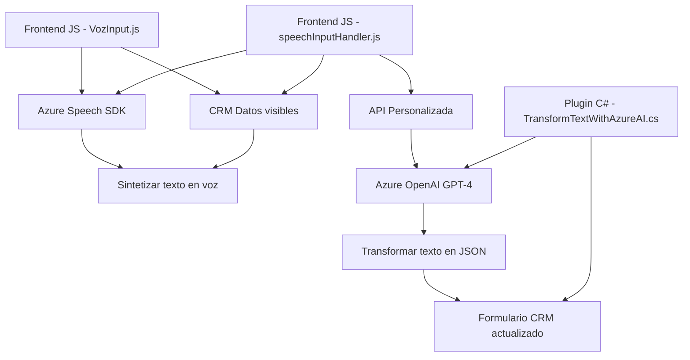

### Breve resumen técnico:
El sistema descrito consiste principalmente en tres elementos funcionales integrados:
1. Archivos JavaScript orientados al frontend, destinados a manipular formularios dentro de un entorno CRM y realizar síntesis/reconocimiento de voz utilizando Azure Speech SDK.
2. Un plugin C# (para Microsoft Dynamics CRM) que transforma texto ingresado en el CRM mediante Azure OpenAI para estructurar datos en formato JSON.
3. Es altamente probable que el repositorio esté enfocado en la integración entre un sistema CRM (como Dynamics 365) y servicios en la nube, facilitando la entrada y salida de datos en interfaces humanas (voz y texto).

---

### Descripción de arquitectura:
Este repositorio sigue una arquitectura **modular de integración** o **n capas**, donde:
1. **Capa de interfaz (Frontend)**: Frontend en JavaScript que interactúa con datos en el CRM, permitiendo manipulación de datos estructurados y reconocimiento/síntesis de voz.
2. **Capa de lógica de negocio**: Plugins en C# como parte del backend del CRM, encargados de implementar lógica de transformación avanzada (p. ej., interacción con Azure AI).
3. **Capa de servicios externos**: Uso de servicios de terceros como:
   - Azure Speech SDK (sintetización y reconocimiento de voz).
   - Azure OpenAI (GPT-4) para estructura de datos con reglas personalizadas.

Los flujos de datos incluyen: 
- Comunicación entre formularios (frontend) y plugins/backend CRM.
- Integración posterior con APIs externas (Azure Speech/API personalizada).

---

### Tecnologías utilizadas:
1. **JavaScript** (Frontend)
   - Uso del SDK de Azure Speech para sintetización/reconocimiento de voz.
   - Directo acceso a formularios en Dynamics CRM.
   - Patrones de modularidad y delegación.

2. **C# (.NET Framework)** (Plugins)
   - Microsoft Dynamics CRM SDK (`IPlugin`).
   - Integración directa con Azure OpenAI (GPT-4) a través de `HttpClient` para estructuración avanzada de texto.

3. **Dependencias/servicios externos**:
   - **Azure Speech SDK**: Reconocimiento y síntesis de voz.
   - **Azure OpenAI**: Transformación de texto basado en IA.
   - API personalizada para transformar textos reconocidos.

---

### Diagrama **Mermaid** 100% compatible con **GitHub Markdown**:

---

### Conclusión final:
Este repositorio implementa una solución de integración avanzada entre un sistema CRM (probablemente Dynamics 365) y servicios de la nube de Azure. Está diseñado para ampliar funcionalidades humanas como entrada de datos por voz, actualización dinámica de formularios y procesamiento de texto mediante IA. La arquitectura es modular, permitiendo tanto integración directa entre el frontend y el CRM como extensiones a través de plugins y APIs externas, haciendo uso de tecnológicas como Azure Speech SDK, Azure OpenAI, y Microsoft Dynamics CRM SDK.

La modularización en el frontend y los plugins facilita el mantenimiento y escalabilidad, aunque algunas dependencias innecesarias del código podrían optimizarse.