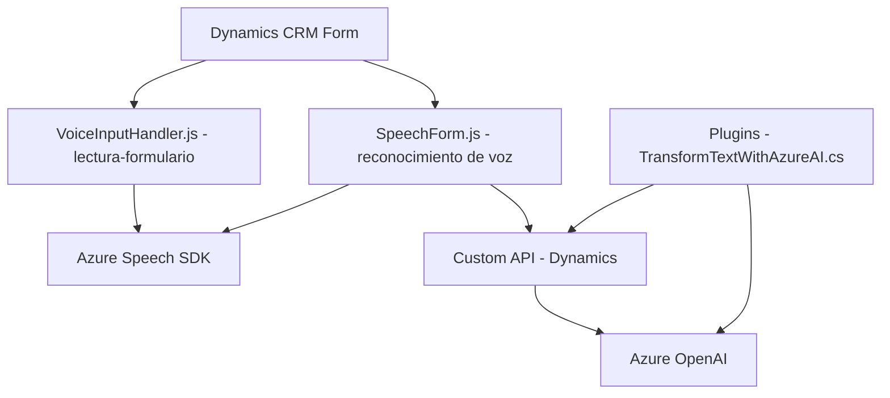

### Breve resumen técnico

El repositorio contiene tres componentes clave que integran funcionalidades relacionadas con síntesis de voz, reconocimiento de voz y procesamiento de texto utilizando servicios de Azure y Dynamics CRM. Los archivos están organizados para soportar tareas de accesibilidad y procesamiento dentro de un contexto empresarial con Dynamics 365.

---

### Descripción de arquitectura

#### Tipo de solución:
- **Tipo:** La solución se clasifica como una combinación de Frontend y Backend orientada a procesamiento con APIs externas y funciones específicas. Es un servicio integrado dentro de Dynamics 365 CRM y utiliza funcionalidades de terceros (Azure Speech SDK y Azure OpenAI).
  
#### Arquitectura:
- **Arquitectura general:**
  - **N capas:** La solución utiliza una arquitectura de capas donde un frontend (JavaScript) y un backend (plugins de Dynamics CRM) interactúan con cada componente de manera desacoplada.
  - **Integración API como microservicio aislado:** Los componentes operan realizando solicitudes a servicios externos como Azure Speech SDK y Azure OpenAI.

#### Patrones utilizados:
- **Callback Structure:** Uso de funciones callback para gestionar operaciones asíncronas como la carga de SDKs y manejo de respuestas de servicios web.
- **Responsabilidad única (SRP - Single Responsibility Principle):** Cada función y archivo aborda un propósito específico (e.g., síntesis de voz, extracción de datos, transformación de texto).
- **Facades:** Centralización de interacciones complejas con APIs (e.g., procesamiento de texto) mediante funciones aisladas.
  
---

### Tecnologías usadas
1. **Frontend (JavaScript):**
   - Uso del **Azure Speech SDK** para síntesis y reconocimiento de voz.
   - Lógica basada en el acceso a formularios dinámicos de Dynamics CRM.
  
2. **Backend (C#):**
   - Uso del **Microsoft Dynamics CRM SDK** para implementar plugins.
   - Conexión al servicio **Azure OpenAI** para procesamiento de texto.

3. **Frameworks y bibliotecas:**
   - `System.Net.Http` (obtenido en C#) para realizar solicitudes a APIs externas.
   - `Newtonsoft.Json.Linq` y `System.Text.Json` para trabajar con datos estructurados JSON.

---

### Dependencias o componentes externos
1. **Azure Speech SDK:**
    - Para funcionalidades de síntesis y reconocimiento de voz en archivos JavaScript.
    - Cargado dinámicamente desde `https://aka.ms/csspeech/jsbrowserpackageraw`.
2. **Azure OpenAI (REST API):**
    - Para transformar texto dinámico enviado desde plugins de Dynamics CRM.
    - Endpoint localizado en `/openai.azure.com/`.
3. **Dynamics 365 CRM Services:**
    - La arquitectura global se integra profundamente con los formularios y APIs de Dynamics CRM.
4. **HTTP y JSON librerías comunes:**
    - Manejo de solicitudes HTTP y deserialización de respuestas en datos JavaScript y JSON.
5. **Custom API:** 
    - Llamadas desde frontend (JavaScript) al backend en CRM mediante "Custom Actions".

---

### Diagrama Mermaid válido para GitHub

---

### Conclusión final

El repositorio presenta una solución híbrida para mejorar accesibilidad y automatización en entornos empresariales basados en Dynamics 365. La arquitectura está orientada al manejo de eventos en el frontend y la integración con API externas, como Azure Speech SDK y Azure OpenAI, mientras que utiliza un enfoque de capas para separar responsabilidades claramente (frontend y backend).

**Fortalezas:**
1. Modularidad y claridad en la separación de responsabilidades (cada archivo cumple un propósito específico).
2. Integración eficaz con servicios de alto rendimiento como Azure AI y Dynamics CRM.

**Aspectos para mejorar:**
1. La seguridad podría robustecerse, evitando la exposición de configuraciones en los archivos fuente (como claves de API).
2. Incorporar mejores prácticas en el manejo de errores, sobre todo en las transacciones de servicios externos.
3. Documentación detallada sobre dependencias críticas, como las Custom API y sus parámetros. 

En general, la solución exhibe un enfoque sólido y extensible, aprovechando poderosas tecnologías modernas.