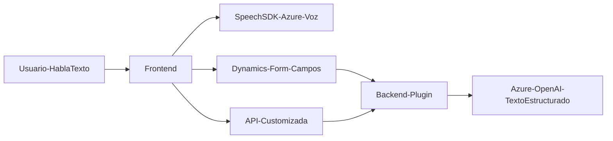

## Breve resumen técnico:

El repositorio combina funcionalidades de frontend (interacción con formularios y SDK de reconocimiento de voz) y backend (transformaciones basadas en IA mediante plugins en Dynamics CRM). Utiliza servicios externos como Azure Speech SDK y Azure OpenAI para construcción de una solución integrada en el ecosistema Dynamics CRM, facilitando interacción con formularios mediante comandos de voz y transformación de datos textuales mediante inteligencia artificial.

---

## Descripción de la arquitectura:

La solución está basada en una arquitectura **de n capas**, claramente dividiendo la lógica de presentación (Frontend/JS scripts) y lógica de negocio (Plugins en C#). Además, integra **servicios externos en la nube** como Azure Speech SDK para reconocimiento/síntesis de voz y Azure OpenAI para procesamiento de texto estructurado.  

Los scripts del frontend están diseñados para interactuar directamente con formularios de Dynamics CRM y consumen APIs externas. El plugin en C# extiende la funcionalidad del CRM, actuando como middleware entre datos introducidos y procesamiento en el servicio de IA.

---

## Tecnologías usadas:

1. **Frontend:**
   - **JavaScript** para la manipulación de datos y SDK.
   - **Azure Speech SDK** para síntesis y reconocimiento de voz.
   - Integración directa con APIs de Dynamics CRM.

2. **Backend:**
   - **C#** en el desarrollo de plugins para Dynamics CRM.
   - **Azure OpenAI API** para procesamiento avanzado de texto.
   - **Dynamics CRM SDK** para extensiones funcionales en el CRM.
   
3. **Patrones utilizados:**
   - **Evento-Controlador:** Scripts ejecutan funciones en respuesta a interacciones de usuario iniciadas en el formulario.
   - **Façade:** Encapsulan las interacciones con servicios externos (speech/text) en funciones dedicadas.
   - **Stateless Design:** El plugin en C# actúa de forma dinámicamente configurada y sin guardar estado.
   - **Delegación:** Uso de callbacks y procesamiento basado en SDKs externos.
   - **Modularización:** Separación clara de responsabilidades entre extracción de datos, síntesis de voz y transformación de texto.

---

## Diagrama Mermaid válido para GitHub:

---

## Conclusión final:

Este repositorio implementa una solución integrada para mejorar la interacción entre usuarios y formularios de Dynamics CRM mediante comandos de voz, así como transformar datos con servicios de inteligencia artificial. La arquitectura está orientada a servicios y se extiende utilizando SDKs externos, manteniendo una clara separación entre frontend y backend. Es altamente escalable al depender de servicios cloud como Azure (Speech/OpenAI), lo que lo hace adecuado en entornos empresariales dinámicos.