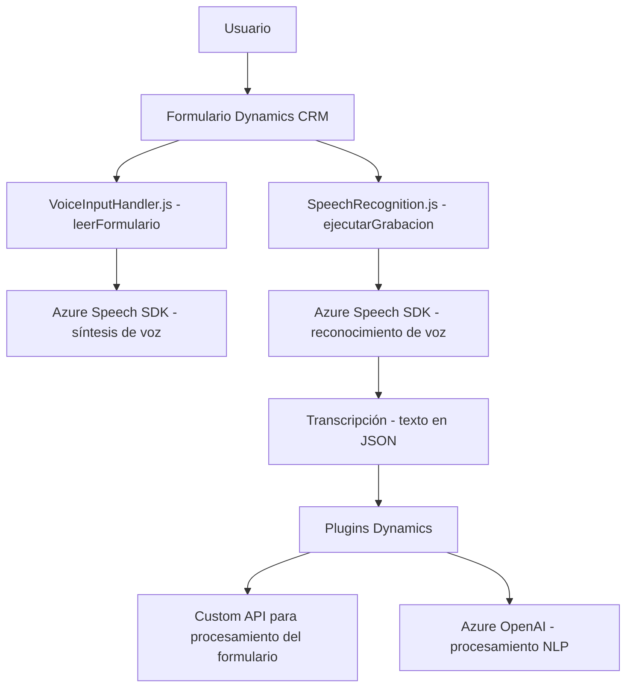

### Breve resumen técnico:
La estructura del repositorio muestra partes de una solución que utiliza el **Azure Speech SDK**, **Microsoft Dynamics CRM Plugins**, y diversos componentes relacionados con el procesamiento de datos y voz. Incluye módulos JavaScript que integran reconocimiento y síntesis de voz, así como procesamiento avanzado de texto con Azure OpenAI en un desarrollo de extensiones para un sistema CRM.

---

### Descripción de arquitectura:
La solución evidencia una arquitectura desacoplada y modular que combina:
1. Funcionalidades del frontend basadas en frameworks o librerías de JavaScript.
2. Integración con servicios de Microsoft Dynamics CRM mediante plugins (.NET).
3. APIs y SDKs externos de Azure (Speech y OpenAI).
4. Uso de principios como **lazy loading**, **modularización**, y patrones de controlador para entrada y procesamiento de datos.

La arquitectura global se puede categorizar como **n-capas**:
- **Frontend (Javascript)**: Responsable de la interacción del usuario y operaciones client-side (speech synthesis y transcription).
- **Backend (Plugins)**: Implementa puntos de extensión en Dynamics CRM, orquesta peticiones a sistemas externos como Azure OpenAI y gestiona lógica de negocios.

Esta estructura facilita la separación de responsabilidades entre interfaces, clientes API, y operaciones del CRM.

---

### Tecnologías usadas:
1. **Frontend**:
   - JavaScript.
   - **Azure Speech SDK**: Speech configuration, synthesis, and transcription.
2. **Backend Plugin**:
   - C# (.NET Framework).
   - **Microsoft Dynamics CRM SDK**: Para plugins y contexto de datos.
   - **Azure OpenAI API**: Procesamiento de texto avanzado.
3. **Patrones identificados**:
   - Modularización y separación de responsabilidades.
   - Lazy loading (carga condicional del SDK).
   - Service-Oriented Architecture (SOA).
   - Plugin Design Pattern (Dynamics SDK).
   - Utility Design Pattern en métodos auxiliares.

---

### Diagrama Mermaid **(válido y funcional para GitHub)**:

---

### Conclusión Final:
La solución presentada combina funcionalidades propias (frontend para interacción con voz y datos, y plugins backend para procesamiento avanzado) con servicios externos mediante APIs y SDKs, lo que la clasifica como una arquitectura híbrida de **n capas** con integración de **servicios externos** tipo SOA. Está bien organizada en módulos y plugins que implementan patrones de modularización y utilidad, asegurando flexibilidad y mantenimiento simplificado dentro de entornos empresariales como **Microsoft Dynamics CRM**.