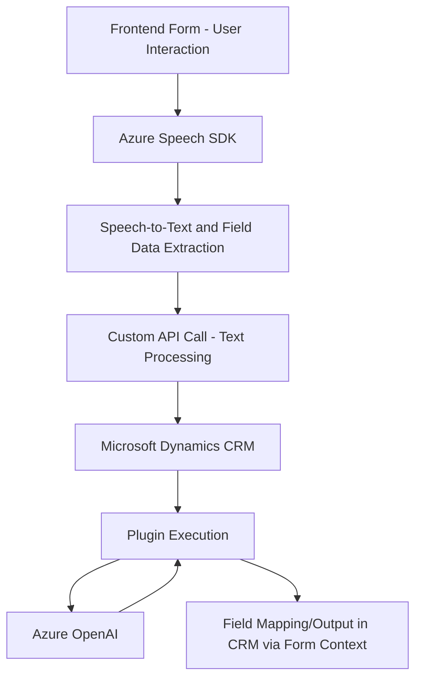

### Breve resumen técnico
La solución analizada parece ser parte de un ecosistema empresarial orientado al uso de tecnología cognitiva y procesamiento de formularios. Está compuesta por tres archivos principales: dos del frontend en JavaScript que interactúan con Azure Speech SDK y uno que implementa un plugin en Dynamics CRM, extendiendo sus funcionalidades mediante el uso de Azure OpenAI Service. La solución tiene un enfoque en la captura, procesamiento y transformación de datos mediante voz y texto.

---

### Descripción de arquitectura
La arquitectura observada combina varios enfoques:
1. **N capas**:
   - **Capa de presentación**: Los archivos de frontend (`readForm.js`, `speechForm.js`) manejan la interfaz relacionada con formularios y voz. Se enfoca en la interacción directa con los usuarios.
   - **Capa de negocio**: Representada por el plugin (`TransformTextWithAzureAI.cs`) que transforma texto según reglas específicas. Este plugin actúa como lógica de negocio para integrarse con Dynamics CRM.
   - **Capa externa**: Delegación de funciones cognitivas a servicios de Microsoft como Azure Speech SDK y Azure OpenAI.

2. **Patrón Cliente-Servidor**:
   - El frontend actúa como cliente, desencadenando procesos de reconocimiento de voz y enviando datos particulares hacia servicios externos y el backend.
   - El backend, representado por el plugin, comunica con un servicio externo (Azure OpenAI API) para realizar transformaciones y devuelve los datos estructurados directamente a Dynamics CRM.

3. **Microservicio**:
   - Aunque en el contexto general este plugin es ejecutado como parte del entorno de CRM (y ligado directamente a su ciclo de vida), su delegación de tareas a un servicio externo representa un enfoque de microservicios al introducir un "puente" entre Dynamics CRM y Azure OpenAI. 

4. **Integración con APIs externas**: Se utiliza el servicio Azure Speech SDK y el servicio Azure OpenAI para speech-to-text conversion y procesamiento avanzado del texto respectivamente.

---

### Tecnologías usadas
1. **Frontend (JavaScript)**:
   - **Azure Speech SDK**: Procesos de conversión de texto a voz y reconocimiento de voz.
   - **async/await**, **Promises**, manejo de eventos: Estructuración de lógica basada en asincronía y callbacks.
   - Interacción con formarios (`formContext`) de Dynamics 365.

2. **Backend (.NET/C#)**:
   - **Microsoft Dynamics CRM SDK**: Extensión de funcionalidades mediante plugins.
   - **Azure OpenAI via HTTP**: Integración con la API Azure OpenAI para la transformación inteligente de datos mediante IA.
   - **Newtonsoft.Json**, **System.Text.Json**: Procesamiento de datos JSON.
   - Uso estandarizado de patrones como el Plugin Pattern y Gateway Pattern en el plugin.

---

### Diagrama Mermaid (GitHub Markdown-compliant)

---

### Conclusión final
La solución examinada constituye una implementación híbrida de n-capas con integración de microservicio para procesamiento de datos en Dynamics CRM, ligada a servicios cognitivos de Azure. Por un lado, los archivos del frontend gestionan la interacción usuario-vía voz y la integración de formularios. Por otro lado, el plugin se encarga de la transformación inteligente de los datos mediante el uso de la API de Azure OpenAI, aplicando reglas de negocio y devolviendo un JSON estructurado a la capa de datos.

Las tecnologías utilizadas tienen soporte para procesos cognitivos, asincronía y manejo de APIs, mientras que los patrones observados garantizan modularidad, reutilización del código y robustez. Sin embargo, un enfoque más moderno podría plantear la adopción del patrón de arquitectura hexagonal, promoviendo la mejor separación entre dependencias externas y lógica interna.