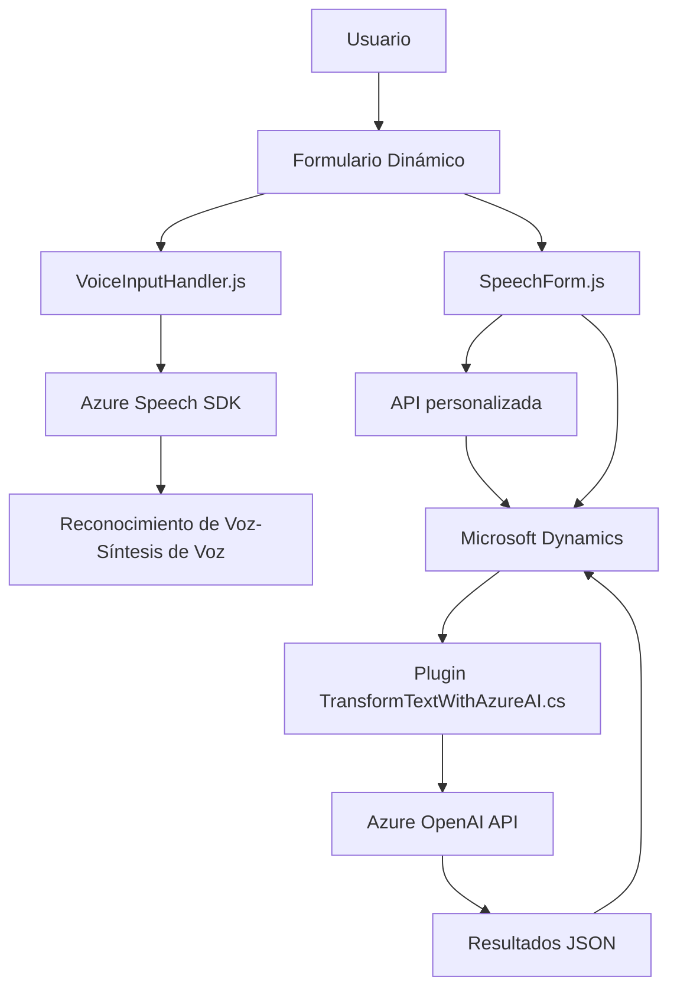

### Breve Resumen Técnico

El repositorio presenta una solución enfocada en la integración de lenguaje natural y síntesis de voz con Microsoft Dynamics CRM, utilizando servicios de Azure como Speech SDK y OpenAI API. Se divide en componentes frontend en JavaScript para manejar la interfaz y formularios dinámicos, junto con un backend basado en un plugin .NET para procesamiento avanzado con OpenAI.

---

### Descripción de Arquitectura

La solución utiliza una **arquitectura de n capas**, particularmente reforzada con características propias del diseño orientado a servicios (SOA). Las capas principales son:

1. **Frontend (Presentación):** Implementada en JavaScript para interactuar con usuarios mediante formularios dinámicos y funciones de voz (entrada de voz y síntesis de texto a voz).
2. **Backend (Lógica de Negocio):** Un plugin basado en .NET (TransformTextWithAzureAI.cs) que procesa texto estructurado y se comunica con Azure OpenAI para la transformación.
3. **Integración de APIs Externas:** Servicios como Azure Speech y Azure OpenAI se utilizan para manejar reconocimiento de texto, síntesis de voz y procesamiento de lenguaje natural.
4. **Microsoft Dynamics CRM:** Actúa como la capa de gestión de datos y almacenamiento, interactuando con formularios y datos de entidades empresariales.

---

### Tecnologías Usadas

1. **Frontend:**
   - Lenguaje: JavaScript.
   - Frameworks: Ninguno explícito, pero sigue un diseño modular.
   - Integraciones:
     - **Azure Speech SDK:** 
       - Reconocimiento de voz.
       - Síntesis de texto a voz.
     - **Microsoft Dynamics API (`Xrm.WebApi`)**:
       - Interacción con formularios y datos dinámicos.

2. **Backend:**
   - **Microsoft Dynamics CRM SDK (`IPlugin`, `IOrganizationService`)**
   - Lenguaje: C#.
   - **Azure OpenAI API:** Procesamiento de texto usando modelos como GPT-4 configurados en Azure.
   - Librerías: `Newtonsoft.Json`, `System.Text.Json`, `System.Net.Http`.

3. **Patrones de Diseño:**
   - **Modularidad:** Separación de funcionalidades en métodos independientes, reutilizables y enfocados.
   - **Defer Loading:** (Frontend) Carga dinámica del SDK de Azure Speech para optimizar rendimiento.
   - **Plugin Pattern:** En el backend para extender funcionalidad Dynamics CRM.
   - **Adapter Pattern:** Integración con Azure OpenAI API.

---

### Diagrama Mermaid (GitHub Markdown Compatible)

---

### Conclusión Final

Esta solución es un sistema integrador que enlaza tecnologías de reconocimiento y procesamiento de voz (Azure Speech SDK) con manejo dinámico de formularios en Microsoft Dynamics CRM, junto con el uso de inteligencia artificial avanzada (Azure OpenAI API). Utiliza una arquitectura de n capas con principios de modularidad, optimización mediante carga diferida y extensibilidad por medio de API y plugins. Es ideal para transformar información hablada en datos estructurados y aplicar inteligencia artificial en procesos empresariales dinámicos.