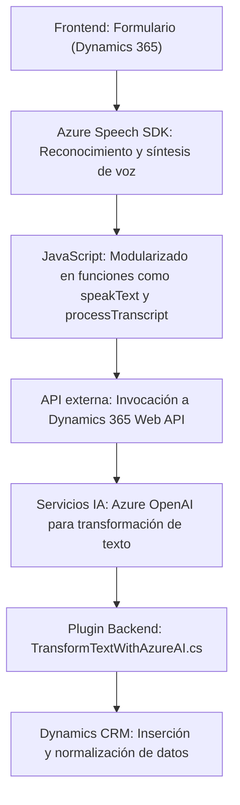

### Breve resumen técnico
El repositorio implementa una solución **híbrida orientada a Dynamics 365**. Combina capacidades de interacción mediante **frontend (JavaScript)** y **backend (.NET)**. La funcionalidad principal involucra el procesamiento de datos de formularios, interacción mediante **reconocimiento de voz** y síntesis de texto a voz con el **Azure Speech SDK**, además de integración con **Azure OpenAI** para transformar texto utilizando servicios de inteligencia artificial directamente.

---

### Descripción de arquitectura
La arquitectura puede definirse como **n-capas** orientada a servicios debido a las siguientes características:
1. **Frontend:** Las responsabilidades están organizadas en módulos autónomos para la interacción con formularios.
2. **Middleware (backend):** Se define un plugin en Dynamics CRM que sirve como interfase para ejecutar transformaciones de texto mediante **Azure OpenAI**.
3. **Servicios externos:** Amplias capacidades de integración con endpoints como Azure Speech y Azure OpenAI.

El código sigue principios de modularidad y separation of concerns, lo que facilita la interoperabilidad en una arquitectura basada en **eventos y flujos distribuidos**.

---

### Tecnologías usadas
1. **Frontend:**  
   - **Lenguaje:** JavaScript (ES6).  
   - **SDK:** Azure Speech SDK (para reconocimiento y síntesis de voz).  
   - **Plataforma:** Dynamics 365 (mediante objetos como `executionContext`).

2. **Backend:**  
   - **Lenguaje:** C#.  
   - **Framework:** .NET (Microsoft Dynamics CRM Plugin).  
   - **Bibliotecas:** `Newtonsoft.Json.Linq`, `System.Net.Http` para integrar Azure OpenAI.

3. **Servicios externos:**  
   - Azure Speech SDK.  
   - Azure OpenAI.

4. **Patrones de diseño:**  
   - **Integración basada en eventos.**  
   - **Plugin Pattern (Dynamics CRM).**  
   - **Adaptador de datos** para transformar y normalizar entrada y salida (formato legible).  
   - **API Gateway** para interacción con servicios en Dynamics y Azure.

---

### Diagrama Mermaid válido para GitHub

---

### Conclusión final
La solución está diseñada para integrarse profundamente con la plataforma Dynamics 365, permitiendo un flujo interactivo mediante **voz y texto**, fortalecido por servicios avanzados de **IA** ofrecidos por Azure. La arquitectura n-capas y el uso de patrones como el **plugin** y **adaptador** aseguran una separación clara de responsabilidades y escalabilidad. Las dependencias de Azure permiten gestionar inteligencia artificial y capacidades de voz para enriquecer la experiencia de usuario en entornos empresariales.

Aunque la estructura muestra una alta modularidad, podría beneficiarse con una abstracción adicional para configuraciones de entorno y seguridad (manejo seguro de claves API).