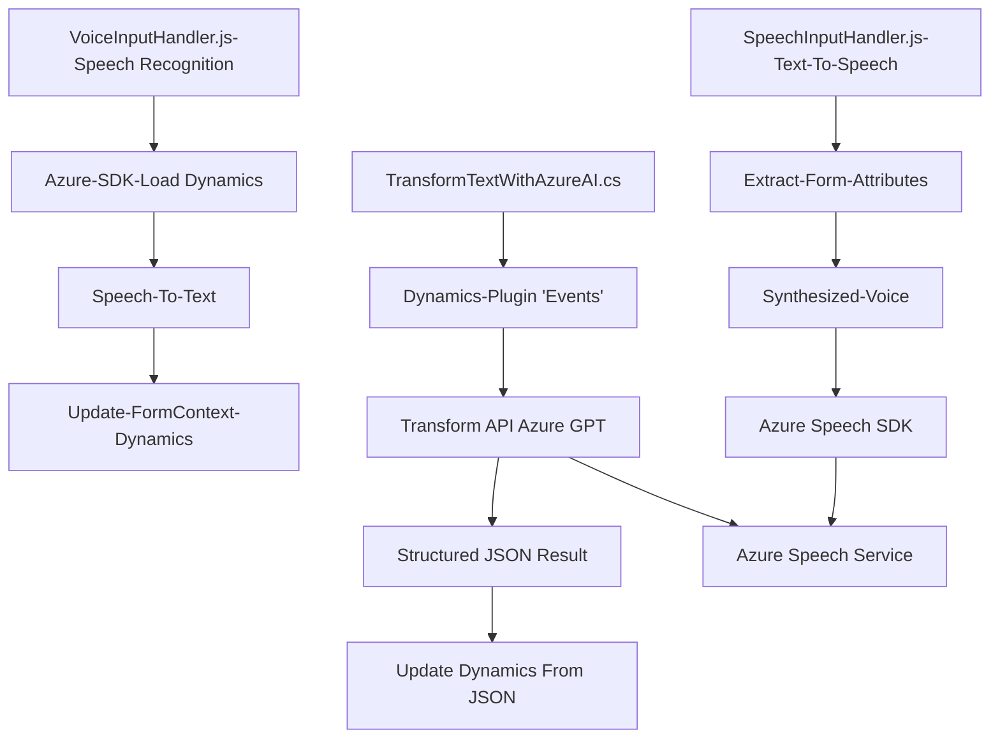

### Breve resumen técnico
El repositorio describe componentes funcionales que interactúan con formularios de Microsoft Dynamics CRM y servicios de Azure, con enfoque en síntesis y reconocimiento de voz, así como transformación de texto basado en IA. Está compuesto de:
1. Archivos JavaScript integrados con Azure Speech SDK y Dynamics CRM.
2. Un plugin para Dynamics desarrollado en C# que utiliza Azure OpenAI para transformación de texto.

### Descripción de arquitectura
1. **Tipo de solución**: La solución es un conjunto de microservicios y recursos extendidos para formularios Dynamics CRM.
   - **Frontend**: Scripts de JavaScript para interacción con formularios y servicios externos.
   - **Backend**: Plugin de C# para extensiones específicas del CRM.
   
2. **Arquitectura**:
   - **Arquitectura moderna y modular**, con principios de desacoplamiento:
     - **Microservicios**: Interacción con APIs externas de Azure Cognitive Services (Speech SDK y OpenAI).
     - **Integración ligera**: Integración modular entre frontend (Dynamics Script libraries), plataforma CRM (Dynamics), y servicios de Azure.
   - **Plugin Architecture**: El archivo `.cs` sigue este patrón al extender funcionalidades del CRM en eventos específicos (proporcionado por Microsoft Dynamics).
   - **Event-Driven**: En el frontend, las operaciones se disparan mediante eventos que responden a interacciones del usuario.

### Tecnologías, frameworks y patrones
1. **Tecnologías/Frameworks usados**:
   - **JavaScript**: Scripts para integrar el SDK de Azure y manipular formularios Dynamics.
   - **Azure Speech SDK**:
     - **Funcionalidades**: Síntesis y reconocimiento de voz.
     - **URL dinámico de carga**: `https://aka.ms/csspeech/jsbrowserpackageraw`.
   - **Azure OpenAI**:
     - **Modelo GPT-4**: Operaciones relacionadas con sintaxis avanzada de transformación de texto.
   - **C#: .NET Framework para Plugins de Dynamics CRM**:
     - Usa `IPluginExecutionContext` y `IOrganizationService` para manipulación personalizada de entidades de CRM.
   - **Dynamics CRM**:
     - Extensiones de formularios mediante scripting y plugins.
   - **Newtonsoft.Json**: Manejo de JSON en el backend.

2. **Patrones arquitectónicos**:
   - **Modularidad Funcional**: Organización basada en funciones específicas separadas por funcionalidades.
   - **Plugin Architecture**: Para extensiones de eventos en Dynamics CRM.
   - **Integración basada en servicios**: Comunicación vía APIs REST y SDK externos.
   - **Event-Driven Pattern**: Operaciones disparadas por eventos asociados a formularios o voz.
   - **Microservicios (Front y Backend)**: Cada servicio depende fuertemente de APIs externas.

### Diagrama Mermaid

### Conclusión final
La solución integra reconocimiento, síntesis de voz, y procesamiento de texto mediante microservicios modulares, ideales para ampliar la accesibilidad y la funcionalidad de Dynamics CRM utilizando poderosos servicios de Azure. La arquitectura muestra un equilibrio entre separación de responsabilidades mediante scripts JavaScript en el frontend y plugins en el backend. Sin embargo, el alto nivel de acoplamiento con Azure SDK y OpenAI puede generar riesgos en términos de portabilidad hacia otras plataformas.