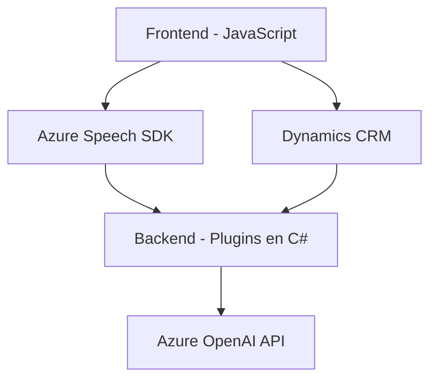

### Breve resumen técnico:
Este repositorio está orientado hacia una solución de interacción por voz con formularios, destinada principalmente a entornos de gestión como Dynamics CRM. Combina elementos frontend desarrollados en JavaScript para la interacción con Azure Speech SDK y plugins backend en C# que integran servicios de inteligencia artificial de Azure OpenAI para el procesamiento de datos. 

---

### Descripción de arquitectura:
La solución exhibe características de una arquitectura híbrida de **n capas**, distribuida entre los siguientes componentes:
- **Frontend**: Implementación de funcionalidades de reconocimiento de voz y síntesis de texto mediante JavaScript y Azure Speech SDK, que permite la interacción directa con el navegador.
- **Backend**: Plugins de Dynamics CRM en C# que actúan como middleware. Conectan el CRM con servicios externos (Azure OpenAI API) para transformar datos y aplicarlos al modelo.
Esta arquitectura está claramente dividida entre el cliente que realiza operaciones de entrada/salida (Frontend) y un servidor que ejecuta lógica específica (Backend). La interacción ocurre principalmente mediante APIs y plugins.

---

### Tecnologías usadas:
1. **Frontend**:
   - **JavaScript**: Para el manejo de la lógica de formularios y la comunicación con el SDK.
   - **Azure Speech SDK**: Reconocimiento de voz y síntesis de texto a voz.
2. **Backend**:
   - **C#**: Plugins personalizados que extienden funcionalidades en Dynamics CRM.
   - **Azure OpenAI API**: Procesamiento avanzado de texto según normas específicas.
   - **ASP.NET** (implícito en el uso de Dynamics CRM).
   - **Microsoft Dynamics SDK**: Para acceder al modelo de datos y servicios CRM.
3. **Dependencias comunes**:
   - Bibliotecas de manipulación JSON (`Newtonsoft.Json.Linq` y `System.Text.Json`).
   - Comunicaciones HTTP (`HttpClient`).

---

### Diagrama **Mermaid** válido para GitHub:

---

### Conclusión final:
La solución es una extensión basada en voz para aplicaciones en el entorno de Microsoft Dynamics CRM. Combina tecnologías modernas como Azure Speech SDK para síntesis y reconocimiento de voz en el frontend, y servicios de procesamiento avanzados como Azure OpenAI en el backend. La arquitectura sigue un enfoque tradicional de **n capas**, con separación clara entre presentación, lógica de negocio y acceso a datos. Una posible mejora podría ser ofrecer una capa adicional de abstracción que permita su uso en otros entornos CRM, ampliando su interoperabilidad.