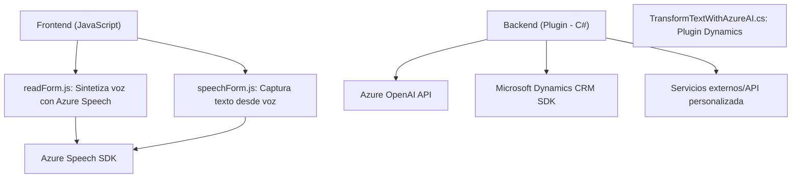

# Breve resumen técnico

El conjunto de archivos analizados pertenece a una solución que integra funcionalidades de entrada y síntesis de voz, captura de audio, procesamiento de texto con inteligencia artificial (IA) y transformación de datos en un entorno Dynamics 365. Utiliza tecnologías como Azure Speech SDK y Azure OpenAI API, diseñadas para operar en interfaces web y plugins personalizados. 

Estos archivos representan algo más que una API o librería, ya que implementan procesos interactivos con formularios y servicios externos utilizando un enfoque modular y orientado a eventos/lógica de negocio.

---

# Descripción de arquitectura

La arquitectura de esta solución puede clasificarse como **n capas** (o multicapas) con módulos específicos funcionales:

1. **Frontend (JavaScript):** Proporciona integración con SDKs de terceros y maneja la interacción entre el usuario y la interfaz web.
   - Implementa lógica de negocio mediante métodos desacoplados para procesamiento de formularios y síntesis de voz.
2. **Backend Plugin (C# Dynamics Plugin):** Extiende la funcionalidad de Dynamics 365 utilizando Azure OpenAI para transformar datos y realizar procesamiento basado en IA.
   - Diseñado para integración directa con Dynamics mediante el patrón de repositorio y el consumo de servicios HTTP externos.

---

# Tecnologías usadas

1. **Frontend (JavaScript):**
   - **Azure Speech SDK:** Para síntesis de voz y transcripción.
   - **Microsoft Dynamics CRM JavaScript SDK (`Xrm.WebApi`)**: Interacción directa con formularios y bases de datos de Dynamics.
   - APIs personalizadas: Envía datos procesados desde el frontend a servicios externos.

2. **Backend (C# Plugin):**
   - **Microsoft Dynamics 365 SDK:** Para gestión de eventos y entidades en Dynamics.
   - **Azure OpenAI API:** Realiza transformaciones de texto utilizando inteligencia artificial.
   - **HTTP Client Libraries (`System.Net.Http`)**: Para consumir APIs externas.
   - **JSON Parsing Libraries:** `Newtonsoft.Json` y `System.Text.Json` para manejar datos JSON.

3. **Patrones principales:**
   - **Evento modular:** Lógica activada por interacción del usuario.
   - **Responsabilidad única:** Cada módulo tiene objetivos específicos (formularios, audio, texto).
   - **Integración externa:** SDKs y APIs dinámicas permiten adaptabilidad.

---

# Diagrama Mermaid válido para GitHub Markdown

---

# Conclusión final

La solución está diseñada para integrar entrada de voz, síntesis de audio y procesamiento de texto utilizando servicios avanzados de inteligencia artificial como Azure OpenAI y Azure Speech SDK. Tiene una arquitectura de **n capas**, dividida entre el frontend (JavaScript) y el backend (Plugins C#) para manejar la lógica específica de Dynamics 365 y consumir servicios externos. 

Este enfoque modular permite escalar la solución, facilitar el mantenimiento y mejorar la interacción con servicios externos. Es ideal para sistemas empresariales que buscan integrar AI de forma práctica.