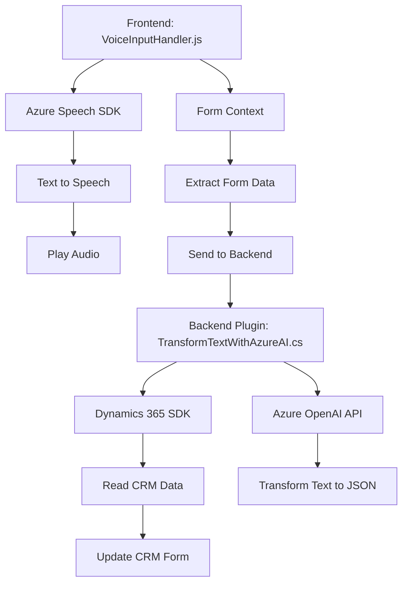

### Breve resumen técnico
El repositorio contiene componentes diseñados para una solución integrada en Microsoft Dynamics 365, habilitando interacción por voz, transformación de texto y actualización dinámica de formularios. Utiliza servicios externos (Azure Speech SDK y Azure OpenAI) y sigue estándares de extensibilidad de Dynamics.

---

### Descripción de arquitectura
La arquitectura empleada es una combinación de **n capas** y **event-driven architecture**:
1. **Capa de presentación:** Los archivos de frontend (`readForm.js`, `speechForm.js`) manejan la interacción del usuario mediante voz, concebidos como una interfaz orientada a eventos.
2. **Capa de lógica de negocios:** El plugin `TransformTextWithAzureAI.cs` proporciona funcionalidades avanzadas de procesamiento usando Azure OpenAI, directamente integrado con Dynamics 365.
3. **Capa de integración:** El SDK de Azure Speech y las APIs internas de Dynamics permiten interacción externa (servicios de voz y datos CRM) para manipular formularios y realizar transformaciones de datos.

---

### Tecnologías, frameworks y patrones usados
**Tecnologías:**
- **Frontend:** JavaScript con carga dinámica de librerías (Azure Speech SDK).
- **Backend:** Microsoft Dynamics 365 SDK, C# (.NET Framework).
- **Servicios en la nube:** Azure Speech SDK, Azure OpenAI.
- **Estándares:** Integración con Microsoft Dynamics 365 APIs.

**Patrones:**
- **Event-driven Programming:** Uso de eventos (voz, carga de SDK) para disparar lógica en el frontend.
- **Convenience Layer:** Métodos auxiliares en frontend para extracción y manipulación de datos dinámicos.
- **Plugins en Dynamics 365:** Arquitectura de extensibilidad basada en la interfaz `IPlugin` para procesamiento backend.
- **API Wrapper:** Acceso directo a servicios externos como Azure Speech y Azure OpenAI.
- **Integración de servicios externos:** Comunicación con APIs de Speech y OpenAI para aumentar capacidades del sistema.

---

### Dependencias o componentes externos presentes
1. **Azure Speech SDK:** Para reconocimiento y síntesis de voz. Dependencia incluida mediante carga dinámica de scripts.
2. **Azure OpenAI Service:** Para transformación avanzada de texto usando IA.
3. **Microsoft Dynamics 365 SDK:** Proporciona las herramientas necesarias para implementar plugins y comunicarse con los datos CRM.
4. **Navegador:** Elementos y dependencias de DOM y objetos como `window`.

---

### Diagrama Mermaid

---

### Conclusión final
La solución presentada integra tecnologías modernas para enriquecer la experiencia de usuario en sistemas CRM, habilitando capacidades avanzadas de interacción por voz y procesamiento de texto por IA. La arquitectura utiliza una estructura de **n capas**, donde el frontend actúa como una interfaz interactiva y los plugins en el backend procesan transformaciones avanzadas mediante servicios externos (Azure). La implementación sigue principios sólidos de desacoplamiento, reutilización de funciones específicas, y extensibilidad en el ecosistema Dynamics 365, aunque puede mejorar en aspectos de seguridad (como externalización de claves sensibles).