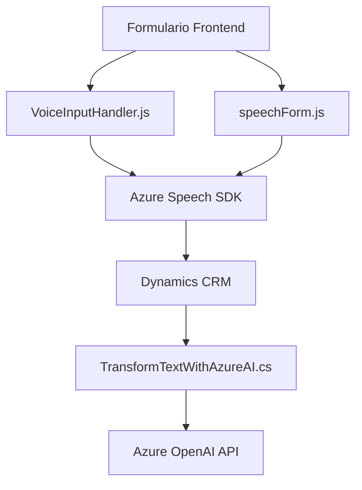

### Breve resumen técnico
El repositorio contiene archivos enfocados en la integración de capacidades de reconocimiento y síntesis de voz mediante **Azure Speech SDK** en aplicaciones relacionadas con formularios dinámicos (probablemente Dynamics CRM). También incluye un plugin en .NET que utiliza **Azure OpenAI** para transformar texto en estructuras JSON según reglas predefinidas. Los archivos exhiben una arquitectura modular que combina dependencias externas e internas para el procesamiento de datos y voces en tiempo real.

---

### Descripción de arquitectura
#### Tipo de solución
Se trata de una solución híbrida que incluye:
1. **Frontend**:
   - Implementado en JavaScript para la interacción con formularios donde se trabajan datos visibles y se realizan procesos de síntesis y reconocimiento.
   - Integra SDKs externos como **Azure Speech SDK**.
   
2. **Backend**:
   - Compuesto por un plugin en .NET que extiende funcionalidad dentro del entorno **Dynamics CRM** para transformar datos utilizando servicios avanzados de inteligencia artificial como **Azure OpenAI**.

#### Arquitectura global
- **Arquitectura distribuida**: Con componentes separados que interactúan con servicios en la nube de Azure mediante SDKs y APIs.
- **Patrón de capas**: El frontend realiza la captura y procesamiento inicial de datos (y entrada de voz), mientras que el backend (plugin .NET) transforma la información con servicios de AI. El sistema de CRM actúa de manera centralizada para gestionar los datos definitivos.

#### Componentes principales:
1. **Modularidad**:
   - Frontend: Cada archivo JS agrupa funciones relacionadas con la entrada de voz o síntesis de texto.
   - Backend: El plugin presenta una lógica específica para transformar texto y es llamado mediante eventos definidos en **Dynamics CRM**.

2. **Integraciones con servicios externos**:
   - **Azure Speech SDK**: Usado en el frontend para síntesis y reconocimiento.
   - **Azure OpenAI**: Utilizado en el plugin para transformar y estructurar texto.

---

### Tecnologías usadas
1. **Frontend**:
   - **JavaScript**: Manejo de lógica para entrada de voz y síntesis.
   - **Azure Speech SDK**: Procesamiento de voz para reconocimiento y generación (Text-to-Speech, Speech-to-Text).
   - **Promise**: Gestión de flujos asincrónicos, especialmente cuando interactúa con APIs externas.

2. **Backend**:
   - **AspNet/.NET Framework**: Para la implementación de plugins en Dynamics CRM.
   - **Dynamics CRM SDK**: Interacción con servicios del entorno CRM.
   - **HttpClient**: Manejo de solicitudes hacia APIs externas (Azure OpenAI).
   - **JSON frameworks**:
      - `System.Text.Json` & `Newtonsoft.Json.Linq` para manipulación y análisis de objetos JSON.

---

### Posibles dependencias o componentes externos
1. **Azure Speech SDK**: Cargado dinámicamente desde el frontend mediante un enlace público.
2. **Azure OpenAI API**: Consumida por el plugin para transformar texto en JSON estructurado.
3. **Microsoft Dynamics CRM**: Contexto principal de los complementos en ambos componentes (plugin y frontend).
4. **CRM APIs**: Uso de `Xrm.WebApi` en JavaScript para interactuar con la base de datos y estructura de Dynamics CRM.
5. **HTTP services**: Dependencia del plugin .NET para comunicación con APIs externas.

---

### Diagrama Mermaid válido para GitHub

---

### Conclusión final
La solución presenta una arquitectura híbrida con funciones distribuidas entre el frontend (JavaScript) y backend (.NET plugins). Está diseñada para integrarse con Dynamics CRM y completar tareas avanzadas de procesamiento de voz y transformación de datos textuales mediante APIs avanzadas de Azure. Sobresale por su modularidad, uso de patrones de integración como *Lazy Loading* y su dependencia de servicios externos (Azure). Sin embargo, su robustez depende de la disponibilidad de las APIs utilizadas y la correcta configuración del entorno Dynamics CRM.