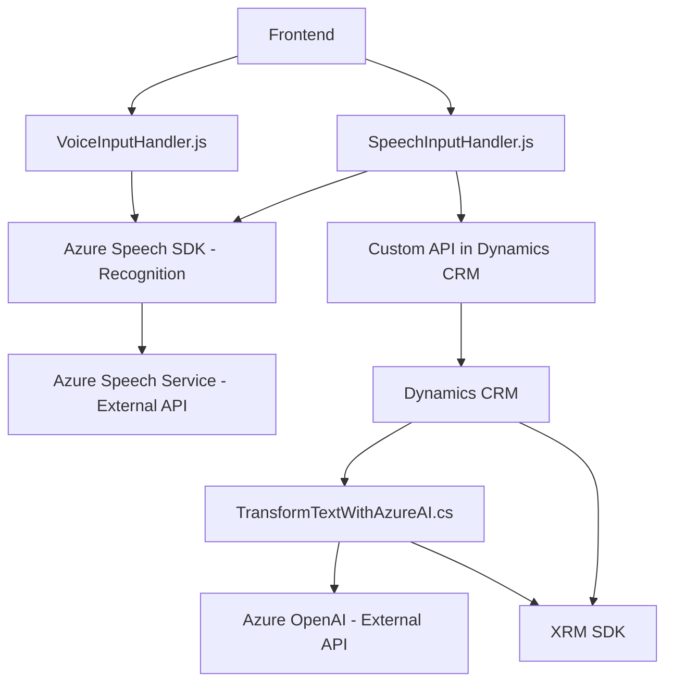

### Breve resumen técnico
El repositorio parece estar orientado a la integración de servicios de reconocimiento y síntesis de voz (Azure Speech SDK) con formularios dinámicos en Dynamics 365, complementado con el uso de Azure OpenAI para procesamiento avanzado de texto. La solución define lógica en el frontend mediante JavaScript y en el backend usando `C#`, en forma de un plugin para Dynamics 365.

### Descripción de arquitectura
La arquitectura es híbrida: combina un **modelo n capas** para los archivos del frontend (cliente como primera capa, SDK como integración externa y backend de Dynamics 365/API como capa de lógica) con un diseño basado en **extensibilidad por plugins** en Dynamics CRM. Adicionalmente, sigue principios de integración con servicios externos como Azure Speech y Azure OpenAI.

### Tecnologías usadas
1. **Frontend**: JavaScript:
   - Azure Speech SDK (Speech Service).
   - DOM APIs.
2. **Backend**: C# para Dynamics CRM:
   - Microsoft Dynamics CRM SDK (Microsoft.Xrm.Sdk).
   - Newtonsoft.Json for JSON parsing.
   - System.Net.Http for HTTP API calls.
3. **Servicios externos**:
   - Azure Speech (reconocimiento y síntesis de voz).
   - Azure OpenAI (transformación de texto).

### Diagrama Mermaid válido para GitHub

### Conclusión final
La solución es una integración compleja entre interacción por voz, procesamiento de texto mediante IA y formularios dinámicos en Dynamics 365. Emplea tecnologías modernas como Azure Speech y Azure OpenAI para proporcionar funcionalidades exclusivas asociadas con reconocimiento de voz, síntesis de la misma y transformación de texto. La arquitectura es modular, híbrida y extensible, adecuada para sistemas empresariales integrados con servicios en la nube.