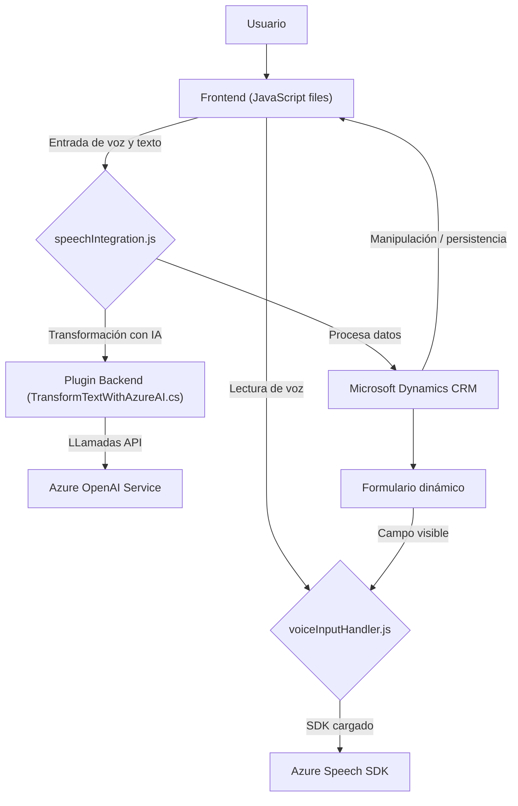

# Breve resumen técnico
El repositorio pertenece a una solución de integración que utiliza servicios de Azure para manejar la entrada y salida de voz en formularios dinámicos. Esta solución parece centrada en aprovechar APIs de procesamiento de lenguaje (Azure Speech SDK, Azure OpenAI) y es usada como una extensión o funcionalidad complementaria en un entorno moderno como Microsoft Dynamics CRM.

---

# Descripción de arquitectura
La arquitectura del repositorio está orientada a *n capas*, donde se manejan distintas responsabilidades:
1. **Frontend (JavaScript)**: Proporciona funcionalidades como lectura en voz alta y entrada de datos por voz. Utiliza SDKs externos (Azure Speech).
2. **Backend (C# Plugin)**: Procesa texto utilizando reglas específicas con el servicio Azure OpenAI y lo devuelve como JSON estructurado para su uso en el frontend.
3. **Integración API dinámica**: Ambas capas están altamente integradas mediante APIs y dependencias contextuales específicas (como Dynamics CRM).

---

# Tecnologías usadas
1. **Frontend**
   - **JavaScript estándar**: Manipulación de datos del DOM y dependencias internas.
   - **Azure Speech SDK**: Funcionalidades de conversión texto-voz y reconocimiento de voz.
   - **Microsoft Dynamics API (Xrm)**: Para acceso y manipulación de datos en formularios.

2. **Backend**
   - **C# (.NET Framework)**: Desarrollo de plugin modular.
   - **Azure OpenAI Service**: Interacción directa con servicios GPT mediante HTTP.

3. **Patrones**
   - *Carga dinámica*: SDKs como el Azure Speech se cargan solo cuando es necesario.
   - *Separación de responsabilidades*: La lógica está bien segmentada en funciones específicas.
   - *Integración basada en servicios*: Arquitectura orientada a APIs con Azure y Dynamics CRM.

---

# Diagrama **Mermaid** válido para GitHub

---

# Conclusión final
El repositorio implementa una extensión modular de procesamiento de voz y texto para formularios dinámicos en un entorno empresarial como Dynamics CRM. La arquitectura utiliza una estructura **n capas** donde el frontend y backend están integrados mediante servicios de Azure. Destaca su enfoque modular, dinámico y orientado a APIs, lo que ofrece flexibilidad y escalabilidad en soluciones empresariales modernas.