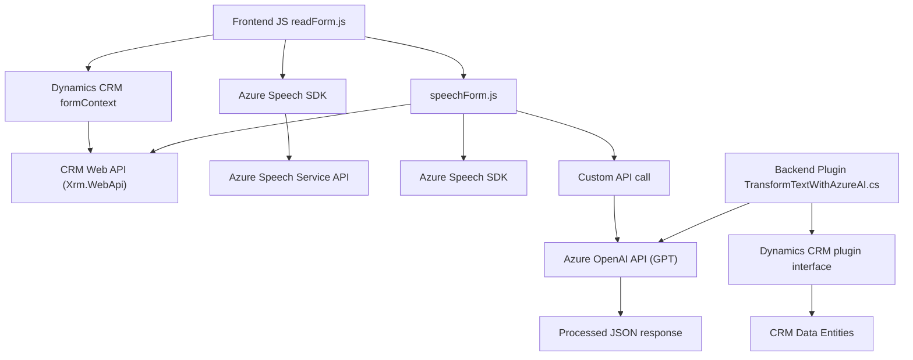

### Breve resumen técnico:
El repositorio posee funcionalidades centradas en la integración con servicios de Azure, específicamente Speech SDK y OpenAI, para la manipulación de texto, síntesis de voz y transformación de datos estructurados. Está dividido en tres módulos principales:
1. **Frontend/JS**: Scripts de JavaScript para interacción cliente, entrada de voz y síntesis textual.
2. **Backend/Plugins**: Código C# para ejecución como plugin en Dynamics CRM con integración hacia Azure OpenAI.

---

### Descripción de arquitectura:
El sistema está diseñado como una **arquitectura híbrida basada en servicios**. Esto incluye:
- Un **frontend funcional**, donde los scripts de JavaScript interactúan directamente con APIs de Azure y Dynamics CRM.
- Un **backend modular**, que utiliza un modelo de plugins para Dynamics CRM y establece comunicación con servicios RESTful externos (Azure OpenAI).  
El frontend actúa como cliente ligero que delega la mayor parte de la manipulación y ejecución al backend en Dynamics CRM y APIs externas.
  
El enfoque sigue un patrón descentralizado pero cohesionado: el frontend se comunica con APIs (Speech SDK y Dynamics CRM) para adquirir datos, y el backend maneja transformaciones avanzadas a través del plugin de Dynamics y la integración con servicios de Azure. Técnicas como **procesamiento asíncrono**, **cargadores dinámicos** y **encapsulación de funcionalidades por contexto** son predominantes.

---

### Tecnologías, frameworks y patrones usados:
#### Tecnologías:
1. **Frontend:**
   - **JavaScript** (ES6+): Para la lógica del cliente, procesamiento de voz y mapeo de datos del formulario.
   - **Azure Speech SDK**: Para síntesis de voz desde datos procesados en el cliente.
   - **Dynamics CRM Web API**: Para lectura y escritura interactiva en campos de formularios CRM.
   
2. **Backend:**
   - **C#**: Language for Dynamics CRM plugins.
   - **Azure OpenAI**: Servicio para transformación del texto, posiblemente basado en GPT.
   - **Microsoft.Xrm.Sdk**: Para las acciones y comunicación en Dynamics CRM.
   - **System.Net.Http**: Para integración HTTPS hacia Azure OpenAI.
   - **System.Text.Json** y **Newtonsoft.JSON**: Para manipulación de JSON en C#.

#### Patrones:
1. **Procedural**: En los scripts del Frontend que trabajan con funciones individuales para tareas específicas.
2. **Plugin Architecture**: Para el backend que implementa Dynamics CRM plugins (extensibilidad mediante eventos).
3. **Encapsulación**: Cada responsabilidad se encapsula en funciones o métodos; hay abstracción de detalles técnicos. Por ejemplo:
   - Plugin encapsula la lógica de conexión a OpenAI.
   - Funciones frontend dividen tareas como carga dinámica del SDK y transformación de datos.
4. **Integración API externa**: Conexiones directas hacia APIs en Azure para procesamiento de datos y síntesis de voz.

---

### Dependencias o componentes externos:
1. **Azure Speech SDK**:
   - `https://aka.ms/csspeech/jsbrowserpackageraw`: Referencia para cargar dinámicamente Speech SDK en frontend.
   - Permite convertir texto en audio mediante Azure Speech REST APIs.

2. **Azure OpenAI GPT** (Usado en `TransformTextWithAzureAI.cs`):
   - Endpoint RESTful para procesamiento de texto y generación de estructuras JSON.

3. **Dynamics CRM Web API**:
   - Operaciones de lectura, escritura y manipulación de datos de formularios mediante `Xrm.WebApi` en Frontend y SDK en Backend.

4. **System.Net.Http**:
   - Utilizado en plugins del backend para comunicarse con servicios RESTful.

---

### Diagrama Mermaid:

---

### Conclusión final:
La solución presentada utiliza una arquitectura basada en servicios que conecta un frontend ligero con una capa backend integrada en Dynamics CRM. Tecnologías como Azure Speech SDK y OpenAI permiten capacidades avanzadas de entrada-salida de voz y manipulación de datos estructurados, haciéndola adecuada para escenarios de automatización en entornos empresariales. La modularidad y la interacción con APIs externas son sus puntos fuertes, aunque hay áreas para optimización como centralización de las dependencias en el front y estandarización en los patrones de diseño.