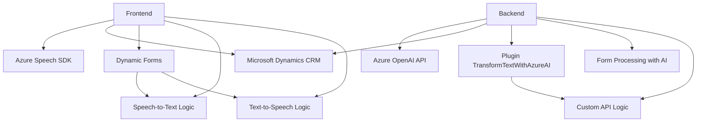

### Breve resumen técnico
El repositorio forma parte de una solución integrada que utiliza reconocimiento de voz, síntesis de voz y procesamiento de formularios en Dynamics 365 CRM con soporte de servicios externos como Azure Speech SDK y Azure OpenAI. Es una solución orientada tanto a la interacción del usuario como al procesamiento automatizado de datos.

---

### Descripción de arquitectura
La arquitectura combina principios de **Microservicios** en el backend y **N capas** en el frontend. Cada componente del sistema realiza tareas específicas y autónomas: reconocimiento y síntesis de voz en el frontend, procesamiento de texto con inteligencia artificial en el backend mediante plugins para Dynamics CRM.

- **Frontend**:
  - Módulos en JavaScript integran el Azure Speech SDK para el reconocimiento y síntesis de voz. 
  - Procesan y manipulan datos dinámicos de formularios en aplicaciones CRM interactuando con APIs de Dynamics.
  - Dividido en componentes funcionales como captura de datos visibles del formulario, generación de texto legible y comunicación con Speech SDK.

- **Backend**:
  - Los plugins de Dynamics CRM utilizan arquitectura basada en eventos. Implementan la interfaz `IPlugin` para interactuar con Dynamics y Azure OpenAI, mandando solicitudes POST y procesando las respuestas JSON recibidas.
  
---

### Tecnologías usadas
1. **Frontend (JavaScript)**:
   - **Azure Speech SDK**:
     - Reconocimiento y síntesis de voz.
     - Técnicas asincrónicas con `callbacks`.
     - Configuración dinámica de SDK en el navegador.
   - **Dynamics Web API**:
     - Extracción y actualización de datos del contexto de formulario en Dynamics CRM.
   - **Vanilla JS**:
     - División modular de funciones para encapsular tareas específicas.
   - **Patrones**:
     - Separación funcional.
     - Event-driven design (manejo de carga dinámica de SDK).
     - Diseño modular.

2. **Backend (C#)**:
   - **Azure OpenAI API**: Integración HTTP para generación y transformación de texto.
   - **Microsoft Dynamics SDK**:
     - Modelo de Plugins basado en `IPlugin`.
     - Gestión de contexto para interacción con datos de CRM.
   - **Newtonsoft.Json** para manipulación de JSON.
   - **Patrones**:
     - Plugin Architecture.
     - API Integration mediante `HttpClient`.

---

### Dependencias y componentes externos presentes
1. **Azure Speech SDK** para síntesis y reconocimiento de voz.
2. **Azure OpenAI API** para transformación de texto.
3. **Microsoft Dynamics SDK** para la configuración e interacción con plugins y formularios CRM.
4. **JSON Manipulation Libraries**:
   - `Newtonsoft.Json`, `System.Text.Json`.
5. **Dynamics Web API**:
   - Métodos como `Xrm.WebApi.retrieveMultipleRecords`.

---

### Diagrama Mermaid válido para GitHub

---

### Conclusión final
La solución combina frontend interactivo con capacidades avanzadas de reconocimiento y síntesis de voz utilizando Azure Speech SDK, y backend orientado a procesamiento de texto mediante inteligencia artificial con Azure OpenAI API a través de Plugins en Dynamics CRM. Implementa patrones de separación funcional y modularidad en JavaScript y una arquitectura de **microservicios complementados con capas** en su backend para interacción con Dynamics CRM. La integración con Azure amplía las capacidades de automatización y mejora la experiencia del usuario tanto en procesamiento como visualización.