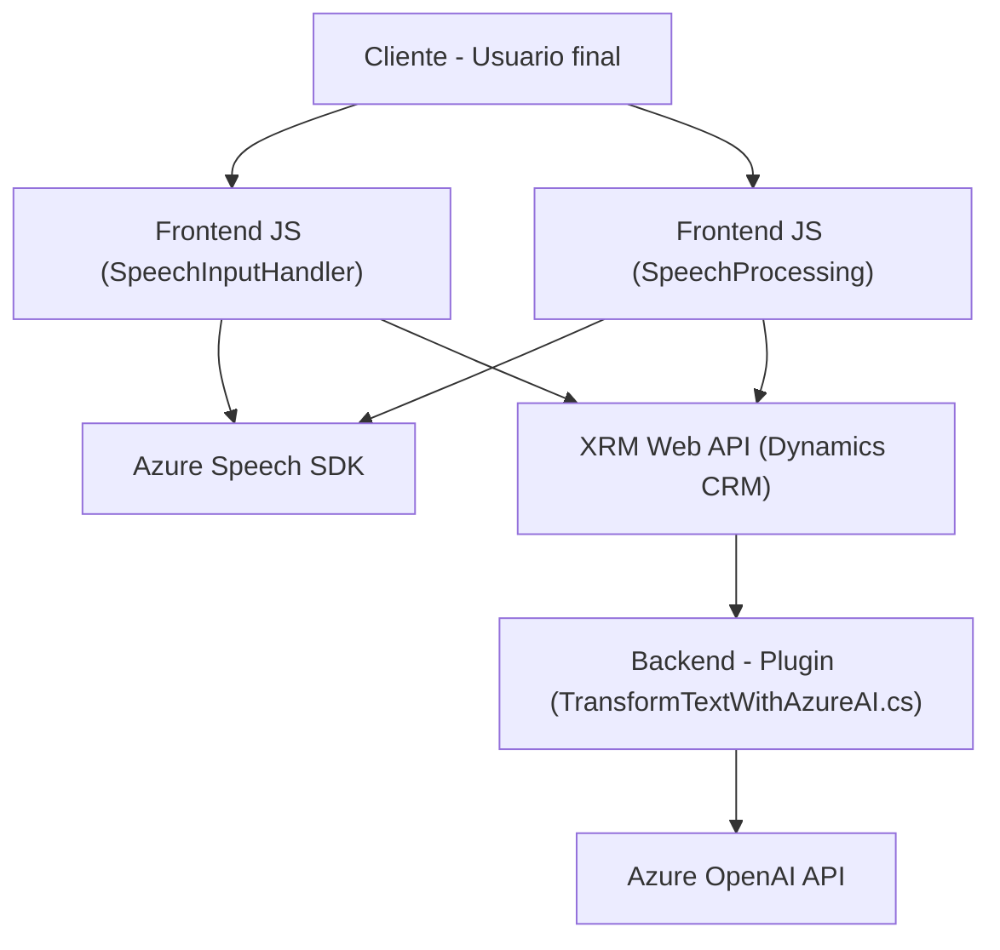

### Breve resumen técnico:

El repositorio representa una solución tecnológica con múltiples componentes para integrar funcionalidades avanzadas de entrada y salida de voz, procesamiento de texto e inteligencia artificial (IA) basada en Azure dentro de un entorno Dynamics CRM. Se basa en el uso de APIs externas (Azure Speech SDK, Azure OpenAI) y extensiones de CRM mediante plugins.

---

### Descripción de arquitectura:

La solución emplea una arquitectura híbrida de **n capas** para organizar sus funcionalidades:
1. **Frontend** (JavaScript): Gestión de entrada y salida de voz, manipulación de formularios, integración con SDK externo (Azure Speech SDK).
2. **Plugin backend** (.NET): Procesamiento de texto usando Azure OpenAI, conectado al modelo de Dynamics CRM para lógica empresarial.
3. **Servicios externos**: Azure Speech SDK y Azure OpenAI API como puntos clave de integración. Estos servicios encapsulan las capacidades de reconocimiento de voz e inteligencia artificial.

Los módulos del frontend están diseñados para ser ejecutados dentro del navegador en contexto CRM (XRM Web API). Los plugins .NET actúan como lógica del backend extendida para ejecutar transformaciones avanzadas.

---

### Tecnologías usadas:

#### **Frontend:**
- **JavaScript**: Lenguaje principal para manipulación de formularios y entrada/salida de voz.
- **Azure Speech SDK**: Servicio para reconocimiento de voz y síntesis.
- **XRM Web API**: Framework de Dynamics CRM para interactuar con datos del sistema CRM.

#### **Backend (Plugin):**
- **C#** con **.NET Framework**: Base para el desarrollo del plugin de Dynamics CRM.
- **Azure OpenAI API**: Asistencia de IA para transformar textos en JSON estructurados.
- **Newtonsoft.Json**: Manipulación y serialización de JSON en el plugin.
- **System.Net.Http**: Comunicación HTTP con APIs externas.

#### **Patrones:**
1. **Separación de responsabilidades**: Cada módulo cumple una función específica (manipulación de formularios, procesamiento de texto, interacción con APIs externas).
2. **Integración de SDKs externos**: Azure Speech SDK y Azure OpenAI son activos clave para las funcionalidades avanzadas de procesamiento.
3. **Plugin pattern**: Extiende el comportamiento del CRM mediante lógica en C#.

---

### Dependencias o componentes externos:

1. **Azure Speech SDK** para entrada/salida de voz en el frontend.
2. **Azure OpenAI API** para transformación de texto en el plugin backend.
3. **CRM SDK** (via XRM Web API) para interactuar con el sistema Dynamics CRM.
4. **Microsoft.Xrm.Sdk**, **Newtonsoft.Json**, y **System.Net.Http** en la lógica del plugin.

---

### Diagrama Mermaid (válido para GitHub Markdown):

---

### Conclusión final:

La solución representa una arquitectura **intermedia** entre n capas y un sistema orientado a servicios. El frontend (con JavaScript y Azure Speech SDK) se encarga de captar entrada de voz y manipular formularios en tiempo real en el contexto CRM. El plugin backend (.NET/C#) realiza transformaciones avanzadas de texto usando IA en Azure OpenAI.

Esta solución aprovecha una mezcla de tecnologías modernas (Azure SDK y OpenAI) y frameworks estándar (Dynamics CRM), demostrando buenas prácticas de separación de responsabilidades y extensibilidad. Sería adecuada para escenarios de CRM que requieran interactividad avanzada basada en voz e inteligencia artificial.