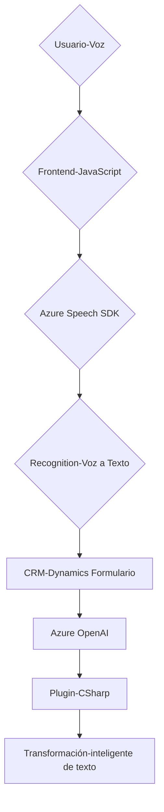

# Análisis Técnico, Arquitectura e Implementación

## Breve resumen técnico
Este repositorio define una solución híbrida que integra un **frontend basado en voz** con servicios de **CRM (Microsoft Dynamics)** y herramientas avanzadas como **Azure Speech SDK** y **Azure OpenAI**. La funcionalidad general convierte datos del formulario en texto, permite manipular formularios dinámicos utilizando síntesis y reconocimiento de voz, y transforma texto con inteligencia artificial.

## Descripción de arquitectura
La arquitectura es notablemente **modular**. Se desarolla en los siguientes componentes:
1. **Frontend (JavaScript)**:
   - Scripts enfocados en entrada y salida de voz utilizando el SDK de Azure Speech.
   - Modularidad alta con funciones para mapeo y manipulación de formularios CRM.
   - Utilización dinámica de SDK y APIs en tiempo de ejecución mediante carga basada en eventos.

2. **Backend Plugins (C#)**:
   - **Plugin en Dynamics CRM**: Define lógica que transforma texto con GPT-4 desde Azure OpenAI basado en reglas específicas.
   - Definido bajo la arquitectura **plugin** y con acceso a servicios CRM mediante `IPlugin`.

3. **Patrones arquitectónicos usados**:
   - **Event-driven programming**: En el frontend JavaScript, los eventos son centrales para cargar dinámicamente el SDK y actualizar formularios.
   - **SDK Integration:** Ambos frontend y backend integran SDKs externos para lógica avanzada (Azure Speech para voz y Azure OpenAI para IA).
   - **Plugin Architecture:** En el backend, los plugins encapsulan lógica específica para ser ejecutada dentro del ecosistema Dynamics CRM.

4. **Arquitectura Tipo**: 
   - **Frontend**: Modular con funciones y servicios consumibles externos.
   - **Backend**: Interfaz **monolítica extendida con plugins**.
   - En conjunto, es una mezcla entre **arquitectura de capas** y **modularidad funcional** adaptada al ecosistema Dynamics CRM.

---

## Tecnologías usadas
### **Frontend**
- **JavaScript**: Lenguaje central para manejar lógica de entrada/salida de voz y el formulario dinámico.
- **Azure Speech SDK**: Servicio para síntesis de voz y transcripción.
- **APIs Personalizadas de CRM**: Usadas mediante `Xrm.WebApi` para operaciones en Dynamics.

### **Backend**
- **C# (.NET Framework)**: Central para el desarrollo del plugin que interactúa con Dynamics CRM.
- **Azure OpenAI (GPT-4)**: Servicio de inteligencia artificial usado para transformar texto.
- **Microsoft Xrm SDK**: Framework para extensiones y servicios del CRM.
- **HTTP APIs**: Comunicación directa con Azure y otras APIs externas.

### **Protocolos**
- HTTP(S): Para consumir servicios de Azure.

---

## Dependencias externas/internas
### **Externas**
- **Azure Speech SDK**: Reconocimiento y síntesis de voz.
- **Azure OpenAI**: GPT-4 para la transformación avanzada de texto.
- **APIs Xrm.WebApi**: Para la comunicación bidireccional entre formularios dinámicos y datos CRM.
- **System.Net.Http**: Llamadas HTTP al servicio Azure GPT.
- **JSON Libraries**: `System.Text.Json` para serialización/deserialización de datos en plugins.

### **Internas**
- Mapeo de campos del formulario CRM en JavaScript.
- Métodos de manipulación dinámica del formulario.
- Métodos en C# para ejecutar plugins dentro de Dynamics CRM.

---

## Diagrama de flujo **Mermaid** válido para GitHub

---

## Conclusión final
Este repositorio implementa una solución centrada en la interacción mediante voz y texto, con fuerte soporte en tecnologías modernas de **Azure** y extensibilidad en **Microsoft Dynamics CRM**. La arquitectura es modular, permitiendo escalabilidad en futuros desarrollos (por ejemplo, añadir reconocimiento de imágenes o análisis de emociones). La dependencia de SDKs externos asegura un rendimiento eficaz aunque aumenta la necesidad de conectividad constante.

La solución está bien diseñada, destacando por:
- Modularidad para integrar partes independientes (voz y transformación segmentada).
- Utilización de estilos **event-driven** y **backend extendido por plugins**.
- Integración avanzada con servicios del ecosistema Microsoft.

Adecuada para sistemas CRM centrados en interacción intuitiva y aplicaciones empresariales basadas en IA.