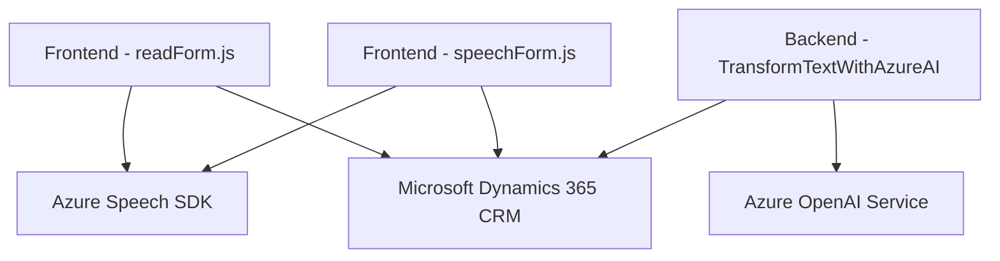

### Resumen técnico
El repositorio está compuesto por tres archivos principales: dos destinados al frontend (JavaScript) y uno al backend (.NET/C#). Los archivos relacionados con el frontend (`readForm.js` y `speechForm.js`) se encargan de interactuar con un formulario en una aplicación web (posiblemente basada en Dynamics 365 CRM), proporcionando funcionalidades de texto a voz y reconocimiento de voz, mientras que el `TransformTextWithAzureAI.cs` actúa como un plugin backend que usa el Azure OpenAI Service para generar un JSON estructurado. Este sistema combina frontend y backend componentes para conectar una aplicación CRM con servicios cognitivos de Microsoft Azure.

### Descripción de arquitectura
La arquitectura es una combinación de **arquitectura de cliente-servidor** en el frontend que interactúa con un backend basado en **SOA (Service-Oriented Architecture)**, que delega tareas específicas relacionadas con la inteligencia artificial (Azure OpenAI y Azure Speech SDK) a servicios externos. Se puede decir que utiliza un estilo **n-capas**: 
- **Presentación** en el frontend, que gestiona la interfaz y la interacción del usuario.
- **Lógica de negocio** en el plugin y estrategias como procesamiento de transcripciones o asignación de atributos.
- **Integración con servicios externos** como APIs de Azure.

### Tecnologías usadas
1. **Frontend (JavaScript)**:
   - Microsoft Dynamics 365 CRM SDK (`formContext`, `executionContext`).
   - Azure Speech SDK (carga dinámica desde CDN: `https://aka.ms/csspeech/jsbrowserpackageraw`).
   - Manejo de eventos y modularidad funcional.

2. **Backend (.NET/C#)**:
   - Microsoft Azure OpenAI Service (`GPT-4` o similares).
   - Microsoft Dynamics CRM SDK (`IPlugin`, `Xrm.WebApi`).
   - Librerías para manipulación de datos (.NET `HttpClient`, `Json`, etc.).
   - Construcción de plugins con patrones como Plugin Design Pattern.

3. **Servicios externos (Azure)**:
   - Azure Speech SDK para reconocimiento de voz y síntesis.
   - Azure OpenAI Service para generación automática de textos y estructuras JSON.

### Dependencias o componentes externos
1. **Microsft Azure Speech SDK**: Usado para reconocimiento y síntesis de voz en el frontend.
2. **Microsoft Dynamics 365 CRM SDK**: Para la interacción con formularios, API y gestión de datos.
3. **Azure OpenAI Service**: Usado en el backend para transformar texto en JSON estructurado que cumple con los requisitos de la aplicación.
4. **Gestión de datos**: Uso de JSON mediante `Newtonsoft.Json` y manipulación con librerías .NET para transmitir información entre componentes del sistema.

### Diagrama Mermaid compatible con GitHub Markdown

### Conclusión final
Este repositorio está diseñado para extender la funcionalidad de un sistema de gestión (CRM en Dynamics) mediante integración con servicios cognitivos avanzados de Microsoft Azure. La solución implementa la interacción de usuarios con datos a través de voz y texto, ofreciendo capacidades robustas como reconocimiento de voz, síntesis y transformación de texto a JSON, probablemente útil para casos de automatización de entradas en sistemas CRM.

La separación lógica entre frontend (integración directa con Azure Speech SDK y el CRM) y backend (Azure OpenAI + Dynamics Plugin) junto con la organización modular de funciones asegura una arquitectura escalable basada en **principios de SOA y n capas**, ideal para aplicaciones empresariales con dependencias externas. Sin embargo, se deberían implementar mecanismos de seguridad avanzados para gestionar mejor las credenciales de las APIs.