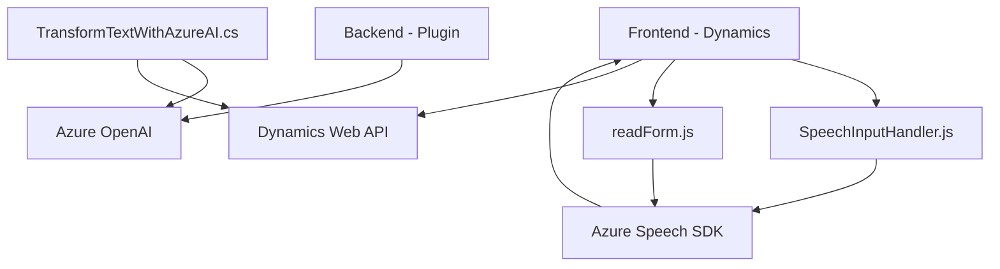

### Breve resumen técnico:
El conjunto de archivos y su estructura sugieren un sistema que integra una **interfaz de usuario web basada en JavaScript** (frontend), una **lógica de backend basada en plugins para Dynamics 365**, y una integración directa con **Azure AI Services** como Speech SDK y OpenAI.

---

### Descripción de la arquitectura:
La solución implementa una arquitectura **modular basada en n capas**:
1. **Capa de Presentación (Frontend)**:
   - Comprende scripts en JavaScript para la interacción con el usuario en un entorno de Dynamics 365, permitiendo entrada y salida de voz.
2. **Capa de Negocio (Plugins)**:
   - Utiliza plugins como `TransformTextWithAzureAI` registrados en Dynamics 365 para procesar lógicas específicas.
3. **Capa de Servicios Externos**:
   - Azure Speech SDK y Azure OpenAI son componentes fundamentales para la síntesis y procesamiento de voz y el análisis de texto.

La arquitectura mantiene reglas claras de delegación y separación de responsabilidades entre las capas, aunque podría beneficiarse de una estructura más desacoplada, como **Hexagonal Architecture**, para reducir la dependencia directa entre los servicios y el core del sistema.

---

### Tecnologías usadas:
1. **Frontend**:
   - **JavaScript**: Implementación de scripts para manipular y procesar formularios interactivos.
   - **Dynamics 365 Form SDK**: Proporciona acceso dinámico al contexto del formulario (`executionContext`).
2. **Backend/Plugins**:
   - **C#**: Desarrollado como plugins para Dynamics 365.
   - **Dynamics 365 SDK (Microsoft.Xrm.Sdk)**: Para interacción directa con formularios y registros en CRM.
3. **Servicios externos**:
   - **Azure Speech SDK**: Para síntesis de voz.
   - **Azure OpenAI Services (GPT-4)**: Para procesamiento avanzado de texto.
4. **Frameworks adicionales**:
   - **Newtonsoft.Json**: Manipulación de JSON en C#.

---

### Diagrama Mermaid:
El diagrama refleja los componentes y cómo interactúan entre ellos:

---

### Conclusión Final:
La solución evidencia un diseño funcional robusto con integración de servicios externos como **Azure Speech SDK y Azure OpenAI**, que enriquecen la interacción del usuario mediante voz y texto. La arquitectura modular basada en capas y el uso de patrones como delegación y desacoplamiento facilitan la extensibilidad y mantenibilidad. Sin embargo, sería mejor fortalecer la seguridad y desacoplamiento, evitando codificar configuraciones sensibles directamente en el código fuente y promoviendo mayor independencia entre el frontend y los servicios externos.